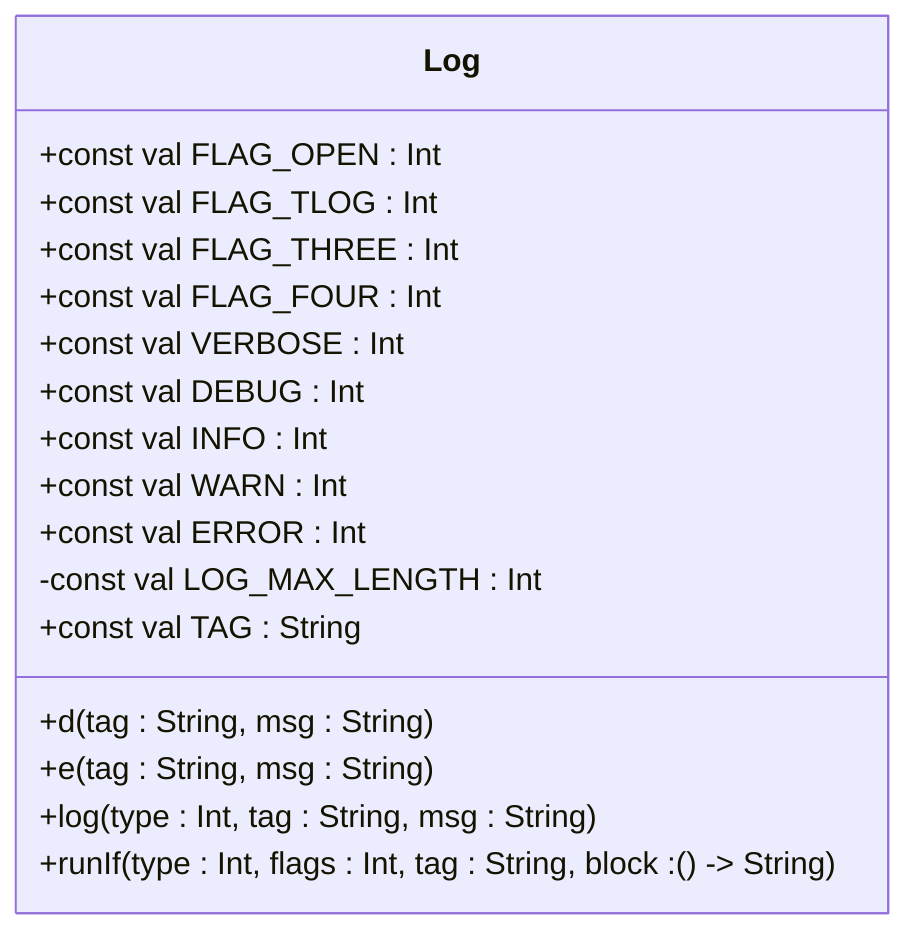
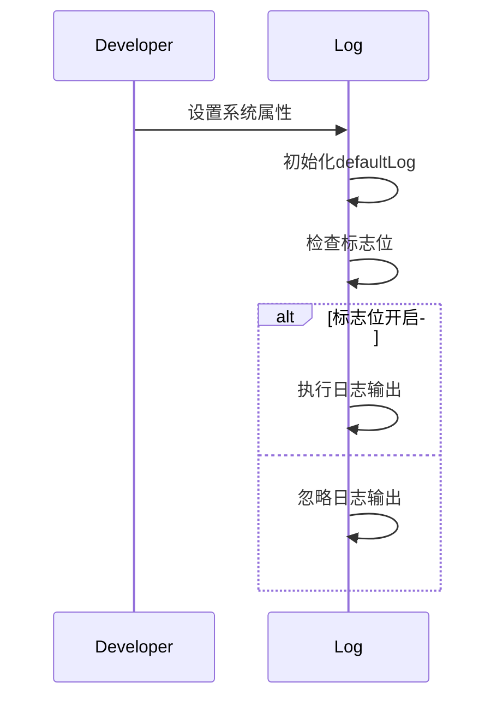
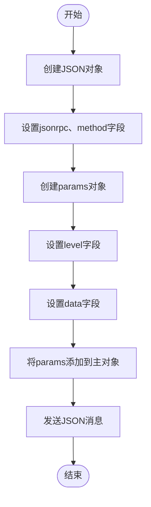
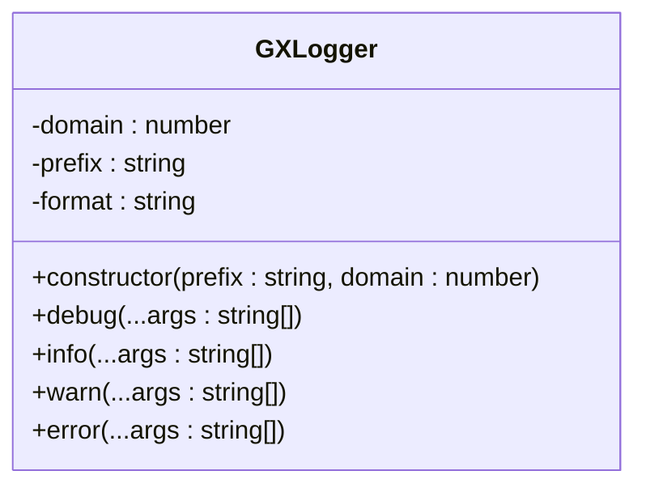

# 日志输出格式

<cite>
**Referenced Files in This Document**   
- [Log.kt](file://GaiaXAndroidAdapter/src/main/java/com/alibaba/gaiax/adapter/Log.kt)
- [Log.kt](file://GaiaXAndroidJSProxy/src/main/java/com/alibaba/gaiax/js/proxy/Log.kt)
- [Log.kt](file://GaiaXAndroidJS/src/main/kotlin/com/alibaba/gaiax/js/utils/Log.kt)
- [Log.kt](file://GaiaXAndroid/src/main/kotlin/com/alibaba/gaiax/utils/Log.kt)
- [GXJSLogModule.kt](file://GaiaXAndroidJSProxy/src/main/java/com/alibaba/gaiax/js/proxy/modules/GXJSLogModule.kt)
- [GXLogger.ets](file://GaiaXHarmony/GaiaXCore/GaiaX/src/main/ets/utils/GXLogger.ets)
</cite>

## Table of Contents
1. [日志输出格式设计](#日志输出格式设计)
2. [日志格式自定义方法](#日志格式自定义方法)
3. [JSON与纯文本输出格式](#json与纯文本输出格式)
4. [上下文信息扩展](#上下文信息扩展)
5. [日志解析与监控系统集成](#日志解析与监控系统集成)

## 日志输出格式设计

GaiaX框架中的日志输出格式设计遵循统一的结构化原则，确保日志信息的可读性和可解析性。日志输出主要由时间戳、标签、线程信息和日志内容四部分组成，通过`Log.kt`文件中的实现来组织这些信息。

在不同的模块中，如`GaiaXAndroidAdapter`、`GaiaXAndroidJSProxy`、`GaiaXAndroidJS`和`GaiaXAndroid`，日志类都定义了类似的常量和方法，以保证日志格式的一致性。例如，`TAG`常量用于标识日志来源，`LOG_MAX_LENGTH`限制单条日志的最大长度，防止日志过长导致的问题。

日志输出的核心方法是`log`函数，它接受日志类型、标签和消息作为参数，并根据日志类型调用相应的Android系统日志方法（如`Log.d`、`Log.e`等）。为了处理超过最大长度的日志消息，`log`函数会将长消息分割成多个部分进行输出。

**Diagram sources**
- [Log.kt](file://GaiaXAndroidAdapter/src/main/java/com/alibaba/gaiax/adapter/Log.kt#L9-L53)
- [Log.kt](file://GaiaXAndroidJSProxy/src/main/java/com/alibaba/gaiax/js/proxy/Log.kt#L9-L53)

**Section sources**
- [Log.kt](file://GaiaXAndroidAdapter/src/main/java/com/alibaba/gaiax/adapter/Log.kt#L1-L121)
- [Log.kt](file://GaiaXAndroidJSProxy/src/main/java/com/alibaba/gaiax/js/proxy/Log.kt#L1-L121)

## 日志格式自定义方法

开发者可以根据团队规范或监控系统的要求自定义日志格式。GaiaX框架提供了灵活的机制来支持不同输出格式的需求，包括JSON和纯文本等。

通过`runIf`内联函数，可以条件性地执行日志记录操作，这为日志格式的自定义提供了基础。`runIf`函数检查标志位是否开启，如果开启则调用`log`方法输出日志。这种设计允许开发者通过设置不同的标志位来控制日志的输出行为。

此外，`defaultLog`属性通过懒加载的方式初始化，基于系统属性决定是否启用日志输出。这种方式使得日志的开启和关闭可以通过外部配置轻松管理，而无需修改代码。

**Diagram sources**
- [Log.kt](file://GaiaXAndroidAdapter/src/main/java/com/alibaba/gaiax/adapter/Log.kt#L49-L64)
- [Log.kt](file://GaiaXAndroidJSProxy/src/main/java/com/alibaba/gaiax/js/proxy/Log.kt#L49-L64)

**Section sources**
- [Log.kt](file://GaiaXAndroidAdapter/src/main/java/com/alibaba/gaiax/adapter/Log.kt#L49-L92)
- [Log.kt](file://GaiaXAndroidJSProxy/src/main/java/com/alibaba/gaiax/js/proxy/Log.kt#L49-L92)

## JSON与纯文本输出格式

GaiaX框架支持JSON和纯文本两种主要的日志输出格式。对于需要结构化数据的场景，JSON格式提供了更好的可解析性；而对于简单的调试信息，纯文本格式则更加直观易读。

在`GXJSLogModule.kt`中，`sendJSLogMsg`函数负责将日志消息封装成JSON格式并发送。该函数创建一个包含`jsonrpc`、`method`和`params`字段的`JSONObject`，其中`params`字段包含了日志级别和实际的日志内容。这种方式便于与远程监控系统集成，实现日志的集中管理和分析。

**Diagram sources**
- [GXJSLogModule.kt](file://GaiaXAndroidJSProxy/src/main/java/com/alibaba/gaiax/js/proxy/modules/GXJSLogModule.kt#L25-L38)

**Section sources**
- [GXJSLogModule.kt](file://GaiaXAndroidJSProxy/src/main/java/com/alibaba/gaiax/js/proxy/modules/GXJSLogModule.kt#L1-L78)

## 上下文信息扩展

为了增强日志的上下文信息，GaiaX框架允许开发者在日志中包含用户ID、会话ID等关键信息。这有助于在复杂的分布式系统中追踪问题和分析用户行为。

虽然核心日志类没有直接提供扩展上下文信息的方法，但通过`runE`扩展函数和`block`参数，可以在日志输出时动态生成包含上下文信息的消息。例如，在`GXJSLogModule.kt`中，`log`、`info`、`warn`和`error`方法都使用了`runE`来记录调用时的详细信息，包括传入的参数值。

这种设计模式鼓励开发者在编写日志时考虑上下文的重要性，从而提高日志的实用价值。通过在日志消息中加入更多相关信息，可以显著提升问题诊断的效率。

**Section sources**
- [GXJSLogModule.kt](file://GaiaXAndroidJSProxy/src/main/java/com/alibaba/gaiax/js/proxy/modules/GXJSLogModule.kt#L47-L77)

## 日志解析与监控系统集成

日志格式的设计对日志解析和监控系统集成有着重要影响。结构化的日志格式（如JSON）更容易被自动化工具解析，从而实现高效的日志收集、存储和分析。

GaiaX框架通过`GXJSLogModule`将日志消息以JSON-RPC协议的形式发送到远程服务器，实现了与监控系统的无缝集成。这种方式不仅保证了日志数据的完整性，还支持实时监控和告警功能。

此外，`GXLogger.ets`为HarmonyOS平台提供了专门的日志实现，使用`hilog`模块进行日志输出。`format`字段定义了日志的格式字符串，支持公共占位符`%{public}s`，确保日志信息的一致性和可读性。

**Diagram sources**
- [GXLogger.ets](file://GaiaXHarmony/GaiaXCore/GaiaX/src/main/ets/utils/GXLogger.ets#L10-L25)

**Section sources**
- [GXLogger.ets](file://GaiaXHarmony/GaiaXCore/GaiaX/src/main/ets/utils/GXLogger.ets#L1-L49)