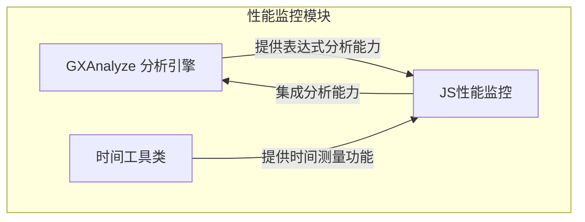
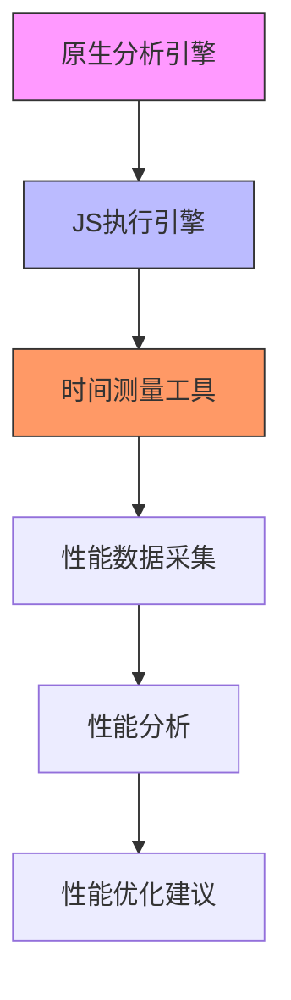
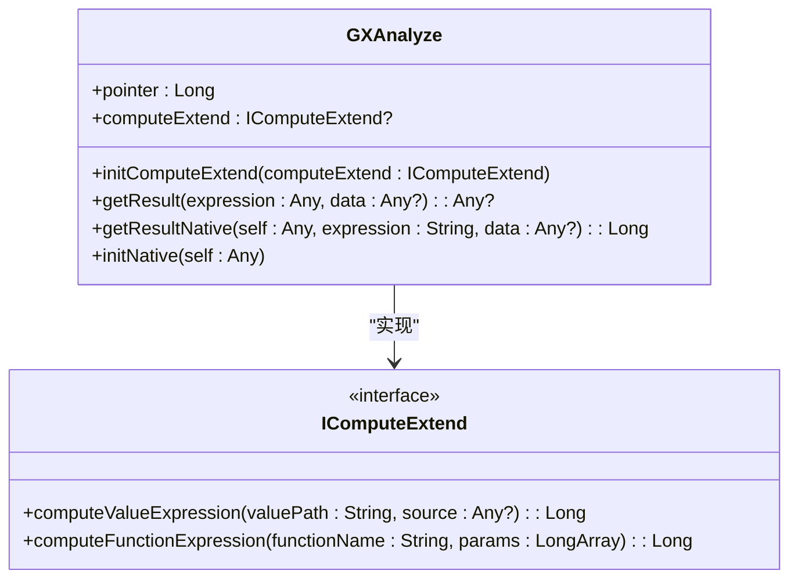
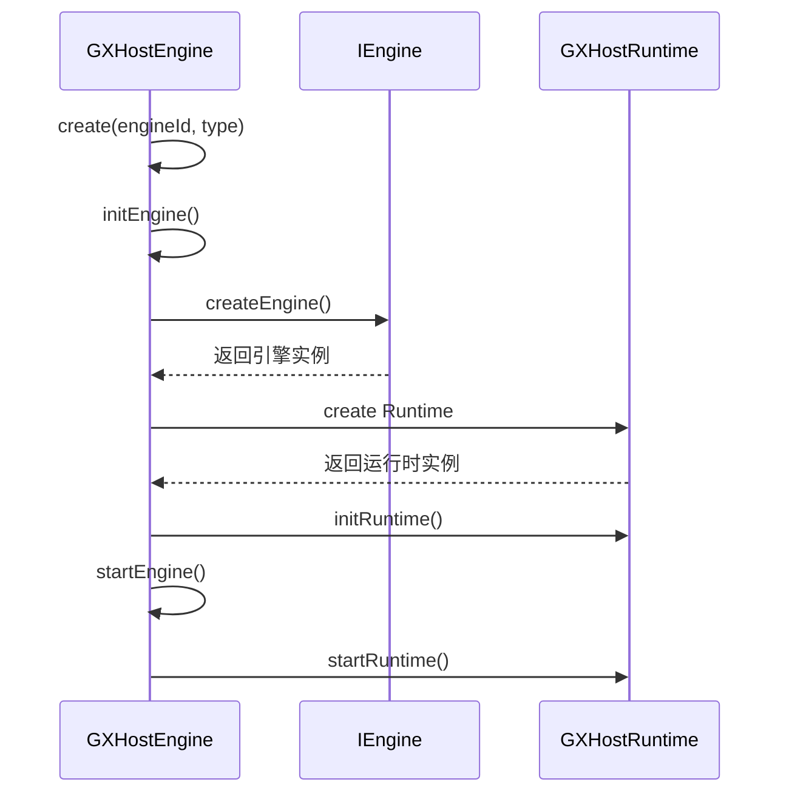
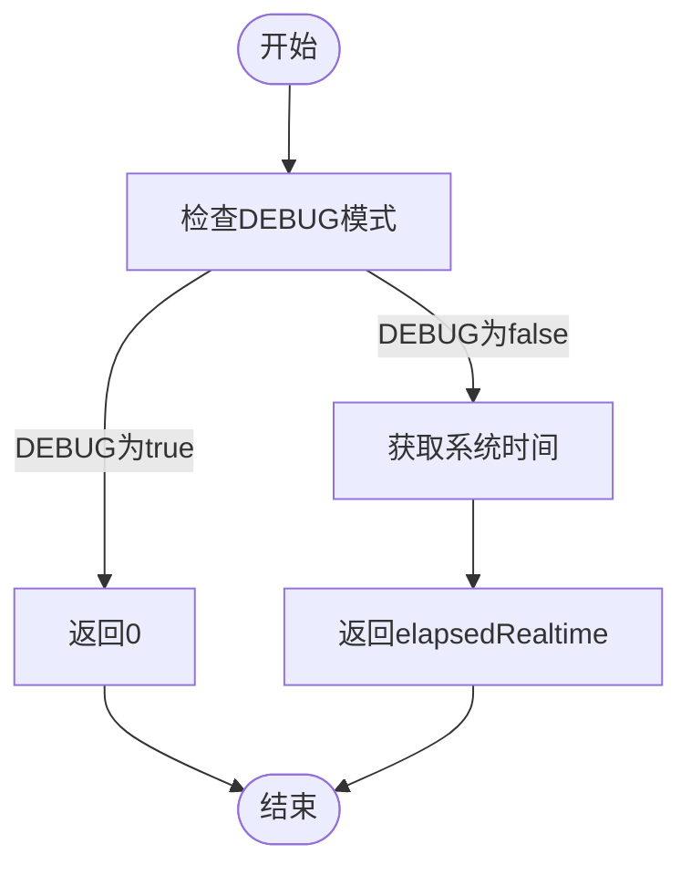
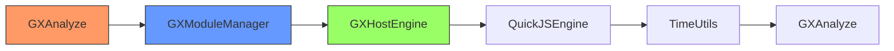

# 性能监控体系

<cite>
**本文档引用的文件**
- [GXAnalyze.kt](file://GaiaXAnalyze/GXAnalyzeAndroid/src/main/java/com/alibaba/gaiax/analyze/GXAnalyze.kt)
- [TimeUtils.kt](file://GaiaXAndroidJS/src/main/kotlin/com/alibaba/gaiax/js/utils/TimeUtils.kt)
- [GXHostEngine.kt](file://GaiaXAndroidJS/src/main/kotlin/com/alibaba/gaiax/js/engine/GXHostEngine.kt)
- [QuickJSEngine.kt](file://GaiaXAndroidJS/src/main/kotlin/com/alibaba/gaiax/js/impl/qjs/QuickJSEngine.kt)
- [GXModuleManager.kt](file://GaiaXAndroidJS/src/main/kotlin/com/alibaba/gaiax/js/support/GXModuleManager.kt)
- [GXAnalyzeWrapper.kt](file://GaiaXAnalyze/GXAnalyzeAndroid/src/androidTest/kotlin/com/alibaba/gaiax/analyze/GXAnalyzeWrapper.kt)
- [GXAnalyze.h](file://GaiaXAnalyze/GXAnalyzeAndroid/src/main/cpp/GXAnalyzeCore/GXAnalyze.h)
</cite>

## 目录
1. [简介](#简介)
2. [项目结构](#项目结构)
3. [核心组件](#核心组件)
4. [架构概述](#架构概述)
5. [详细组件分析](#详细组件分析)
6. [依赖分析](#依赖分析)
7. [性能考量](#性能考量)
8. [故障排除指南](#故障排除指南)
9. [结论](#结论)

## 简介
GaiaX框架提供了一套完整的性能监控体系，旨在帮助开发者全面监控和优化应用性能。本指南基于实际代码库中的性能测量实现，详细介绍如何建立全面的性能指标监控系统。内容涵盖渲染性能、内存使用、JS执行效率等关键指标的监控方法，以及如何集成性能监控平台。为初学者提供基本的性能数据采集指导，同时为经验丰富的开发者提供高级性能分析策略。

## 项目结构
GaiaX框架的性能监控相关代码分布在多个模块中，主要包括分析引擎、JS执行引擎和工具类。这些模块协同工作，实现全面的性能监控功能。

**图表来源**
- [GXAnalyze.kt](file://GaiaXAnalyze/GXAnalyzeAndroid/src/main/java/com/alibaba/gaiax/analyze/GXAnalyze.kt#L1-L141)
- [TimeUtils.kt](file://GaiaXAndroidJS/src/main/kotlin/com/alibaba/gaiax/js/utils/TimeUtils.kt#L1-L15)

## 核心组件
GaiaX框架的性能监控体系由多个核心组件构成，包括表达式分析引擎、JS执行引擎和时间测量工具。这些组件共同实现了对应用性能的全面监控。

**章节来源**
- [GXAnalyze.kt](file://GaiaXAnalyze/GXAnalyzeAndroid/src/main/java/com/alibaba/gaiax/analyze/GXAnalyze.kt#L1-L141)
- [TimeUtils.kt](file://GaiaXAndroidJS/src/main/kotlin/com/alibaba/gaiax/js/utils/TimeUtils.kt#L1-L15)

## 架构概述
GaiaX框架的性能监控架构采用分层设计，从底层的原生分析引擎到上层的JS执行引擎，形成完整的性能监控链条。

**图表来源**
- [GXAnalyze.h](file://GaiaXAnalyze/GXAnalyzeAndroid/src/main/cpp/GXAnalyzeCore/GXAnalyze.h#L15-L44)
- [GXHostEngine.kt](file://GaiaXAndroidJS/src/main/kotlin/com/alibaba/gaiax/js/engine/GXHostEngine.kt#L1-L96)

## 详细组件分析
### 表达式分析引擎
表达式分析引擎是GaiaX框架性能监控的核心组件之一，负责处理各种表达式计算和性能分析。

#### 类图

**图表来源**
- [GXAnalyze.kt](file://GaiaXAnalyze/GXAnalyzeAndroid/src/main/java/com/alibaba/gaiax/analyze/GXAnalyze.kt#L8-L141)
- [GXAnalyzeWrapper.kt](file://GaiaXAnalyze/GXAnalyzeAndroid/src/androidTest/kotlin/com/alibaba/gaiax/analyze/GXAnalyzeWrapper.kt#L23-L135)

### JS执行引擎
JS执行引擎负责管理JS代码的执行过程，是性能监控的重要组成部分。

#### 序列图

**图表来源**
- [GXHostEngine.kt](file://GaiaXAndroidJS/src/main/kotlin/com/alibaba/gaiax/js/engine/GXHostEngine.kt#L16-L96)
- [QuickJSEngine.kt](file://GaiaXAndroidJS/src/main/kotlin/com/alibaba/gaiax/js/impl/qjs/QuickJSEngine.kt#L10-L40)

### 时间测量工具
时间测量工具提供精确的时间测量功能，是性能监控的基础。

#### 流程图

**图表来源**
- [TimeUtils.kt](file://GaiaXAndroidJS/src/main/kotlin/com/alibaba/gaiax/js/utils/TimeUtils.kt#L5-L15)

**章节来源**
- [TimeUtils.kt](file://GaiaXAndroidJS/src/main/kotlin/com/alibaba/gaiax/js/utils/TimeUtils.kt#L1-L15)

## 依赖分析
GaiaX框架的性能监控组件之间存在明确的依赖关系，这些依赖关系确保了性能监控功能的完整性和可靠性。

**图表来源**
- [GXModuleManager.kt](file://GaiaXAndroidJS/src/main/kotlin/com/alibaba/gaiax/js/support/GXModuleManager.kt#L7-L59)
- [GXHostEngine.kt](file://GaiaXAndroidJS/src/main/kotlin/com/alibaba/gaiax/js/engine/GXHostEngine.kt#L16-L96)

**章节来源**
- [GXModuleManager.kt](file://GaiaXAndroidJS/src/main/kotlin/com/alibaba/gaiax/js/support/GXModuleManager.kt#L1-L59)

## 性能考量
在使用GaiaX框架的性能监控体系时，需要考虑以下几个方面：

1. **性能开销**：性能监控本身会带来一定的性能开销，建议在生产环境中合理配置监控级别。
2. **内存使用**：监控数据的采集和存储会占用内存，需要合理管理监控数据的生命周期。
3. **线程安全**：性能监控组件需要保证线程安全，避免在多线程环境下出现数据竞争。
4. **扩展性**：框架提供了扩展接口，可以根据需要自定义性能监控逻辑。

## 故障排除指南
在使用性能监控功能时，可能会遇到以下常见问题：

1. **监控数据不准确**：检查时间测量工具的配置，确保没有启用DEBUG模式。
2. **性能下降**：降低监控级别或关闭不必要的监控功能。
3. **内存泄漏**：确保及时释放监控数据，避免长时间持有大对象引用。
4. **集成问题**：检查各组件的依赖关系，确保正确初始化和配置。

**章节来源**
- [GXAnalyze.kt](file://GaiaXAnalyze/GXAnalyzeAndroid/src/main/java/com/alibaba/gaiax/analyze/GXAnalyze.kt#L28-L31)
- [TimeUtils.kt](file://GaiaXAndroidJS/src/main/kotlin/com/alibaba/gaiax/js/utils/TimeUtils.kt#L7-L14)

## 结论
GaiaX框架提供了一套完整的性能监控解决方案，通过表达式分析引擎、JS执行引擎和时间测量工具的协同工作，实现了对应用性能的全面监控。开发者可以根据需要选择合适的监控策略，从基础的数据采集到高级的性能分析，持续优化应用性能。