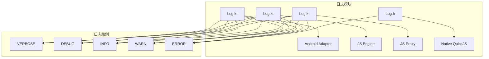
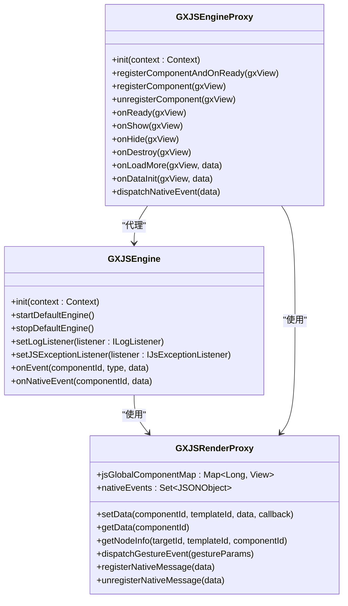
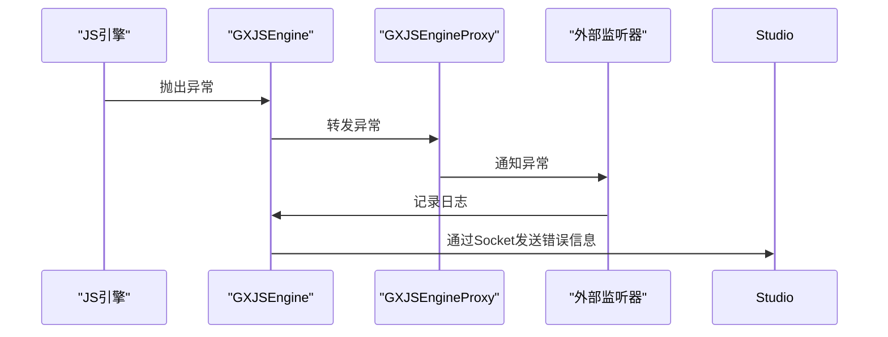
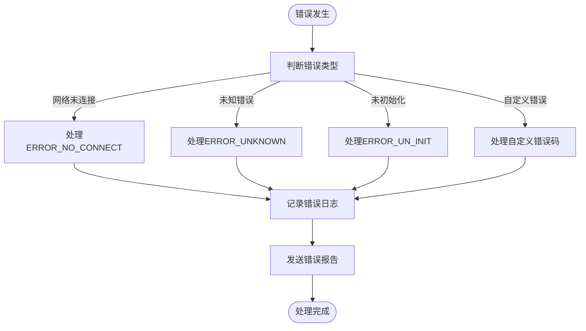
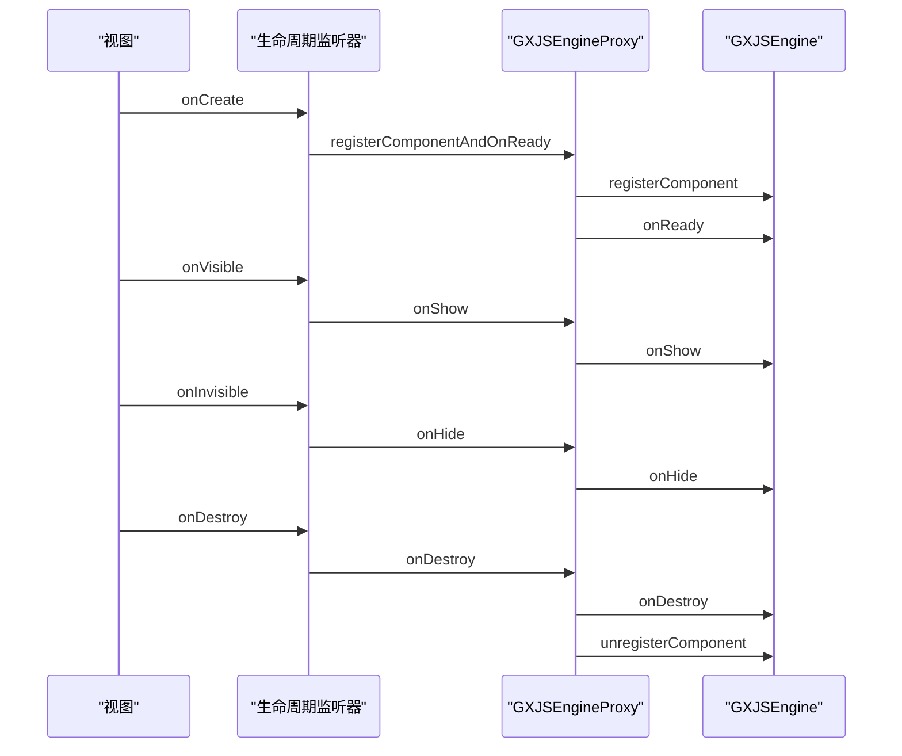
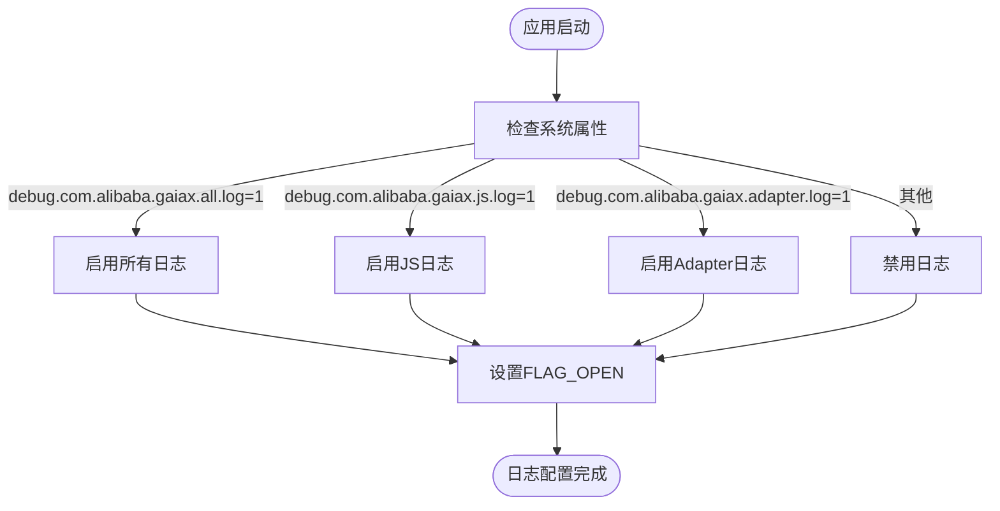
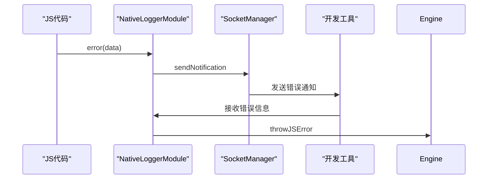

# 监控告警体系

<cite>
**本文档引用文件**  
- [Log.kt](file://GaiaXAndroidAdapter/src/main/java/com/alibaba/gaiax/adapter/Log.kt)
- [Log.kt](file://GaiaXAndroidJS/src/main/kotlin/com/alibaba/gaiax/js/utils/Log.kt)
- [Log.kt](file://GaiaXAndroidJSProxy/src/main/java/com/alibaba/gaiax/js/proxy/Log.kt)
- [Log.h](file://GaiaXAndroidQuickJS/src/main/c/Log.h)
- [GXJSEngine.kt](file://GaiaXAndroidJS/src/main/kotlin/com/alibaba/gaiax/js/GXJSEngine.kt)
- [GXJSRenderProxy.kt](file://GaiaXAndroidJSProxy/src/main/java/com/alibaba/gaiax/js/proxy/GXJSRenderProxy.kt)
- [GXJSEngineProxy.kt](file://GaiaXAndroidJSProxy/src/main/java/com/alibaba/gaiax/js/proxy/GXJSEngineProxy.kt)
- [ErrorResponse.java](file://GaiaXAndroidClientToStudio/src/main/java/com/alibaba/gaiax/studio/third/socket/websocket/response/ErrorResponse.java)
- [GaiaXJSNativeLoggerModule.m](file://GaiaXJSiOS/GaiaXJS/src/bridge/modules/GaiaXJSNativeLoggerModule.m)
</cite>

## 目录
1. [引言](#引言)
2. [日志系统架构](#日志系统架构)
3. [核心监控组件](#核心监控组件)
4. [错误上报机制](#错误上报机制)
5. [性能与稳定性监控](#性能与稳定性监控)
6. [告警阈值与故障排查](#告警阈值与故障排查)
7. [跨平台监控集成](#跨平台监控集成)
8. [最佳实践](#最佳实践)

## 引言
GaiaX框架提供了一套完整的运行时监控与告警体系，旨在帮助开发者及时发现并解决生产环境中的问题。本指南基于实际代码库实现，详细阐述了如何构建有效的监控告警机制，涵盖错误上报、性能监控、稳定性监控以及与外部监控平台的集成策略。

## 日志系统架构
GaiaX框架在多个模块中实现了统一的日志记录机制，支持不同级别的日志输出和条件性日志控制。

**图表来源**  
- [Log.kt](file://GaiaXAndroidAdapter/src/main/java/com/alibaba/gaiax/adapter/Log.kt#L8-L53)
- [Log.kt](file://GaiaXAndroidJS/src/main/kotlin/com/alibaba/gaiax/js/utils/Log.kt#L8-L67)
- [Log.kt](file://GaiaXAndroidJSProxy/src/main/java/com/alibaba/gaiax/js/proxy/Log.kt#L8-L53)
- [Log.h](file://GaiaXAndroidQuickJS/src/main/c/Log.h#L1-L19)

**章节来源**  
- [Log.kt](file://GaiaXAndroidAdapter/src/main/java/com/alibaba/gaiax/adapter/Log.kt#L8-L53)
- [Log.kt](file://GaiaXAndroidJS/src/main/kotlin/com/alibaba/gaiax/js/utils/Log.kt#L8-L67)
- [Log.kt](file://GaiaXAndroidJSProxy/src/main/java/com/alibaba/gaiax/js/proxy/Log.kt#L8-L53)
- [Log.h](file://GaiaXAndroidQuickJS/src/main/c/Log.h#L1-L19)

## 核心监控组件
GaiaX的核心监控能力主要由`GXJSEngine`、`GXJSRenderProxy`和`GXJSEngineProxy`三个组件构成，它们协同工作以实现全面的运行时监控。

**图表来源**  
- [GXJSEngine.kt](file://GaiaXAndroidJS/src/main/kotlin/com/alibaba/gaiax/js/GXJSEngine.kt#L20-L426)
- [GXJSRenderProxy.kt](file://GaiaXAndroidJSProxy/src/main/java/com/alibaba/gaiax/js/proxy/GXJSRenderProxy.kt#L14-L181)
- [GXJSEngineProxy.kt](file://GaiaXAndroidJSProxy/src/main/java/com/alibaba/gaiax/js/proxy/GXJSEngineProxy.kt#L45-L407)

**章节来源**  
- [GXJSEngine.kt](file://GaiaXAndroidJS/src/main/kotlin/com/alibaba/gaiax/js/GXJSEngine.kt#L20-L426)
- [GXJSRenderProxy.kt](file://GaiaXAndroidJSProxy/src/main/java/com/alibaba/gaiax/js/proxy/GXJSRenderProxy.kt#L14-L181)
- [GXJSEngineProxy.kt](file://GaiaXAndroidJSProxy/src/main/java/com/alibaba/gaiax/js/proxy/GXJSEngineProxy.kt#L45-L407)

## 错误上报机制
GaiaX框架通过多层次的错误捕获和上报机制确保运行时异常能够被及时发现和处理。

### JS异常监听
`GXJSEngine`提供了`IJsExceptionListener`接口，允许外部监听JS执行过程中的异常：

**图表来源**  
- [GXJSEngine.kt](file://GaiaXAndroidJS/src/main/kotlin/com/alibaba/gaiax/js/GXJSEngine.kt#L404-L417)
- [GXJSEngineProxy.kt](file://GaiaXAndroidJSProxy/src/main/java/com/alibaba/gaiax/js/proxy/GXJSEngineProxy.kt#L98-L107)

**章节来源**  
- [GXJSEngine.kt](file://GaiaXAndroidJS/src/main/kotlin/com/alibaba/gaiax/js/GXJSEngine.kt#L404-L417)
- [GXJSEngineProxy.kt](file://GaiaXAndroidJSProxy/src/main/java/com/alibaba/gaiax/js/proxy/GXJSEngineProxy.kt#L98-L107)

### 原生错误处理
对于原生层的错误，框架通过`ErrorResponse`类进行封装和处理：

**图表来源**  
- [ErrorResponse.java](file://GaiaXAndroidClientToStudio/src/main/java/com/alibaba/gaiax/studio/third/socket/websocket/response/ErrorResponse.java#L1-L56)

**章节来源**  
- [ErrorResponse.java](file://GaiaXAndroidClientToStudio/src/main/java/com/alibaba/gaiax/studio/third/socket/websocket/response/ErrorResponse.java#L1-L56)

## 性能与稳定性监控
GaiaX框架通过组件生命周期监控和性能指标收集来保障应用的稳定运行。

### 组件生命周期监控
`GXJSEngineProxy`通过注册`GXIItemViewLifecycleListener`来监控视图的生命周期变化：

**图表来源**  
- [GXJSEngineProxy.kt](file://GaiaXAndroidJSProxy/src/main/java/com/alibaba/gaiax/js/proxy/GXJSEngineProxy.kt#L123-L158)

**章节来源**  
- [GXJSEngineProxy.kt](file://GaiaXAndroidJSProxy/src/main/java/com/alibaba/gaiax/js/proxy/GXJSEngineProxy.kt#L123-L158)

### 性能指标收集
框架通过`TimeUtils`等工具类收集关键性能指标，如JS执行时间、组件渲染时间等。

## 告警阈值与故障排查
### 日志级别控制
GaiaX提供了灵活的日志级别控制机制，通过系统属性进行动态配置：

**图表来源**  
- [Log.kt](file://GaiaXAndroidJS/src/main/kotlin/com/alibaba/gaiax/js/utils/Log.kt#L70-L72)
- [Log.kt](file://GaiaXAndroidAdapter/src/main/java/com/alibaba/gaiax/adapter/Log.kt#L56-L58)

**章节来源**  
- [Log.kt](file://GaiaXAndroidJS/src/main/kotlin/com/alibaba/gaiax/js/utils/Log.kt#L70-L72)
- [Log.kt](file://GaiaXAndroidAdapter/src/main/java/com/alibaba/gaiax/adapter/Log.kt#L56-L58)

### 故障排查流程
当出现问题时，建议按照以下步骤进行排查：
1. 检查日志输出级别是否已开启
2. 查看JS引擎异常日志
3. 检查组件生命周期是否正常
4. 验证原生与JS通信是否畅通
5. 检查网络连接状态

## 跨平台监控集成
GaiaX框架支持多平台监控集成，包括Android、iOS和HarmonyOS。

### iOS平台集成
在iOS平台上，通过`GaiaXJSNativeLoggerModule`实现日志上报：

**图表来源**  
- [GaiaXJSNativeLoggerModule.m](file://GaiaXJSiOS/GaiaXJS/src/bridge/modules/GaiaXJSNativeLoggerModule.m#L42-L58)

**章节来源**  
- [GaiaXJSNativeLoggerModule.m](file://GaiaXJSiOS/GaiaXJS/src/bridge/modules/GaiaXJSNativeLoggerModule.m#L42-L58)

## 最佳实践
### 初学者配置指导
1. 在`AndroidManifest.xml`中添加调试属性
2. 初始化`GXJSEngineProxy`并设置异常监听器
3. 开启日志输出以便调试
4. 使用`registerComponentAndOnReady`注册组件

### 高级监控策略
1. 实现自定义`ILogListener`收集错误日志
2. 集成第三方监控平台（如Sentry、Bugly）
3. 设置性能监控指标和告警阈值
4. 实现自动化错误分析和报告生成
5. 建立监控数据看板，实时观察系统状态

通过以上监控告警体系的建设，开发者可以全面掌握GaiaX应用的运行状态，及时发现并解决潜在问题，确保应用的稳定性和用户体验。