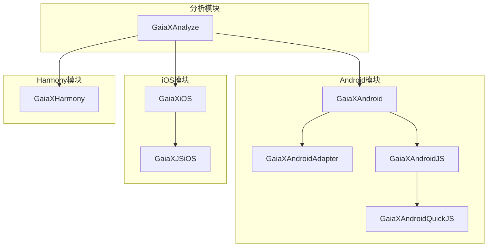
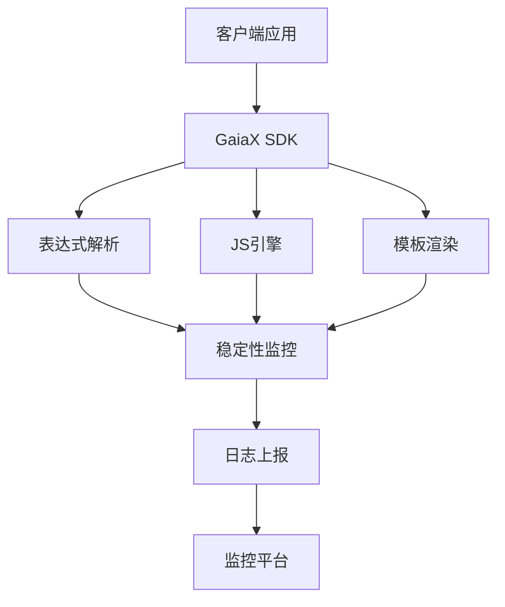
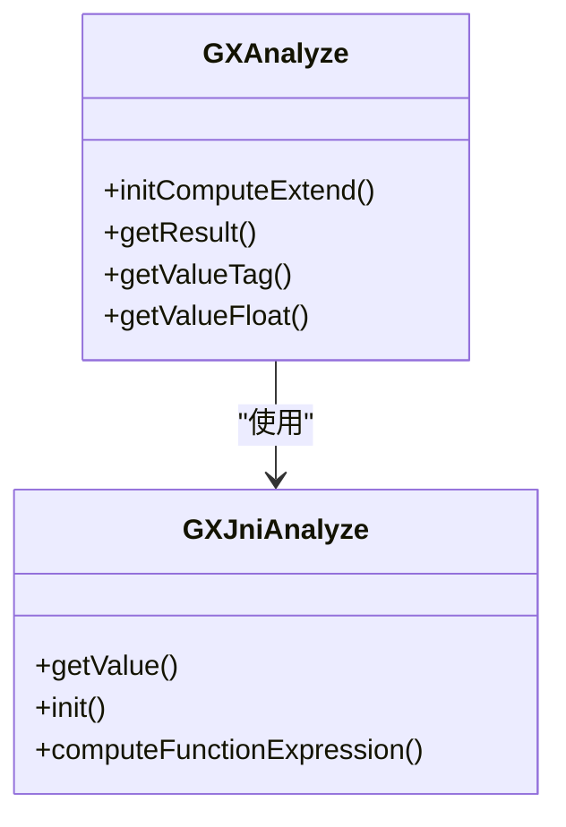
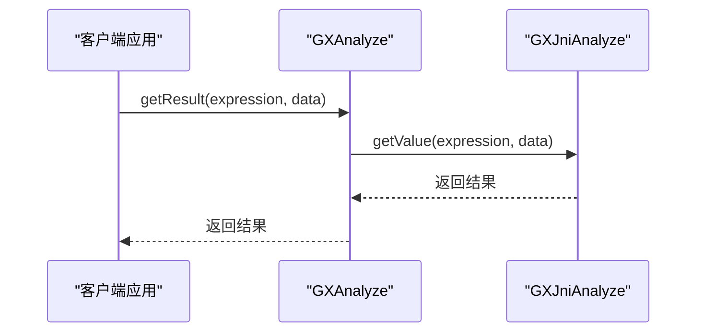
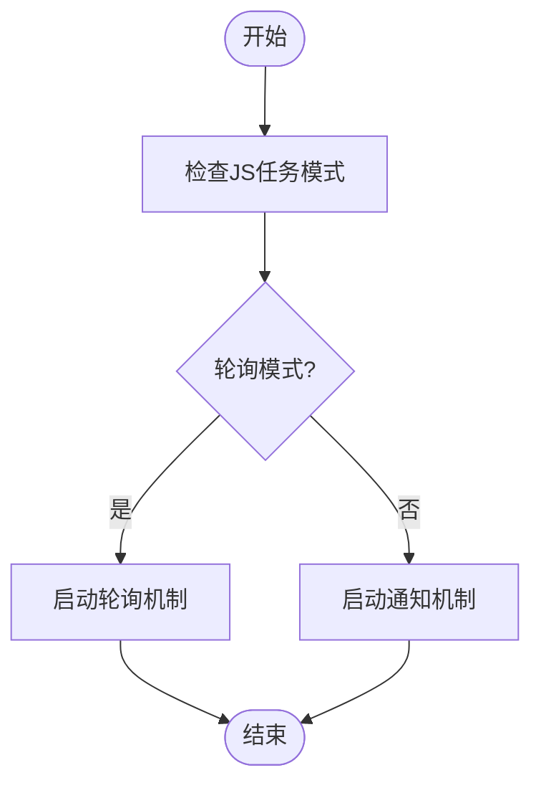
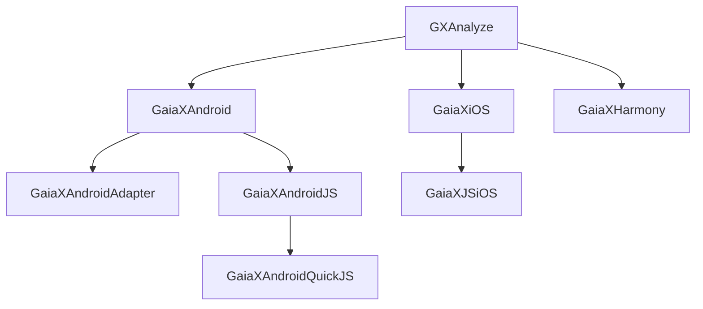

# 稳定性监控

<cite>
**本文档引用文件**  
- [GXAnalyzeAndroid](file://GaiaXAnalyze/GXAnalyzeAndroid)
- [GXAnalyzeWrapper.kt](file://GaiaXAnalyze/GXAnalyzeAndroid/src/androidTest/kotlin/com/alibaba/gaiax/analyze/GXAnalyzeWrapper.kt)
- [GXJniAnalyze.cpp](file://GaiaXAnalyze/GXAnalyzeAndroid/src/main/cpp/GXJniAnalyze.cpp)
- [ConfigUtils.kt](file://GaiaXAndroidJS/src/main/kotlin/com/alibaba/gaiax/js/utils/ConfigUtils.kt)
- [pending_job_notifier.c](file://GaiaXAndroidQuickJS/src/main/c/pending_job_notifier.c)
- [GaiaXCommandCenter.h](file://GaiaXiOSDemo/GaiaXiOSDemo/Preview/DevTools/GaiaXCommandCenter.h)
</cite>

## 目录
1. [简介](#简介)
2. [项目结构](#项目结构)
3. [核心组件](#核心组件)
4. [架构概述](#架构概述)
5. [详细组件分析](#详细组件分析)
6. [依赖分析](#依赖分析)
7. [性能考量](#性能考量)
8. [故障排除指南](#故障排除指南)
9. [结论](#结论)
10. [附录](#附录)（如有必要）

## 简介
本指南旨在为GaiaX框架提供全面的稳定性监控解决方案。基于实际代码库中的稳定性检测实现，文档将详细介绍如何构建可靠的稳定性监控系统，涵盖崩溃率监控、ANR监控、内存泄漏检测等关键指标。同时，为初学者提供基础配置指导，为高级开发者提供优化策略，确保应用长期稳定运行。

## 项目结构
GaiaX框架的项目结构清晰地划分为多个模块，每个模块负责不同的功能。核心模块包括GaiaXAnalyze、GaiaXAndroid、GaiaXAndroidJS等，这些模块共同构成了框架的基础。通过分析这些模块，可以更好地理解稳定性监控的实现方式。

**图表来源**
- [GXAnalyzeAndroid](file://GaiaXAnalyze/GXAnalyzeAndroid)
- [GaiaXAndroid](file://GaiaXAndroid)
- [GaiaXiOS](file://GaiaXiOS)
- [GaiaXHarmony](file://GaiaXHarmony)

**章节来源**
- [GXAnalyzeAndroid](file://GaiaXAnalyze/GXAnalyzeAndroid)
- [GaiaXAndroid](file://GaiaXAndroid)
- [GaiaXiOS](file://GaiaXiOS)
- [GaiaXHarmony](file://GaiaXHarmony)

## 核心组件
GaiaX框架的核心组件包括表达式解析引擎、JS引擎、适配器等。这些组件在稳定性监控中扮演着重要角色。例如，表达式解析引擎用于处理复杂的逻辑判断，而JS引擎则负责执行JavaScript代码。

**章节来源**
- [GXAnalyzeWrapper.kt](file://GaiaXAnalyze/GXAnalyzeAndroid/src/androidTest/kotlin/com/alibaba/gaiax/analyze/GXAnalyzeWrapper.kt)
- [ConfigUtils.kt](file://GaiaXAndroidJS/src/main/kotlin/com/alibaba/gaiax/js/utils/ConfigUtils.kt)

## 架构概述
GaiaX框架的架构设计充分考虑了跨平台兼容性和高性能需求。通过使用Rust、Kotlin、Swift等多种语言，框架实现了高效的原生渲染。稳定性监控系统作为框架的一部分，集成在各个模块中，确保了应用的稳定运行。

**图表来源**
- [GXAnalyzeWrapper.kt](file://GaiaXAnalyze/GXAnalyzeAndroid/src/androidTest/kotlin/com/alibaba/gaiax/analyze/GXAnalyzeWrapper.kt)
- [ConfigUtils.kt](file://GaiaXAndroidJS/src/main/kotlin/com/alibaba/gaiax/js/utils/ConfigUtils.kt)
- [pending_job_notifier.c](file://GaiaXAndroidQuickJS/src/main/c/pending_job_notifier.c)

## 详细组件分析
### 表达式解析组件分析
表达式解析组件是GaiaX框架中的关键部分，负责处理复杂的逻辑判断。通过JNI调用C++代码，实现了高效的表达式计算。

#### 类图

**图表来源**
- [GXAnalyzeWrapper.kt](file://GaiaXAnalyze/GXAnalyzeAndroid/src/androidTest/kotlin/com/alibaba/gaiax/analyze/GXAnalyzeWrapper.kt)
- [GXJniAnalyze.cpp](file://GaiaXAnalyze/GXAnalyzeAndroid/src/main/cpp/GXJniAnalyze.cpp)

#### 序列图

**图表来源**
- [GXAnalyzeWrapper.kt](file://GaiaXAnalyze/GXAnalyzeAndroid/src/androidTest/kotlin/com/alibaba/gaiax/analyze/GXAnalyzeWrapper.kt)
- [GXJniAnalyze.cpp](file://GaiaXAnalyze/GXAnalyzeAndroid/src/main/cpp/GXJniAnalyze.cpp)

**章节来源**
- [GXAnalyzeWrapper.kt](file://GaiaXAnalyze/GXAnalyzeAndroid/src/androidTest/kotlin/com/alibaba/gaiax/analyze/GXAnalyzeWrapper.kt)
- [GXJniAnalyze.cpp](file://GaiaXAnalyze/GXAnalyzeAndroid/src/main/cpp/GXJniAnalyze.cpp)

### JS引擎组件分析
JS引擎组件负责执行JavaScript代码，支持动态模板的渲染。通过配置工具类，可以灵活调整JS任务模式和超时时间。

#### 流程图

**图表来源**
- [ConfigUtils.kt](file://GaiaXAndroidJS/src/main/kotlin/com/alibaba/gaiax/js/utils/ConfigUtils.kt)

**章节来源**
- [ConfigUtils.kt](file://GaiaXAndroidJS/src/main/kotlin/com/alibaba/gaiax/js/utils/ConfigUtils.kt)

## 依赖分析
GaiaX框架的各个模块之间存在紧密的依赖关系。通过分析这些依赖，可以更好地理解系统的整体架构。

**图表来源**
- [GXAnalyzeAndroid](file://GaiaXAnalyze/GXAnalyzeAndroid)
- [GaiaXAndroid](file://GaiaXAndroid)
- [GaiaXiOS](file://GaiaXiOS)
- [GaiaXHarmony](file://GaiaXHarmony)

**章节来源**
- [GXAnalyzeAndroid](file://GaiaXAnalyze/GXAnalyzeAndroid)
- [GaiaXAndroid](file://GaiaXAndroid)
- [GaiaXiOS](file://GaiaXiOS)
- [GaiaXHarmony](file://GaiaXHarmony)

## 性能考量
在设计稳定性监控系统时，性能是一个重要的考量因素。通过优化表达式解析和JS引擎的性能，可以显著提升应用的响应速度和用户体验。

## 故障排除指南
当遇到稳定性问题时，可以通过查看日志和监控数据来定位问题。建议定期检查崩溃率、ANR率等关键指标，及时发现并解决问题。

**章节来源**
- [GaiaXCommandCenter.h](file://GaiaXiOSDemo/GaiaXiOSDemo/Preview/DevTools/GaiaXCommandCenter.h)

## 结论
通过本指南，开发者可以全面了解GaiaX框架的稳定性监控机制，并根据实际需求进行配置和优化。希望本文档能帮助开发者构建更加稳定可靠的应用。

## 附录
如有需要，可在此处添加额外的信息或参考资料。