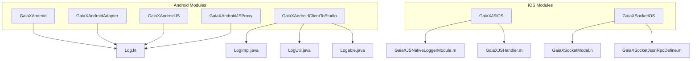
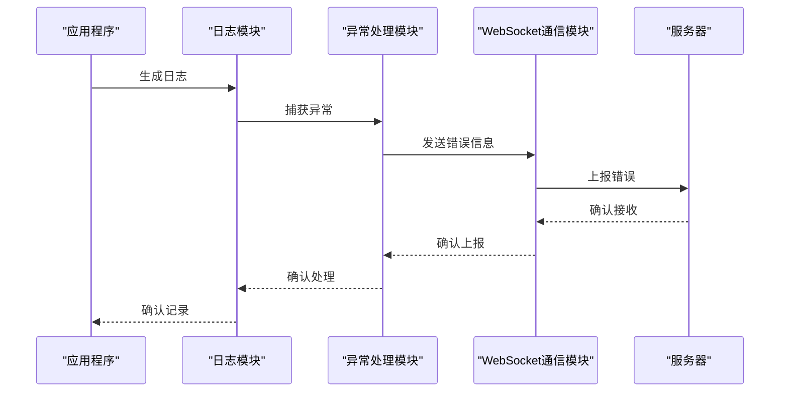
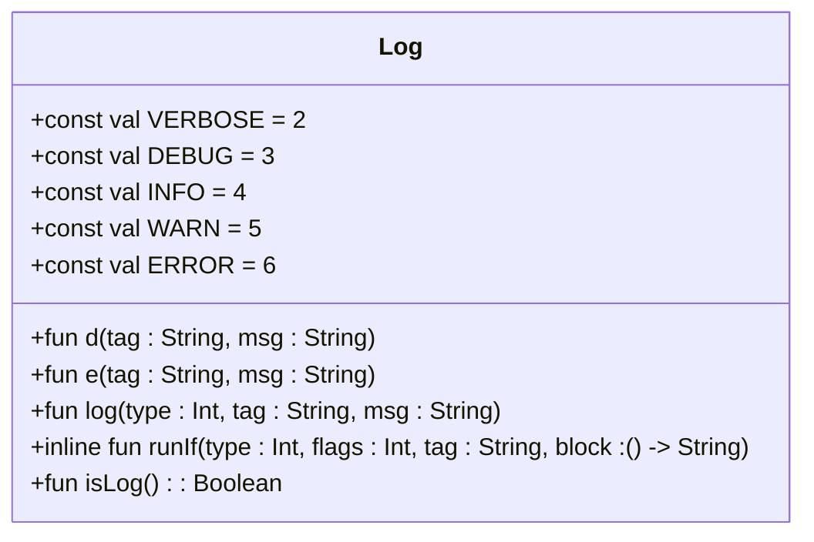
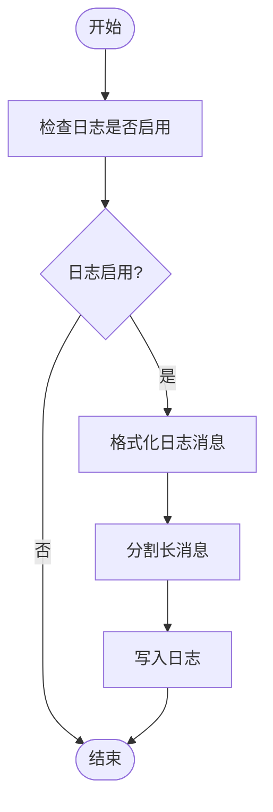
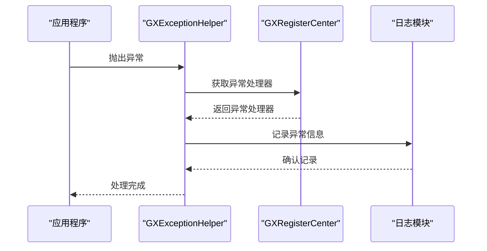
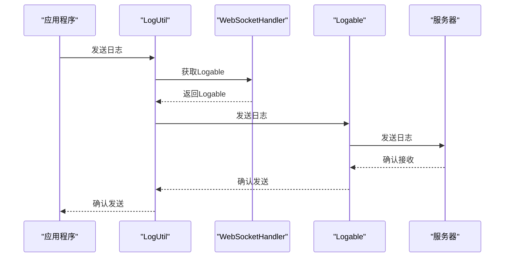
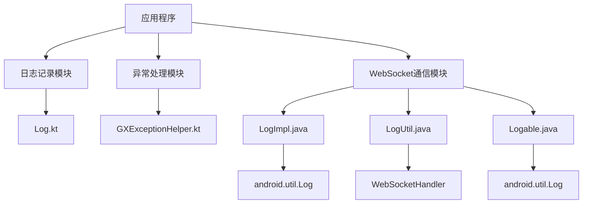

# 错误上报机制

<cite>
**本文档引用的文件**   
- [Log.kt](file://GaiaXAndroid/src/main/kotlin/com/alibaba/gaiax/utils/Log.kt)
- [GXExceptionHelper.kt](file://GaiaXAndroid/src/main/kotlin/com/alibaba/gaiax/utils/GXExceptionHelper.kt)
- [Log.kt](file://GaiaXAndroidAdapter/src/main/java/com/alibaba/gaiax/adapter/Log.kt)
- [Log.kt](file://GaiaXAndroidJS/src/main/kotlin/com/alibaba/gaiax/js/utils/Log.kt)
- [Log.kt](file://GaiaXAndroidJSProxy/src/main/java/com/alibaba/gaiax/js/proxy/Log.kt)
- [LogImpl.java](file://GaiaXAndroidClientToStudio/src/main/java/com/alibaba/gaiax/studio/third/socket/websocket/util/LogImpl.java)
- [LogUtil.java](file://GaiaXAndroidClientToStudio/src/main/java/com/alibaba/gaiax/studio/third/socket/websocket/util/LogUtil.java)
- [Logable.java](file://GaiaXAndroidClientToStudio/src/main/java/com/alibaba/gaiax/studio/third/socket/websocket/util/Logable.java)
- [GaiaXJSNativeLoggerModule.m](file://GaiaXJSiOS/GaiaXJS/src/bridge/modules/GaiaXJSNativeLoggerModule.m)
- [GaiaXJSHandler.m](file://GaiaXJSiOS/GaiaXJS/src/GaiaXJSHandler.m)
- [GaiaXSocketModel.h](file://GaiaXSocketiOS/GaiaXSocket/GaiaXSocketModel.h)
- [GaiaXSocketJsonRpcDefine.m](file://GaiaXSocketiOS/GaiaXSocket/GaiaXSocketJsonRpcDefine.m)
</cite>

## 目录
1. [简介](#简介)
2. [项目结构](#项目结构)
3. [核心组件](#核心组件)
4. [架构概述](#架构概述)
5. [详细组件分析](#详细组件分析)
6. [依赖分析](#依赖分析)
7. [性能考虑](#性能考虑)
8. [故障排除指南](#故障排除指南)
9. [结论](#结论)

## 简介
GaiaX框架提供了一套全面的错误上报和日志记录机制，用于捕获和报告在Android和iOS平台上运行时的各种异常和错误。该机制通过多个模块协同工作，包括日志记录、异常处理和WebSocket通信，确保开发者能够及时发现和定位生产环境中的问题。本指南详细介绍了如何实现和配置这一错误上报系统，为初学者和经验丰富的开发者提供了最佳实践。

## 项目结构
GaiaX框架的错误上报机制分布在多个模块中，每个模块负责不同的功能。主要模块包括GaiaXAndroid、GaiaXAndroidAdapter、GaiaXAndroidJS、GaiaXAndroidJSProxy和GaiaXAndroidClientToStudio。这些模块通过日志记录和异常处理机制，确保错误信息能够被有效捕获和上报。

**图表来源**
- [Log.kt](file://GaiaXAndroid/src/main/kotlin/com/alibaba/gaiax/utils/Log.kt)
- [Log.kt](file://GaiaXAndroidAdapter/src/main/java/com/alibaba/gaiax/adapter/Log.kt)
- [Log.kt](file://GaiaXAndroidJS/src/main/kotlin/com/alibaba/gaiax/js/utils/Log.kt)
- [Log.kt](file://GaiaXAndroidJSProxy/src/main/java/com/alibaba/gaiax/js/proxy/Log.kt)
- [LogImpl.java](file://GaiaXAndroidClientToStudio/src/main/java/com/alibaba/gaiax/studio/third/socket/websocket/util/LogImpl.java)
- [LogUtil.java](file://GaiaXAndroidClientToStudio/src/main/java/com/alibaba/gaiax/studio/third/socket/websocket/util/LogUtil.java)
- [Logable.java](file://GaiaXAndroidClientToStudio/src/main/java/com/alibaba/gaiax/studio/third/socket/websocket/util/Logable.java)
- [GaiaXJSNativeLoggerModule.m](file://GaiaXJSiOS/GaiaXJS/src/bridge/modules/GaiaXJSNativeLoggerModule.m)
- [GaiaXJSHandler.m](file://GaiaXJSiOS/GaiaXJS/src/GaiaXJSHandler.m)
- [GaiaXSocketModel.h](file://GaiaXSocketiOS/GaiaXSocket/GaiaXSocketModel.h)
- [GaiaXSocketJsonRpcDefine.m](file://GaiaXSocketiOS/GaiaXSocket/GaiaXSocketJsonRpcDefine.m)

**章节来源**
- [Log.kt](file://GaiaXAndroid/src/main/kotlin/com/alibaba/gaiax/utils/Log.kt)
- [Log.kt](file://GaiaXAndroidAdapter/src/main/java/com/alibaba/gaiax/adapter/Log.kt)
- [Log.kt](file://GaiaXAndroidJS/src/main/kotlin/com/alibaba/gaiax/js/utils/Log.kt)
- [Log.kt](file://GaiaXAndroidJSProxy/src/main/java/com/alibaba/gaiax/js/proxy/Log.kt)
- [LogImpl.java](file://GaiaXAndroidClientToStudio/src/main/java/com/alibaba/gaiax/studio/third/socket/websocket/util/LogImpl.java)
- [LogUtil.java](file://GaiaXAndroidClientToStudio/src/main/java/com/alibaba/gaiax/studio/third/socket/websocket/util/LogUtil.java)
- [Logable.java](file://GaiaXAndroidClientToStudio/src/main/java/com/alibaba/gaiax/studio/third/socket/websocket/util/Logable.java)
- [GaiaXJSNativeLoggerModule.m](file://GaiaXJSiOS/GaiaXJS/src/bridge/modules/GaiaXJSNativeLoggerModule.m)
- [GaiaXJSHandler.m](file://GaiaXJSiOS/GaiaXJS/src/GaiaXJSHandler.m)
- [GaiaXSocketModel.h](file://GaiaXSocketiOS/GaiaXSocket/GaiaXSocketModel.h)
- [GaiaXSocketJsonRpcDefine.m](file://GaiaXSocketiOS/GaiaXSocket/GaiaXSocketJsonRpcDefine.m)

## 核心组件
GaiaX框架的核心组件包括日志记录模块、异常处理模块和WebSocket通信模块。日志记录模块负责捕获和记录各种级别的日志信息，异常处理模块负责捕获和处理运行时异常，WebSocket通信模块负责将错误信息上报到服务器。

**章节来源**
- [Log.kt](file://GaiaXAndroid/src/main/kotlin/com/alibaba/gaiax/utils/Log.kt)
- [GXExceptionHelper.kt](file://GaiaXAndroid/src/main/kotlin/com/alibaba/gaiax/utils/GXExceptionHelper.kt)
- [LogImpl.java](file://GaiaXAndroidClientToStudio/src/main/java/com/alibaba/gaiax/studio/third/socket/websocket/util/LogImpl.java)
- [LogUtil.java](file://GaiaXAndroidClientToStudio/src/main/java/com/alibaba/gaiax/studio/third/socket/websocket/util/LogUtil.java)
- [Logable.java](file://GaiaXAndroidClientToStudio/src/main/java/com/alibaba/gaiax/studio/third/socket/websocket/util/Logable.java)

## 架构概述
GaiaX框架的错误上报机制通过多个模块协同工作，确保错误信息能够被有效捕获和上报。日志记录模块负责捕获和记录各种级别的日志信息，异常处理模块负责捕获和处理运行时异常，WebSocket通信模块负责将错误信息上报到服务器。

**图表来源**
- [Log.kt](file://GaiaXAndroid/src/main/kotlin/com/alibaba/gaiax/utils/Log.kt)
- [GXExceptionHelper.kt](file://GaiaXAndroid/src/main/kotlin/com/alibaba/gaiax/utils/GXExceptionHelper.kt)
- [LogImpl.java](file://GaiaXAndroidClientToStudio/src/main/java/com/alibaba/gaiax/studio/third/socket/websocket/util/LogImpl.java)
- [LogUtil.java](file://GaiaXAndroidClientToStudio/src/main/java/com/alibaba/gaiax/studio/third/socket/websocket/util/LogUtil.java)
- [Logable.java](file://GaiaXAndroidClientToStudio/src/main/java/com/alibaba/gaiax/studio/third/socket/websocket/util/Logable.java)

## 详细组件分析

### 日志记录模块分析
日志记录模块是GaiaX框架的基础组件，负责捕获和记录各种级别的日志信息。该模块通过`Log`对象提供了一系列静态方法，用于记录不同级别的日志信息。

#### 日志级别定义

**图表来源**
- [Log.kt](file://GaiaXAndroid/src/main/kotlin/com/alibaba/gaiax/utils/Log.kt)

#### 日志记录流程

**图表来源**
- [Log.kt](file://GaiaXAndroid/src/main/kotlin/com/alibaba/gaiax/utils/Log.kt)

**章节来源**
- [Log.kt](file://GaiaXAndroid/src/main/kotlin/com/alibaba/gaiax/utils/Log.kt)

### 异常处理模块分析
异常处理模块负责捕获和处理运行时异常，确保应用程序的稳定性和可靠性。该模块通过`GXExceptionHelper`对象提供了一系列静态方法，用于处理异常。

#### 异常处理流程

**图表来源**
- [GXExceptionHelper.kt](file://GaiaXAndroid/src/main/kotlin/com/alibaba/gaiax/utils/GXExceptionHelper.kt)
- [Log.kt](file://GaiaXAndroid/src/main/kotlin/com/alibaba/gaiax/utils/Log.kt)

**章节来源**
- [GXExceptionHelper.kt](file://GaiaXAndroid/src/main/kotlin/com/alibaba/gaiax/utils/GXExceptionHelper.kt)

### WebSocket通信模块分析
WebSocket通信模块负责将错误信息上报到服务器，确保开发者能够及时发现和定位生产环境中的问题。该模块通过`LogImpl`、`LogUtil`和`Logable`接口提供了一系列静态方法，用于发送和接收日志信息。

#### WebSocket通信流程

**图表来源**
- [LogUtil.java](file://GaiaXAndroidClientToStudio/src/main/java/com/alibaba/gaiax/studio/third/socket/websocket/util/LogUtil.java)
- [LogImpl.java](file://GaiaXAndroidClientToStudio/src/main/java/com/alibaba/gaiax/studio/third/socket/websocket/util/LogImpl.java)
- [Logable.java](file://GaiaXAndroidClientToStudio/src/main/java/com/alibaba/gaiax/studio/third/socket/websocket/util/Logable.java)

**章节来源**
- [LogUtil.java](file://GaiaXAndroidClientToStudio/src/main/java/com/alibaba/gaiax/studio/third/socket/websocket/util/LogUtil.java)
- [LogImpl.java](file://GaiaXAndroidClientToStudio/src/main/java/com/alibaba/gaiax/studio/third/socket/websocket/util/LogImpl.java)
- [Logable.java](file://GaiaXAndroidClientToStudio/src/main/java/com/alibaba/gaiax/studio/third/socket/websocket/util/Logable.java)

## 依赖分析
GaiaX框架的错误上报机制依赖于多个模块和库，包括日志记录模块、异常处理模块和WebSocket通信模块。这些模块通过接口和抽象类进行解耦，确保系统的灵活性和可扩展性。

**图表来源**
- [Log.kt](file://GaiaXAndroid/src/main/kotlin/com/alibaba/gaiax/utils/Log.kt)
- [GXExceptionHelper.kt](file://GaiaXAndroid/src/main/kotlin/com/alibaba/gaiax/utils/GXExceptionHelper.kt)
- [LogImpl.java](file://GaiaXAndroidClientToStudio/src/main/java/com/alibaba/gaiax/studio/third/socket/websocket/util/LogImpl.java)
- [LogUtil.java](file://GaiaXAndroidClientToStudio/src/main/java/com/alibaba/gaiax/studio/third/socket/websocket/util/LogUtil.java)
- [Logable.java](file://GaiaXAndroidClientToStudio/src/main/java/com/alibaba/gaiax/studio/third/socket/websocket/util/Logable.java)

**章节来源**
- [Log.kt](file://GaiaXAndroid/src/main/kotlin/com/alibaba/gaiax/utils/Log.kt)
- [GXExceptionHelper.kt](file://GaiaXAndroid/src/main/kotlin/com/alibaba/gaiax/utils/GXExceptionHelper.kt)
- [LogImpl.java](file://GaiaXAndroidClientToStudio/src/main/java/com/alibaba/gaiax/studio/third/socket/websocket/util/LogImpl.java)
- [LogUtil.java](file://GaiaXAndroidClientToStudio/src/main/java/com/alibaba/gaiax/studio/third/socket/websocket/util/LogUtil.java)
- [Logable.java](file://GaiaXAndroidClientToStudio/src/main/java/com/alibaba/gaiax/studio/third/socket/websocket/util/Logable.java)

## 性能考虑
在实现错误上报机制时，需要考虑性能影响。日志记录和异常处理可能会对应用程序的性能产生负面影响，特别是在高频率的日志记录和异常处理场景下。为了减少性能影响，可以采取以下措施：
- 限制日志记录的频率，避免频繁的日志记录。
- 使用异步方式发送日志信息，避免阻塞主线程。
- 优化日志消息的格式化和分割过程，减少CPU和内存开销。

## 故障排除指南
在使用GaiaX框架的错误上报机制时，可能会遇到一些常见问题。以下是一些故障排除建议：
- 确保日志记录模块已正确配置并启用。
- 检查异常处理模块是否正确注册了异常处理器。
- 确认WebSocket通信模块能够正常连接到服务器并发送日志信息。
- 查看日志文件，确认日志信息是否被正确记录和上报。

**章节来源**
- [Log.kt](file://GaiaXAndroid/src/main/kotlin/com/alibaba/gaiax/utils/Log.kt)
- [GXExceptionHelper.kt](file://GaiaXAndroid/src/main/kotlin/com/alibaba/gaiax/utils/GXExceptionHelper.kt)
- [LogImpl.java](file://GaiaXAndroidClientToStudio/src/main/java/com/alibaba/gaiax/studio/third/socket/websocket/util/LogImpl.java)
- [LogUtil.java](file://GaiaXAndroidClientToStudio/src/main/java/com/alibaba/gaiax/studio/third/socket/websocket/util/LogUtil.java)
- [Logable.java](file://GaiaXAndroidClientToStudio/src/main/java/com/alibaba/gaiax/studio/third/socket/websocket/util/Logable.java)

## 结论
GaiaX框架的错误上报机制通过多个模块协同工作，确保错误信息能够被有效捕获和上报。通过合理配置和使用这些模块，开发者可以及时发现和定位生产环境中的问题，提高应用程序的稳定性和可靠性。希望本指南能够帮助开发者更好地理解和使用GaiaX框架的错误上报机制。