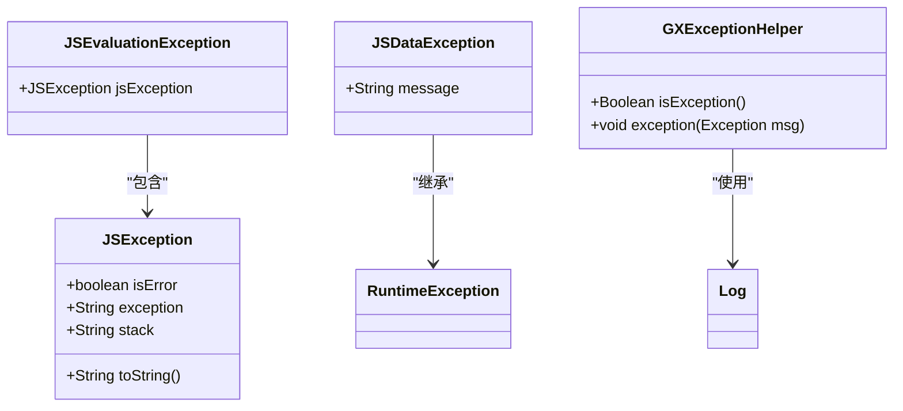
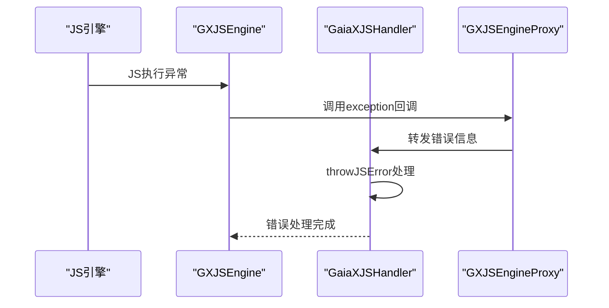
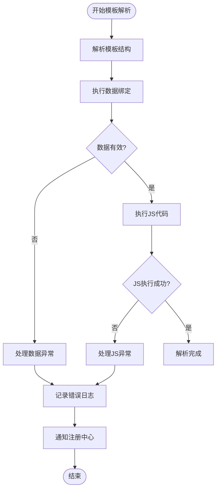
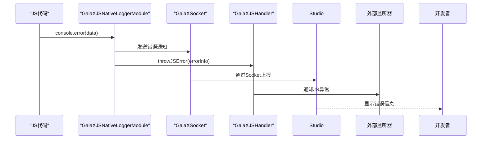
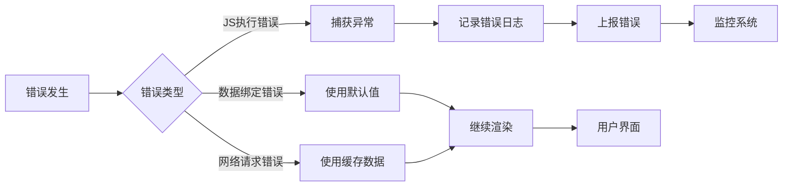
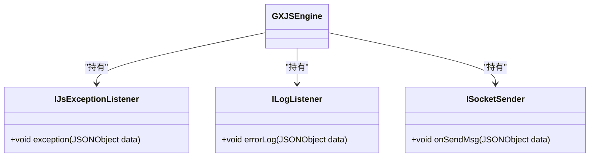
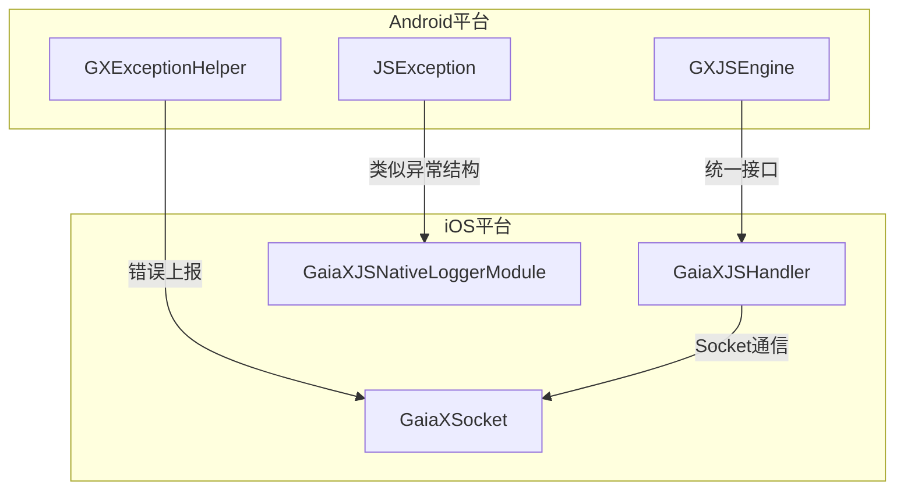

# 错误处理最佳实践

<cite>
**本文档中引用的文件**
- [GXJSEngine.kt](file://GaiaXAndroidJS/src/main/kotlin/com/alibaba/gaiax/js/GXJSEngine.kt)
- [GXExceptionHelper.kt](file://GaiaXAndroid/src/main/kotlin/com/alibaba/gaiax/utils/GXExceptionHelper.kt)
- [Log.kt](file://GaiaXAndroid/src/main/kotlin/com/alibaba/gaiax/utils/Log.kt)
- [GaiaXJSHandler.m](file://GaiaXJSiOS/GaiaXJS/src/GaiaXJSHandler.m)
- [GaiaXJSNativeLoggerModule.m](file://GaiaXJSiOS/GaiaXJS/src/bridge/modules/GaiaXJSNativeLoggerModule.m)
- [JSException.java](file://GaiaXAndroidQuickJS/src/main/java/com/alibaba/gaiax/quickjs/JSException.java)
- [JSEvaluationException.java](file://GaiaXAndroidQuickJS/src/main/java/com/alibaba/gaiax/quickjs/JSEvaluationException.java)
- [JSDataException.java](file://GaiaXAndroidQuickJS/src/main/java/com/alibaba/gaiax/quickjs/JSDataException.java)
- [GXJSEngineProxy.kt](file://GaiaXAndroidJSProxy/src/main/java/com/alibaba/gaiax/js/proxy/GXJSEngineProxy.kt)
</cite>

## 目录
1. [简介](#简介)
2. [错误分类与异常体系](#错误分类与异常体系)
3. [JS执行错误处理](#js执行错误处理)
4. [模板解析与数据绑定异常](#模板解析与数据绑定异常)
5. [错误日志记录与上报机制](#错误日志记录与上报机制)
6. [健壮的容错机制设计](#健壮的容错机制设计)
7. [监控与告警最佳实践](#监控与告警最佳实践)
8. [跨平台错误处理一致性](#跨平台错误处理一致性)
9. [总结](#总结)

## 简介
GaiaX框架提供了一套完整的错误处理机制，用于捕获、处理和监控框架运行时的各种错误。本指南基于实际代码库中的错误处理机制，为开发者提供从基础异常处理到高级监控策略的完整解决方案。通过本指南，开发者可以学习如何有效处理模板解析错误、数据绑定异常、JS执行错误等常见问题，实现错误日志记录和上报，以及构建健壮的容错机制。

## 错误分类与异常体系
GaiaX框架的错误处理体系主要分为三类：JS执行异常、数据转换异常和框架内部异常。

**图源**
- [JSException.java](file://GaiaXAndroidQuickJS/src/main/java/com/alibaba/gaiax/quickjs/JSException.java)
- [JSEvaluationException.java](file://GaiaXAndroidQuickJS/src/main/java/com/alibaba/gaiax/quickjs/JSEvaluationException.java)
- [JSDataException.java](file://GaiaXAndroidQuickJS/src/main/java/com/alibaba/gaiax/quickjs/JSDataException.java)
- [GXExceptionHelper.kt](file://GaiaXAndroid/src/main/kotlin/com/alibaba/gaiax/utils/GXExceptionHelper.kt)

**本节来源**
- [JSException.java](file://GaiaXAndroidQuickJS/src/main/java/com/alibaba/gaiax/quickjs/JSException.java#L1-L53)
- [JSEvaluationException.java](file://GaiaXAndroidQuickJS/src/main/java/com/alibaba/gaiax/quickjs/JSEvaluationException.java#L1-L22)
- [JSDataException.java](file://GaiaXAndroidQuickJS/src/main/java/com/alibaba/gaiax/quickjs/JSDataException.java#L1-L15)
- [GXExceptionHelper.kt](file://GaiaXAndroid/src/main/kotlin/com/alibaba/gaiax/utils/GXExceptionHelper.kt#L1-L17)

## JS执行错误处理
GaiaX框架通过GXJSEngine类提供JS执行错误的捕获和处理机制。当JS代码执行发生异常时，框架会通过IJsExceptionListener接口通知外部。

**图源**
- [GXJSEngine.kt](file://GaiaXAndroidJS/src/main/kotlin/com/alibaba/gaiax/js/GXJSEngine.kt#L404-L417)
- [GaiaXJSHandler.m](file://GaiaXJSiOS/GaiaXJS/src/GaiaXJSHandler.m#L39-L44)
- [GXJSEngineProxy.kt](file://GaiaXAndroidJSProxy/src/main/java/com/alibaba/gaiax/js/proxy/GXJSEngineProxy.kt#L98-L107)

**本节来源**
- [GXJSEngine.kt](file://GaiaXAndroidJS/src/main/kotlin/com/alibaba/gaiax/js/GXJSEngine.kt#L404-L417)
- [GaiaXJSHandler.m](file://GaiaXJSiOS/GaiaXJS/src/GaiaXJSHandler.m#L39-L44)
- [GXJSEngineProxy.kt](file://GaiaXAndroidJSProxy/src/main/java/com/alibaba/gaiax/js/proxy/GXJSEngineProxy.kt#L98-L107)

## 模板解析与数据绑定异常
模板解析和数据绑定过程中的异常主要通过GXExceptionHelper类进行处理。该类提供了统一的异常处理接口，确保框架内部异常能够被正确捕获和记录。

**图源**
- [GXExceptionHelper.kt](file://GaiaXAndroid/src/main/kotlin/com/alibaba/gaiax/utils/GXExceptionHelper.kt#L13-L15)
- [GXJSEngine.kt](file://GaiaXAndroidJS/src/main/kotlin/com/alibaba/gaiax/js/GXJSEngine.kt#L85-L91)

**本节来源**
- [GXExceptionHelper.kt](file://GaiaXAndroid/src/main/kotlin/com/alibaba/gaiax/utils/GXExceptionHelper.kt#L13-L15)
- [GXJSEngine.kt](file://GaiaXAndroidJS/src/main/kotlin/com/alibaba/gaiax/js/GXJSEngine.kt#L85-L91)

## 错误日志记录与上报机制
GaiaX框架通过多层机制实现错误日志的记录和上报。当JS代码中调用console.error时，错误信息会通过GaiaXJSNativeLoggerModule模块进行捕获和上报。

**图源**
- [GaiaXJSNativeLoggerModule.m](file://GaiaXJSiOS/GaiaXJS/src/bridge/modules/GaiaXJSNativeLoggerModule.m#L42-L58)
- [GaiaXJSHandler.m](file://GaiaXJSiOS/GaiaXJS/src/GaiaXJSHandler.m#L39-L44)
- [GaiaXSocketModel.h](file://GaiaXSocketiOS/GaiaXSocket/GaiaXSocketModel.h#L1-L48)

**本节来源**
- [GaiaXJSNativeLoggerModule.m](file://GaiaXJSiOS/GaiaXJS/src/bridge/modules/GaiaXJSNativeLoggerModule.m#L42-L58)
- [GaiaXJSHandler.m](file://GaiaXJSiOS/GaiaXJS/src/GaiaXJSHandler.m#L39-L44)
- [GXJSEngine.kt](file://GaiaXAndroidJS/src/main/kotlin/com/alibaba/gaiax/js/GXJSEngine.kt#L419-L421)

## 健壮的容错机制设计
GaiaX框架在多个关键点实现了容错机制，确保在发生错误时系统能够继续运行或优雅降级。

**图源**
- [GXJSEngine.kt](file://GaiaXAndroidJS/src/main/kotlin/com/alibaba/gaiax/js/GXJSEngine.kt#L85-L91)
- [GXExceptionHelper.kt](file://GaiaXAndroid/src/main/kotlin/com/alibaba/gaiax/utils/GXExceptionHelper.kt#L13-L15)
- [Log.kt](file://GaiaXAndroid/src/main/kotlin/com/alibaba/gaiax/utils/Log.kt#L28-L58)

**本节来源**
- [GXJSEngine.kt](file://GaiaXAndroidJS/src/main/kotlin/com/alibaba/gaiax/js/GXJSEngine.kt#L85-L91)
- [GXExceptionHelper.kt](file://GaiaXAndroid/src/main/kotlin/com/alibaba/gaiax/utils/GXExceptionHelper.kt#L13-L15)
- [Log.kt](file://GaiaXAndroid/src/main/kotlin/com/alibaba/gaiax/utils/Log.kt#L28-L58)

## 监控与告警最佳实践
为了实现有效的错误监控，建议采用以下最佳实践：

1. **设置全局异常监听器**：通过GXJSEngine的setJSExceptionListener方法注册全局异常监听器
2. **实现错误上报**：将捕获的错误信息发送到监控服务器
3. **建立告警机制**：对关键错误类型设置告警阈值
4. **定期分析错误日志**：识别高频错误并进行优化

**图源**
- [GXJSEngine.kt](file://GaiaXAndroidJS/src/main/kotlin/com/alibaba/gaiax/js/GXJSEngine.kt#L404-L425)
- [GXJSEngineProxy.kt](file://GaiaXAndroidJSProxy/src/main/java/com/alibaba/gaiax/js/proxy/GXJSEngineProxy.kt#L89-L96)

**本节来源**
- [GXJSEngine.kt](file://GaiaXAndroidJS/src/main/kotlin/com/alibaba/gaiax/js/GXJSEngine.kt#L404-L425)
- [GXJSEngineProxy.kt](file://GaiaXAndroidJSProxy/src/main/java/com/alibaba/gaiax/js/proxy/GXJSEngineProxy.kt#L89-L96)

## 跨平台错误处理一致性
GaiaX框架在Android和iOS平台实现了统一的错误处理接口，确保开发者在不同平台上能够使用相同的错误处理模式。

**图源**
- [GXJSEngine.kt](file://GaiaXAndroidJS/src/main/kotlin/com/alibaba/gaiax/js/GXJSEngine.kt)
- [GaiaXJSHandler.m](file://GaiaXJSiOS/GaiaXJS/src/GaiaXJSHandler.m)
- [GaiaXJSNativeLoggerModule.m](file://GaiaXJSiOS/GaiaXJS/src/bridge/modules/GaiaXJSNativeLoggerModule.m)

**本节来源**
- [GXJSEngine.kt](file://GaiaXAndroidJS/src/main/kotlin/com/alibaba/gaiax/js/GXJSEngine.kt#L404-L417)
- [GaiaXJSHandler.m](file://GaiaXJSiOS/GaiaXJS/src/GaiaXJSHandler.m#L39-L44)
- [GaiaXJSNativeLoggerModule.m](file://GaiaXJSiOS/GaiaXJS/src/bridge/modules/GaiaXJSNativeLoggerModule.m#L42-L58)

## 总结
GaiaX框架提供了一套完整的错误处理解决方案，涵盖了从错误捕获、处理到监控上报的各个环节。通过合理使用框架提供的错误处理机制，开发者可以构建更加稳定可靠的应用。建议开发者根据实际需求，结合本指南中的最佳实践，实现适合自己业务场景的错误处理策略。