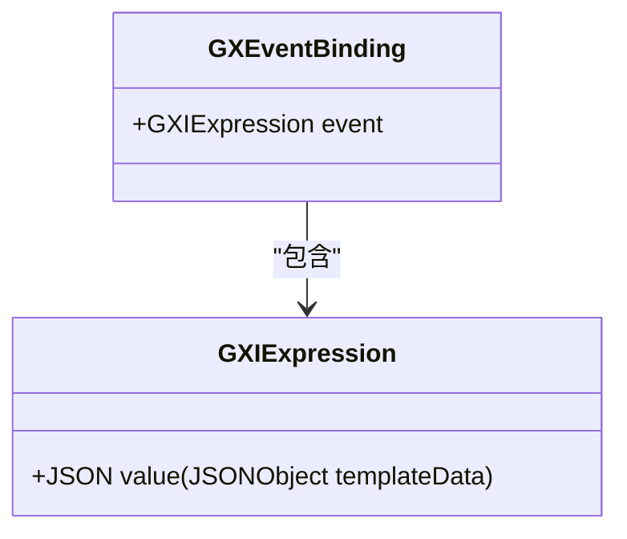
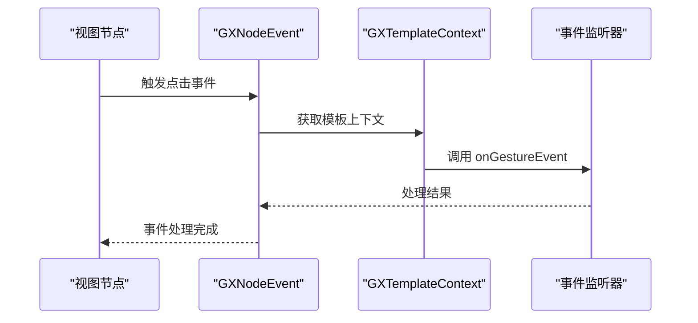
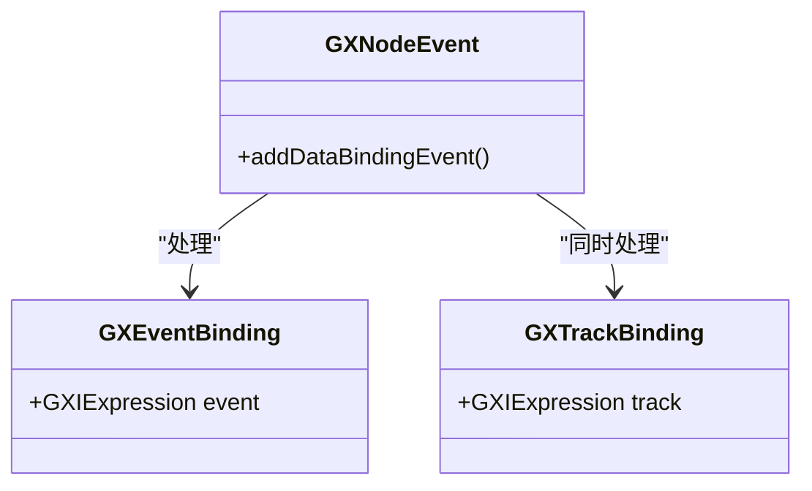
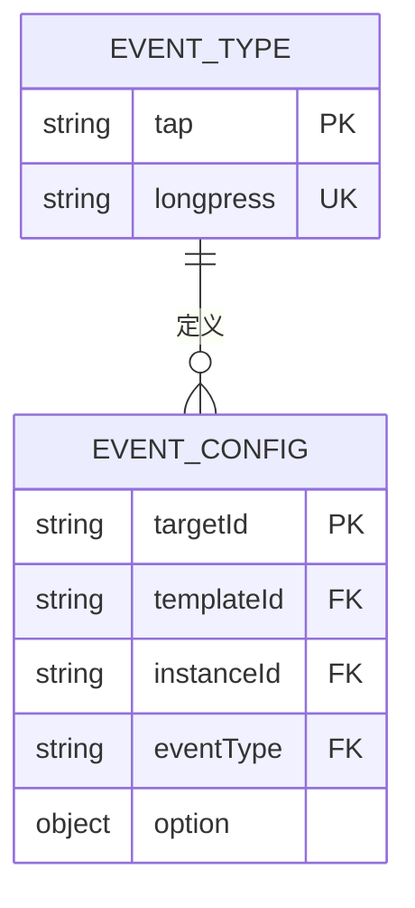
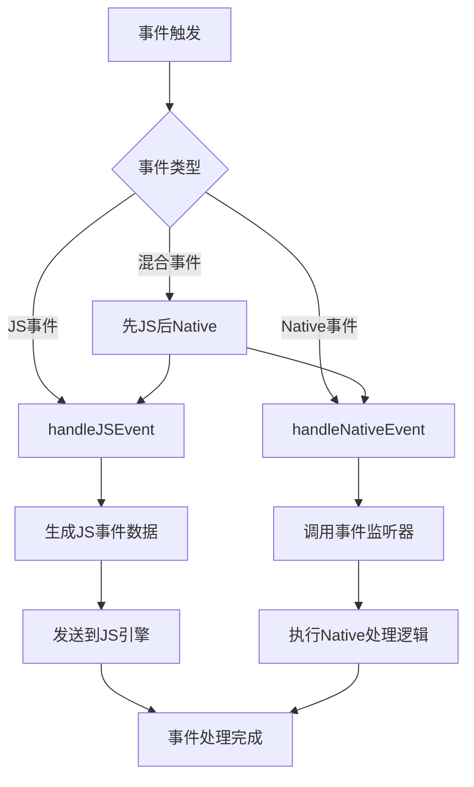
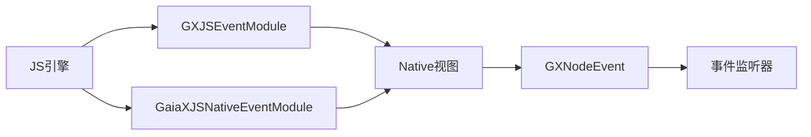

# 事件处理

<cite>
**本文档中引用的文件**  
- [GXEventBinding.kt](file://GaiaXAndroid/src/main/kotlin/com/alibaba/gaiax/template/GXEventBinding.kt)
- [GXTrackBinding.kt](file://GaiaXAndroid/src/main/kotlin/com/alibaba/gaiax/template/GXTrackBinding.kt)
- [GXNodeEvent.kt](file://GaiaXAndroid/src/main/kotlin/com/alibaba/gaiax/render/node/GXNodeEvent.kt)
- [GXEventManager.m](file://GaiaXiOS/GaiaXiOS/Binding/Event/GXEventManager.m)
- [GXJSEventModule.kt](file://GaiaXAndroidJSProxy/src/main/java/com/alibaba/gaiax/js/proxy/modules/GXJSEventModule.kt)
- [GaiaXJSNativeEventModule.m](file://GaiaXJSiOS/GaiaXJS/src/bridge/modules/GaiaXJSNativeEventModule.m)
- [GXTemplateKey.kt](file://GaiaXAndroid/src/main/kotlin/com/alibaba/gaiax/template/GXTemplateKey.kt)
- [GXEvent_Private.h](file://GaiaXiOS/GaiaXiOS/Binding/Event/GXEvent_Private.h)
</cite>

## 目录
1. [简介](#简介)
2. [核心事件机制](#核心事件机制)
3. [GXEventBinding 事件绑定机制](#gxeventbinding-事件绑定机制)
4. [GXNodeEvent 事件传播机制](#gxnodeevent-事件传播机制)
5. [GXTrackBinding 埋点事件处理](#gxtrackbinding-埋点事件处理)
6. [事件类型与配置](#事件类型与配置)
7. [事件分发流程](#事件分发流程)
8. [跨平台事件交互](#跨平台事件交互)
9. [性能优化与最佳实践](#性能优化与最佳实践)

## 简介
GaiaX 框架提供了一套完整的事件处理机制，支持用户交互事件的绑定、分发和埋点处理。该机制通过 GXEventBinding 实现事件绑定，通过 GXNodeEvent 实现事件在视图节点上的传播，并通过 GXTrackBinding 处理埋点事件。事件系统支持点击、长按等多种交互类型，并实现了与 JS 引擎的无缝交互。

## 核心事件机制
GaiaX 的事件处理机制采用分层架构，包含事件绑定、事件传播和事件处理三个核心环节。系统通过统一的事件管理器协调 Native 和 JS 层的事件处理流程，确保事件能够正确分发到相应的处理器。

**本节来源**  
- [GXEventManager.m](file://GaiaXiOS/GaiaXiOS/Binding/Event/GXEventManager.m#L1-L220)
- [GXNodeEvent.kt](file://GaiaXAndroid/src/main/kotlin/com/alibaba/gaiax/render/node/GXNodeEvent.kt#L1-L104)

## GXEventBinding 事件绑定机制
GXEventBinding 是 GaiaX 中用于定义用户交互事件的核心数据结构。它通过 GXIExpression 类型的 event 属性存储事件配置，支持在模板中声明式地绑定各种用户交互事件。

事件绑定机制允许开发者在模板中指定事件类型、事件参数和处理逻辑。系统在渲染时解析这些绑定，并为相应的视图节点注册事件监听器。

**图示来源**  
- [GXEventBinding.kt](file://GaiaXAndroid/src/main/kotlin/com/alibaba/gaiax/template/GXEventBinding.kt#L21-L21)

**本节来源**  
- [GXEventBinding.kt](file://GaiaXAndroid/src/main/kotlin/com/alibaba/gaiax/template/GXEventBinding.kt#L21-L21)

## GXNodeEvent 事件传播机制
GXNodeEvent 负责处理事件在视图节点上的传播和分发。它实现了 GXINodeEvent 接口，通过 addDataBindingEvent 方法为节点添加事件绑定。

事件传播机制支持事件冒泡和事件委托模式。当用户触发交互事件时，系统会从触发节点开始，按照视图层级向上冒泡，直到被处理或到达根节点。同时，系统也支持在父节点上委托处理子节点的事件，提高事件处理效率。

**图示来源**  
- [GXNodeEvent.kt](file://GaiaXAndroid/src/main/kotlin/com/alibaba/gaiax/render/node/GXNodeEvent.kt#L10-L102)

**本节来源**  
- [GXNodeEvent.kt](file://GaiaXAndroid/src/main/kotlin/com/alibaba/gaiax/render/node/GXNodeEvent.kt#L10-L102)

## GXTrackBinding 埋点事件处理
GXTrackBinding 专门用于处理埋点事件，它与 GXEventBinding 并行工作，允许在用户交互时同时触发业务埋点。

埋点事件处理机制在用户触发交互事件（如点击、长按）时，自动发送埋点数据到指定的 trackListener。这种设计将用户交互和数据采集解耦，使业务逻辑和数据分析可以独立演进。

**图示来源**  
- [GXTrackBinding.kt](file://GaiaXAndroid/src/main/kotlin/com/alibaba/gaiax/template/GXTrackBinding.kt#L21-L21)
- [GXNodeEvent.kt](file://GaiaXAndroid/src/main/kotlin/com/alibaba/gaiax/render/node/GXNodeEvent.kt#L10-L102)

**本节来源**  
- [GXTrackBinding.kt](file://GaiaXAndroid/src/main/kotlin/com/alibaba/gaiax/template/GXTrackBinding.kt#L21-L21)
- [GXNodeEvent.kt](file://GaiaXAndroid/src/main/kotlin/com/alibaba/gaiax/render/node/GXNodeEvent.kt#L58-L67)

## 事件类型与配置
GaiaX 支持多种事件类型，主要通过 GXTemplateKey 中定义的常量进行标识。目前支持的核心事件类型包括：

- **tap**: 点击事件，对应常量 GAIAX_GESTURE_TYPE_TAP
- **longpress**: 长按事件，对应常量 GAIAX_GESTURE_TYPE_LONGPRESS

事件配置通过 JSON 格式的数据结构传递，包含事件类型、目标节点 ID、模板实例 ID 等信息。系统还支持通过 option 参数配置事件处理的高级选项，如事件覆盖策略和处理级别。

**图示来源**  
- [GXTemplateKey.kt](file://GaiaXAndroid/src/main/kotlin/com/alibaba/gaiax/template/GXTemplateKey.kt#L394-L403)

**本节来源**  
- [GXTemplateKey.kt](file://GaiaXAndroid/src/main/kotlin/com/alibaba/gaiax/template/GXTemplateKey.kt#L394-L403)

## 事件分发流程
GaiaX 的事件分发流程采用统一的事件管理器模式。GXEventManager 负责协调事件的注册、分发和处理，确保事件能够正确路由到 Native 和 JS 层的处理器。

事件分发流程包括以下步骤：
1. 事件注册：通过 registerEvent 方法为节点绑定事件
2. 事件触发：用户交互触发原生事件
3. 事件处理：根据事件级别（GXEventLevel）决定处理顺序
4. 事件分发：同时或按序分发到 JS 和 Native 处理器

**图示来源**  
- [GXEventManager.m](file://GaiaXiOS/GaiaXiOS/Binding/Event/GXEventManager.m#L100-L158)

**本节来源**  
- [GXEventManager.m](file://GaiaXiOS/GaiaXiOS/Binding/Event/GXEventManager.m#L100-L158)

## 跨平台事件交互
GaiaX 实现了 Native 与 JS 引擎之间的事件交互机制。通过 GXJSEventModule 和 GaiaXJSNativeEventModule，系统能够在两个运行环境之间桥接事件。

在 Android 平台，GXJSEventModule 提供了 addEventListener 和 removeEventListener 方法，用于在 JS 中为 Native 视图添加和移除事件监听器。在 iOS 平台，GaiaXJSNativeEventModule 实现了相应的功能，确保跨平台一致性。

**图示来源**  
- [GXJSEventModule.kt](file://GaiaXAndroidJSProxy/src/main/java/com/alibaba/gaiax/js/proxy/modules/GXJSEventModule.kt#L22-L63)
- [GaiaXJSNativeEventModule.m](file://GaiaXJSiOS/GaiaXJS/src/bridge/modules/GaiaXJSNativeEventModule.m#L37-L91)

**本节来源**  
- [GXJSEventModule.kt](file://GaiaXAndroidJSProxy/src/main/java/com/alibaba/gaiax/js/proxy/modules/GXJSEventModule.kt#L22-L63)
- [GaiaXJSNativeEventModule.m](file://GaiaXJSiOS/GaiaXJS/src/bridge/modules/GaiaXJSNativeEventModule.m#L37-L91)

## 性能优化与最佳实践
GaiaX 事件系统在设计时充分考虑了性能优化，采用了多种策略确保事件处理的高效性：

1. **信号量同步**：使用 dispatch_semaphore 确保多线程环境下的线程安全
2. **弱引用管理**：使用 NSMapTable strongToWeakObjectsMapTable 避免内存泄漏
3. **批量处理**：支持批量事件处理，减少频繁的事件分发开销
4. **事件节流**：通过配置选项实现事件节流和防抖

最佳实践建议：
- 合理使用事件委托，减少事件监听器的数量
- 及时清理不再需要的事件监听器
- 避免在事件处理中执行耗时操作
- 利用事件级别配置优化处理顺序

**本节来源**  
- [GXEventManager.m](file://GaiaXiOS/GaiaXiOS/Binding/Event/GXEventManager.m#L35-L40)
- [GXEventManager.m](file://GaiaXiOS/GaiaXiOS/Binding/Event/GXEventManager.m#L213-L214)