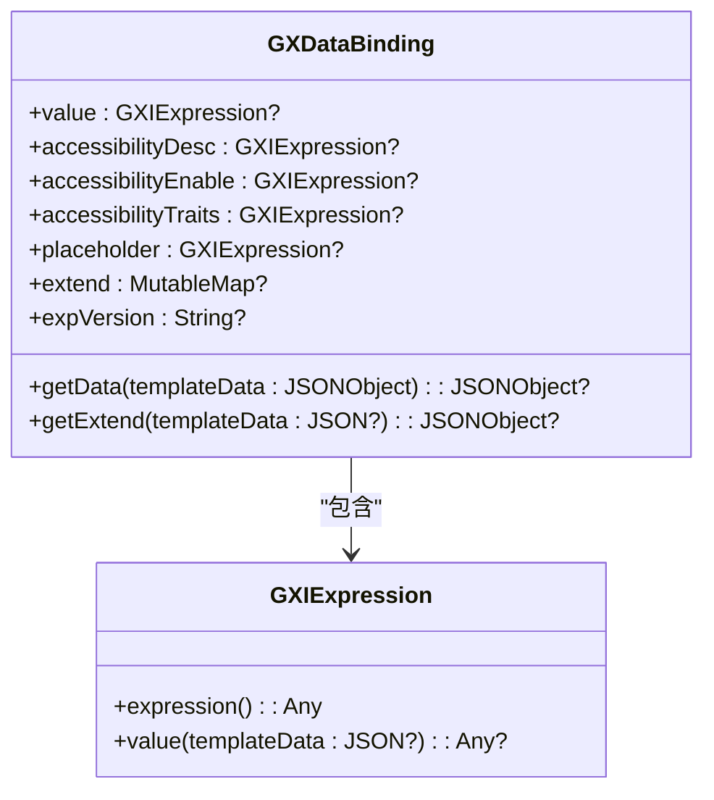
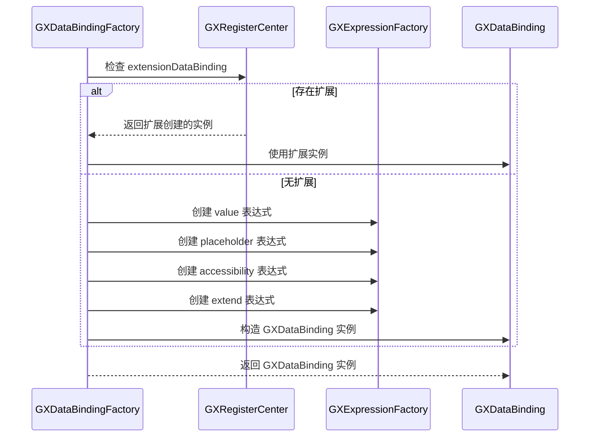
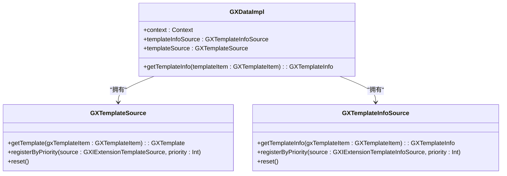
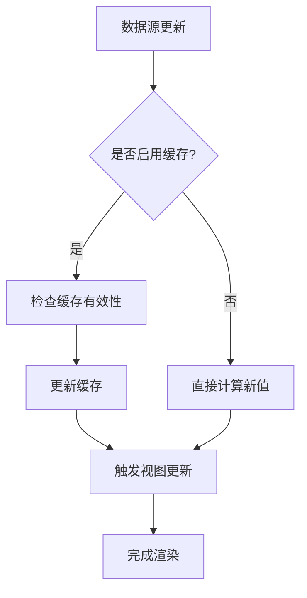
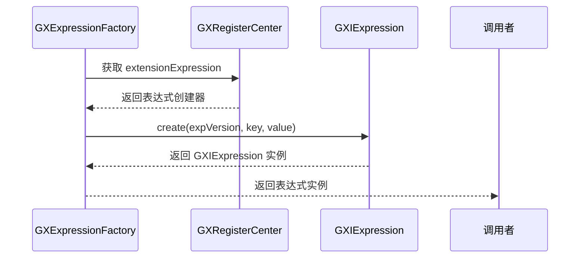
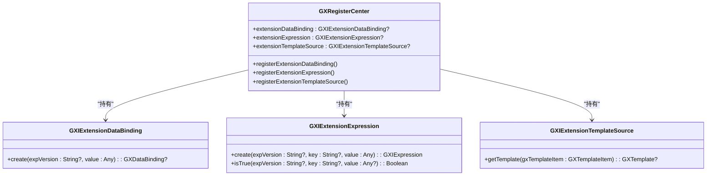
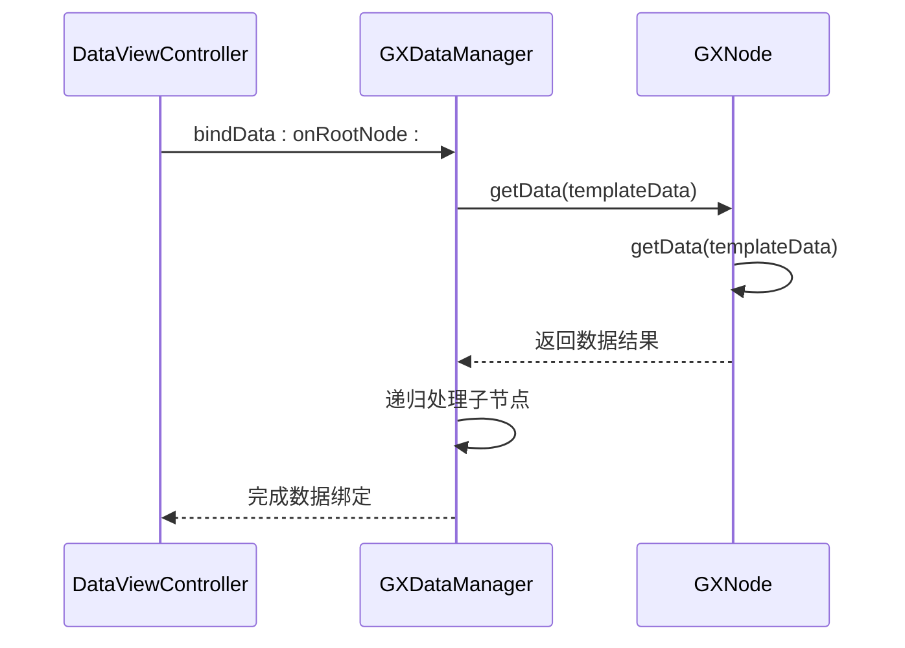

# 数据绑定

<cite>
**本文档中引用的文件**  
- [GXDataBinding.kt](file://GaiaXAndroid/src/main/kotlin/com/alibaba/gaiax/template/GXDataBinding.kt)
- [GXDataImpl.kt](file://GaiaXAndroid/src/main/kotlin/com/alibaba/gaiax/data/GXDataImpl.kt)
- [GXDataBindingFactory.kt](file://GaiaXAndroid/src/main/kotlin/com/alibaba/gaiax/template/factory/GXDataBindingFactory.kt)
- [GXDataManager.h](file://GaiaXiOS/GaiaXiOS/Binding/Data/GXDataManager.h)
- [DataViewController.m](file://GaiaXiOSDemo/GaiaXiOSDemo/Binding/DataViewController.m)
- [GXTemplateInfo.kt](file://GaiaXAndroid/src/main/kotlin/com/alibaba/gaiax/template/GXTemplateInfo.kt)
- [GXTemplateNode.kt](file://GaiaXAndroid/src/main/kotlin/com/alibaba/gaiax/render/node/GXTemplateNode.kt)
- [GXRegisterCenter.kt](file://GaiaXAndroid/src/main/kotlin/com/alibaba/gaiax/GXRegisterCenter.kt)
</cite>

## 目录
1. [引言](#引言)
2. [核心组件](#核心组件)
3. [数据绑定机制详解](#数据绑定机制详解)
4. [GXDataBindingFactory 数据绑定工厂](#gxdatabindingfactory-数据绑定工厂)
5. [GXDataImpl 数据处理实现](#gxdataimpl-数据处理实现)
6. [数据流与更新机制](#数据流与更新机制)
7. [表达式解析与计算](#表达式解析与计算)
8. [高级特性与优化策略](#高级特性与优化策略)
9. [错误处理与调试](#错误处理与调试)
10. [实际应用示例](#实际应用示例)
11. [总结](#总结)

## 引言

GaiaX 是一个跨平台的模板渲染引擎，其核心功能之一是强大的数据绑定机制。该机制实现了模板与数据源之间的动态连接，支持单向和双向数据流，具备高效的数据更新通知和性能优化策略。本文档深入解析 GaiaX 的数据绑定系统，涵盖 GXDataBinding、GXDataImpl 和 GXDataBindingFactory 等核心组件的实现原理，为开发者提供从基础语法到高级技术的全面指导。

## 核心组件

GaiaX 的数据绑定系统由多个核心组件构成，它们协同工作以实现模板与数据的动态连接。主要组件包括：
- **GXDataBinding**: 定义数据绑定的结构和获取数据的逻辑。
- **GXDataBindingFactory**: 负责创建和管理 GXDataBinding 实例。
- **GXDataImpl**: 处理数据解析、转换和更新的核心实现。
- **GXDataManager**: iOS 平台上的数据绑定管理器，负责递归绑定数据。

**Section sources**
- [GXDataBinding.kt](file://GaiaXAndroid/src/main/kotlin/com/alibaba/gaiax/template/GXDataBinding.kt#L26-L105)
- [GXDataImpl.kt](file://GaiaXAndroid/src/main/kotlin/com/alibaba/gaiax/data/GXDataImpl.kt#L29-L167)
- [GXDataBindingFactory.kt](file://GaiaXAndroid/src/main/kotlin/com/alibaba/gaiax/template/factory/GXDataBindingFactory.kt#L8-L74)
- [GXDataManager.h](file://GaiaXiOS/GaiaXiOS/Binding/Data/GXDataManager.h#L1-L52)

## 数据绑定机制详解

GaiaX 的数据绑定机制通过 GXDataBinding 类实现，该类封装了模板中各个字段的数据绑定逻辑。每个 GXDataBinding 实例可以包含多个数据绑定项，如 `value`、`placeholder`、`accessibilityDesc` 等。



**Diagram sources**
- [GXDataBinding.kt](file://GaiaXAndroid/src/main/kotlin/com/alibaba/gaiax/template/GXDataBinding.kt#L26-L105)
- [GXIExpression.kt](file://GaiaXAndroid/src/main/kotlin/com/alibaba/gaiax/template/GXIExpression.kt#L24-L28)

**Section sources**
- [GXDataBinding.kt](file://GaiaXAndroid/src/main/kotlin/com/alibaba/gaiax/template/GXDataBinding.kt#L26-L105)

## GXDataBindingFactory 数据绑定工厂

GXDataBindingFactory 是一个单例对象，负责根据模板数据创建 GXDataBinding 实例。它首先尝试通过扩展点创建自定义的数据绑定，如果失败则使用默认的创建逻辑。



**Diagram sources**
- [GXDataBindingFactory.kt](file://GaiaXAndroid/src/main/kotlin/com/alibaba/gaiax/template/factory/GXDataBindingFactory.kt#L8-L74)
- [GXExpressionFactory.kt](file://GaiaXAndroid/src/main/kotlin/com/alibaba/gaiax/template/factory/GXExpressionFactory.kt#L25-L45)

**Section sources**
- [GXDataBindingFactory.kt](file://GaiaXAndroid/src/main/kotlin/com/alibaba/gaiax/template/factory/GXDataBindingFactory.kt#L8-L74)

## GXDataImpl 数据处理实现

GXDataImpl 是数据处理的核心实现类，负责获取模板信息和管理数据源。它通过 GXTemplateSource 和 GXTemplateInfoSource 两个内部类来管理模板和模板信息的优先级队列。



**Diagram sources**
- [GXDataImpl.kt](file://GaiaXAndroid/src/main/kotlin/com/alibaba/gaiax/data/GXDataImpl.kt#L29-L167)

**Section sources**
- [GXDataImpl.kt](file://GaiaXAndroid/src/main/kotlin/com/alibaba/gaiax/data/GXDataImpl.kt#L29-L167)

## 数据流与更新机制

GaiaX 支持单向和双向数据流。数据更新通过模板节点的缓存机制实现，当数据发生变化时，系统会自动触发重新计算和视图更新。



**Diagram sources**
- [GXTemplateNode.kt](file://GaiaXAndroid/src/main/kotlin/com/alibaba/gaiax/render/node/GXTemplateNode.kt#L71-L97)
- [GXTemplateInfo.kt](file://GaiaXAndroid/src/main/kotlin/com/alibaba/gaiax/template/GXTemplateInfo.kt#L280-L298)

**Section sources**
- [GXTemplateNode.kt](file://GaiaXAndroid/src/main/kotlin/com/alibaba/gaiax/render/node/GXTemplateNode.kt#L71-L97)

## 表达式解析与计算

数据绑定中的表达式通过 GXIExpression 接口进行解析和计算。GXExpressionFactory 负责创建具体的表达式实例，支持多种表达式版本和类型。



**Diagram sources**
- [GXExpressionFactory.kt](file://GaiaXAndroid/src/main/kotlin/com/alibaba/gaiax/template/factory/GXExpressionFactory.kt#L25-L45)
- [GXRegisterCenter.kt](file://GaiaXAndroid/src/main/kotlin/com/alibaba/gaiax/GXRegisterCenter.kt#L191-L194)

**Section sources**
- [GXExpressionFactory.kt](file://GaiaXAndroid/src/main/kotlin/com/alibaba/gaiax/template/factory/GXExpressionFactory.kt#L25-L45)

## 高级特性与优化策略

GaiaX 提供了多种高级特性和优化策略，包括：
- **优先级队列**: 通过 PriorityQueue 管理数据源的优先级。
- **缓存机制**: 在 GXTemplateNode 中实现数据缓存，避免重复计算。
- **扩展点**: 通过 GXRegisterCenter 提供多个扩展接口，支持自定义功能。



**Diagram sources**
- [GXRegisterCenter.kt](file://GaiaXAndroid/src/main/kotlin/com/alibaba/gaiax/GXRegisterCenter.kt#L200-L202)
- [GXRegisterCenter.kt](file://GaiaXAndroid/src/main/kotlin/com/alibaba/gaiax/GXRegisterCenter.kt#L191-L194)
- [GXRegisterCenter.kt](file://GaiaXAndroid/src/main/kotlin/com/alibaba/gaiax/GXRegisterCenter.kt#L145-L152)

**Section sources**
- [GXRegisterCenter.kt](file://GaiaXAndroid/src/main/kotlin/com/alibaba/gaiax/GXRegisterCenter.kt#L200-L202)

## 错误处理与调试

系统通过 GXRegisterCenter 的扩展点处理内部异常，防止应用崩溃。开发者可以通过注册 GXIExtensionException 来捕获和处理异常。

```mermaid
flowchart TD
A[发生异常] --> B{是否存在 extensionException?}
B --> |是| C[调用 exception() 方法]
C --> D[记录日志或上报]
D --> E[返回默认值]
B --> |否| F[抛出异常]
F --> G[可能导致应用崩溃]
```

**Diagram sources**
- [GXRegisterCenter.kt](file://GaiaXAndroid/src/main/kotlin/com/alibaba/gaiax/GXRegisterCenter.kt#L242-L244)

**Section sources**
- [GXRegisterCenter.kt](file://GaiaXAndroid/src/main/kotlin/com/alibaba/gaiax/GXRegisterCenter.kt#L242-L244)

## 实际应用示例

在 iOS 平台上，通过 GXDataManager 类的静态方法 bindData 可以实现数据绑定。该方法会递归地将数据绑定到根视图或根节点上。



**Diagram sources**
- [DataViewController.m](file://GaiaXiOSDemo/GaiaXiOSDemo/Binding/DataViewController.m#L1-L45)
- [GXDataManager.h](file://GaiaXiOS/GaiaXiOS/Binding/Data/GXDataManager.h#L1-L52)

**Section sources**
- [DataViewController.m](file://GaiaXiOSDemo/GaiaXiOSDemo/Binding/DataViewController.m#L1-L45)

## 总结

GaiaX 的数据绑定机制是一个功能强大且灵活的系统，通过 GXDataBinding、GXDataImpl 和 GXDataBindingFactory 等核心组件的协同工作，实现了模板与数据源的高效动态连接。该系统支持复杂的表达式计算、优先级管理、缓存优化和扩展机制，为开发者提供了丰富的功能和良好的性能表现。通过深入理解这些组件的工作原理，开发者可以更好地利用 GaiaX 构建高性能的跨平台应用。