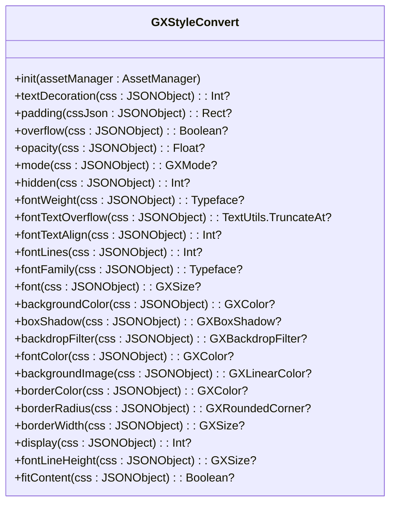
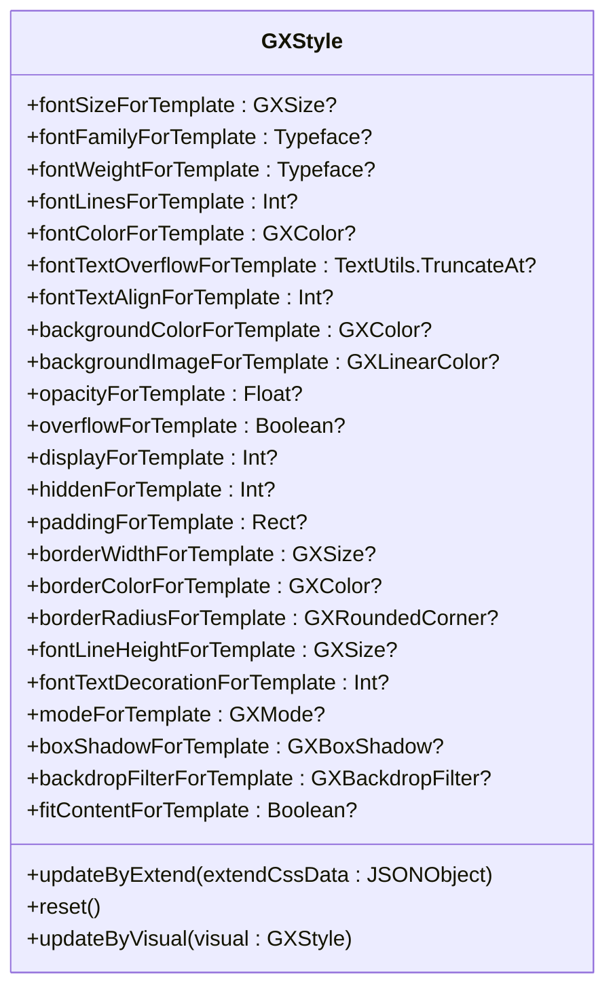
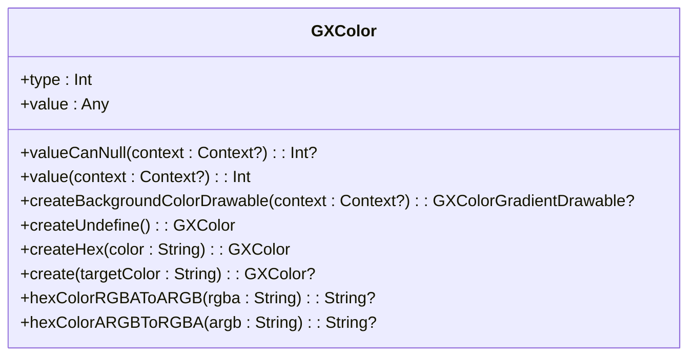
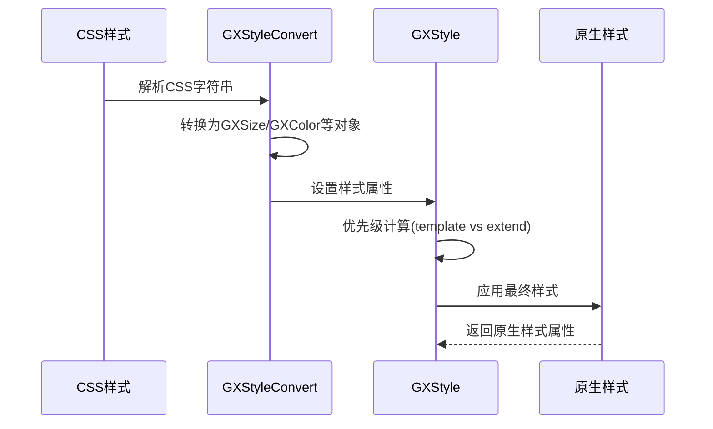
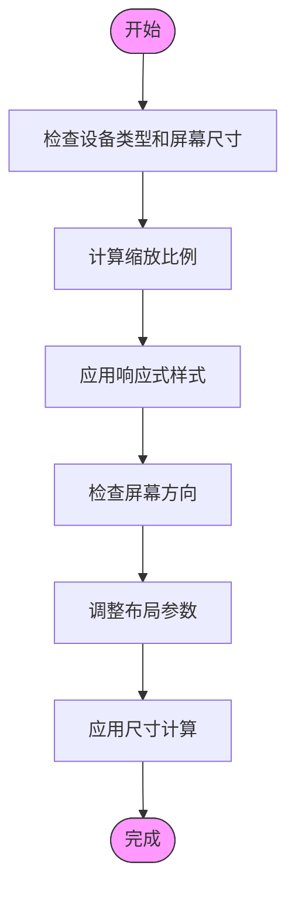
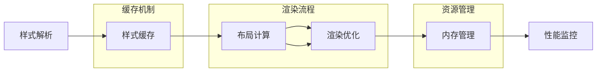
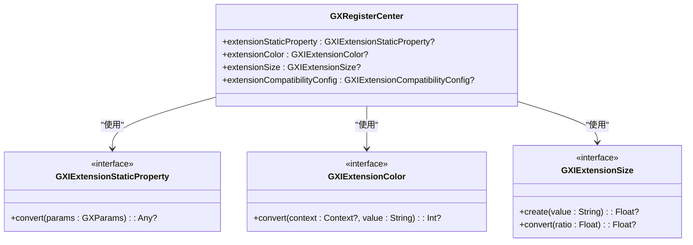

# 样式系统

<cite>
**本文档引用文件**  
- [GXStyleConvert.kt](file://GaiaXAndroid/src/main/kotlin/com/alibaba/gaiax/template/GXStyleConvert.kt)
- [GXStyle.kt](file://GaiaXAndroid/src/main/kotlin/com/alibaba/gaiax/template/GXStyle.kt)
- [GXSize.kt](file://GaiaXAndroid/src/main/kotlin/com/alibaba/gaiax/template/GXSize.kt)
- [GXColor.kt](file://GaiaXAndroid/src/main/kotlin/com/alibaba/gaiax/template/GXColor.kt)
- [GXFlexBox.kt](file://GaiaXAndroid/src/main/kotlin/com/alibaba/gaiax/template/GXFlexBox.kt)
- [GXTemplateKey.kt](file://GaiaXAndroid/src/main/kotlin/com/alibaba/gaiax/template/GXTemplateKey.kt)
- [GXColorUtils.kt](file://GaiaXAndroid/src/main/kotlin/com/alibaba/gaiax/utils/GXColorUtils.kt)
</cite>

## 目录
1. [简介](#简介)
2. [样式转换机制](#样式转换机制)
3. [样式规则定义](#样式规则定义)
4. [尺寸计算系统](#尺寸计算系统)
5. [颜色管理系统](#颜色管理系统)
6. [样式继承与优先级](#样式继承与优先级)
7. [响应式设计支持](#响应式设计支持)
8. [性能优化策略](#性能优化策略)
9. [高级特性](#高级特性)
10. [实际应用示例](#实际应用示例)

## 简介
GaiaX样式系统是一个强大的跨平台UI渲染引擎，它通过将CSS样式转换为原生样式属性来实现高性能的界面渲染。该系统支持复杂的样式组合、媒体查询和动画效果，同时提供了样式缓存机制和内存优化策略。本文档将深入解析GXStyleConvert如何将CSS样式转换为原生样式属性，详细说明GXStyle如何定义样式规则，GXSize如何处理尺寸计算，以及GXColor如何管理颜色系统。

## 样式转换机制
GXStyleConvert是GaiaX样式系统的核心组件，负责将CSS样式转换为原生平台可识别的样式属性。该组件通过解析CSS字符串，将其转换为Android平台的样式对象。



**图表来源**
- [GXStyleConvert.kt](file://GaiaXAndroid/src/main/kotlin/com/alibaba/gaiax/template/GXStyleConvert.kt#L41-L508)

**本节来源**
- [GXStyleConvert.kt](file://GaiaXAndroid/src/main/kotlin/com/alibaba/gaiax/template/GXStyleConvert.kt#L41-L508)

## 样式规则定义
GXStyle类定义了样式规则的结构和行为，它包含了字体、颜色、布局等所有样式属性。样式规则通过GXTemplateKey中的常量进行定义，支持丰富的CSS属性。



**图表来源**
- [GXStyle.kt](file://GaiaXAndroid/src/main/kotlin/com/alibaba/gaiax/template/GXStyle.kt#L31-L567)

**本节来源**
- [GXStyle.kt](file://GaiaXAndroid/src/main/kotlin/com/alibaba/gaiax/template/GXStyle.kt#L31-L567)

## 尺寸计算系统
GXSize类负责处理所有尺寸相关的计算，支持px、pt、百分比等多种单位。系统通过dpToPx等方法实现不同单位之间的转换，确保在不同设备上的一致性表现。

```mermaid
classDiagram
class GXSize {
<<sealed>>
+create(targetSize : String) : GXSize
+dpToPx() : Float
+ptToPx() : Float
+valueDimension : Dimension
+valueInt : Int
+valueFloat : Float
class PX {
+targetName : String
+targetValue : Float
}
class PE {
+targetName : String
+targetValue : Float
}
class PT {
+targetName : String
+targetValue : Float
}
object Auto
object Undefined
}
```

**图表来源**
- [GXSize.kt](file://GaiaXAndroid/src/main/kotlin/com/alibaba/gaiax/template/GXSize.kt#L30-L138)

**本节来源**
- [GXSize.kt](file://GaiaXAndroid/src/main/kotlin/com/alibaba/gaiax/template/GXSize.kt#L30-L138)

## 颜色管理系统
GXColor类管理颜色系统，支持十六进制、rgb、designToken等多种颜色格式。系统通过parseHexColor、parseRGBAColor等方法解析不同格式的颜色值，并支持动态颜色扩展。



**图表来源**
- [GXColor.kt](file://GaiaXAndroid/src/main/kotlin/com/alibaba/gaiax/template/GXColor.kt#L29-L187)

**本节来源**
- [GXColor.kt](file://GaiaXAndroid/src/main/kotlin/com/alibaba/gaiax/template/GXColor.kt#L29-L187)

## 样式继承与优先级
GaiaX样式系统支持样式继承机制，通过模板样式(template)和扩展样式(extend)的优先级计算实现灵活的样式控制。系统优先使用扩展样式，当扩展样式不存在时才使用模板样式。



**图表来源**
- [GXStyleConvert.kt](file://GaiaXAndroid/src/main/kotlin/com/alibaba/gaiax/template/GXStyleConvert.kt#L41-L508)
- [GXStyle.kt](file://GaiaXAndroid/src/main/kotlin/com/alibaba/gaiax/template/GXStyle.kt#L31-L567)

**本节来源**
- [GXStyleConvert.kt](file://GaiaXAndroid/src/main/kotlin/com/alibaba/gaiax/template/GXStyleConvert.kt#L41-L508)
- [GXStyle.kt](file://GaiaXAndroid/src/main/kotlin/com/alibaba/gaiax/template/GXStyle.kt#L31-L567)

## 响应式设计支持
GaiaX样式系统通过GXSize的pt单位和百分比支持响应式设计。系统根据设备屏幕尺寸动态调整布局，确保在不同设备上都能获得良好的用户体验。



**图表来源**
- [GXSize.kt](file://GaiaXAndroid/src/main/kotlin/com/alibaba/gaiax/template/GXSize.kt#L30-L138)
- [GXTemplateKey.kt](file://GaiaXAndroid/src/main/kotlin/com/alibaba/gaiax/template/GXTemplateKey.kt#L356-L362)

**本节来源**
- [GXSize.kt](file://GaiaXAndroid/src/main/kotlin/com/alibaba/gaiax/template/GXSize.kt#L30-L138)
- [GXTemplateKey.kt](file://GaiaXAndroid/src/main/kotlin/com/alibaba/gaiax/template/GXTemplateKey.kt#L356-L362)

## 性能优化策略
GaiaX样式系统采用多种性能优化策略，包括样式缓存、内存优化和与布局引擎的协同工作。系统通过reset方法重置样式缓存，避免内存泄漏。



**图表来源**
- [GXStyle.kt](file://GaiaXAndroid/src/main/kotlin/com/alibaba/gaiax/template/GXStyle.kt#L367-L394)
- [GXFlexBox.kt](file://GaiaXAndroid/src/main/kotlin/com/alibaba/gaiax/template/GXFlexBox.kt#L93-L141)

**本节来源**
- [GXStyle.kt](file://GaiaXAndroid/src/main/kotlin/com/alibaba/gaiax/template/GXStyle.kt#L367-L394)
- [GXFlexBox.kt](file://GaiaXAndroid/src/main/kotlin/com/alibaba/gaiax/template/GXFlexBox.kt#L93-L141)

## 高级特性
GaiaX样式系统提供了一系列高级特性，包括自定义样式处理器、动态主题切换和CSS预处理。开发者可以通过扩展接口实现自定义的样式处理逻辑。



**图表来源**
- [GXStyle.kt](file://GaiaXAndroid/src/main/kotlin/com/alibaba/gaiax/template/GXStyle.kt#L217-L223)
- [GXColor.kt](file://GaiaXAndroid/src/main/kotlin/com/alibaba/gaiax/template/GXColor.kt#L35-L36)
- [GXSize.kt](file://GaiaXAndroid/src/main/kotlin/com/alibaba/gaiax/template/GXSize.kt#L49-L50)

**本节来源**
- [GXStyle.kt](file://GaiaXAndroid/src/main/kotlin/com/alibaba/gaiax/template/GXStyle.kt#L217-L223)
- [GXColor.kt](file://GaiaXAndroid/src/main/kotlin/com/alibaba/gaiax/template/GXColor.kt#L35-L36)
- [GXSize.kt](file://GaiaXAndroid/src/main/kotlin/com/alibaba/gaiax/template/GXSize.kt#L49-L50)

## 实际应用示例
以下是一些实际应用示例，展示了复杂样式组合、媒体查询和动画样式的使用场景。

```mermaid
erDiagram
STYLE ||--o{ PROPERTIES : "包含"
PROPERTIES }|--|| FONT : "字体"
PROPERTIES }|--|| COLOR : "颜色"
PROPERTIES }|--|| LAYOUT : "布局"
PROPERTIES }|--|| EFFECT : "效果"
class STYLE {
+id: String
+name: String
+version: Int
}
class PROPERTIES {
+font: FONT
+color: COLOR
+layout: LAYOUT
+effect: EFFECT
}
class FONT {
+size: GXSize
+family: String
+weight: String
+lines: Int
}
class COLOR {
+text: GXColor
+background: GXColor
+border: GXColor
}
class LAYOUT {
+padding: Rect<GXSize>
+margin: Rect<GXSize>
+border: Rect<GXSize>
+size: Size<GXSize>
}
class EFFECT {
+opacity: Float
+shadow: GXBoxShadow
+filter: GXBackdropFilter
+radius: GXRoundedCorner
}
```

**图表来源**
- [GXStyle.kt](file://GaiaXAndroid/src/main/kotlin/com/alibaba/gaiax/template/GXStyle.kt#L31-L567)
- [GXFlexBox.kt](file://GaiaXAndroid/src/main/kotlin/com/alibaba/gaiax/template/GXFlexBox.kt#L40-L62)
- [GXStyleConvert.kt](file://GaiaXAndroid/src/main/kotlin/com/alibaba/gaiax/template/GXStyleConvert.kt#L41-L508)

**本节来源**
- [GXStyle.kt](file://GaiaXAndroid/src/main/kotlin/com/alibaba/gaiax/template/GXStyle.kt#L31-L567)
- [GXFlexBox.kt](file://GaiaXAndroid/src/main/kotlin/com/alibaba/gaiax/template/GXFlexBox.kt#L40-L62)
- [GXStyleConvert.kt](file://GaiaXAndroid/src/main/kotlin/com/alibaba/gaiax/template/GXStyleConvert.kt#L41-L508)