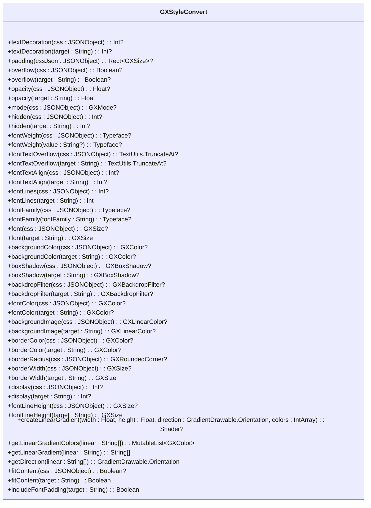
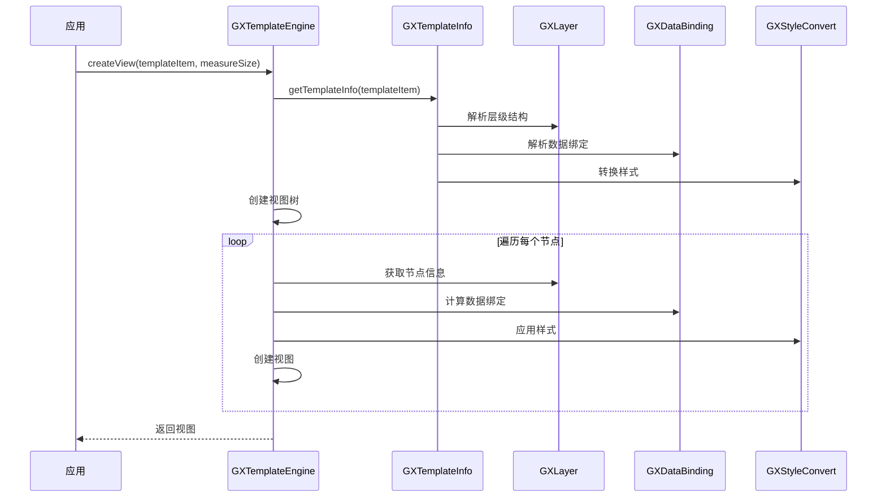

# 核心概念

<cite>
**本文档引用的文件**   
- [GXTemplateEngine.kt](file://GaiaXAndroid/src/main/kotlin/com/alibaba/gaiax/GXTemplateEngine.kt)
- [GXTemplateInfo.kt](file://GaiaXAndroid/src/main/kotlin/com/alibaba/gaiax/template/GXTemplateInfo.kt)
- [GXLayer.kt](file://GaiaXAndroid/src/main/kotlin/com/alibaba/gaiax/template/GXLayer.kt)
- [GXDataBinding.kt](file://GaiaXAndroid/src/main/kotlin/com/alibaba/gaiax/template/GXDataBinding.kt)
- [GXStyleConvert.kt](file://GaiaXAndroid/src/main/kotlin/com/alibaba/gaiax/template/GXStyleConvert.kt)
- [GXTemplateContext.kt](file://GaiaXAndroid/src/main/kotlin/com/alibaba/gaiax/context/GXTemplateContext.kt)
</cite>

## 目录
1. [模板引擎](#模板引擎)
2. [模板信息](#模板信息)
3. [层级结构](#层级结构)
4. [数据绑定](#数据绑定)
5. [样式转换](#样式转换)
6. [组件关系与交互](#组件关系与交互)
7. [常见问题与优化](#常见问题与优化)

## 模板引擎

`GXTemplateEngine` 是 GaiaX 的核心入口，负责协调所有组件的工作。它提供了创建视图、绑定数据、处理事件等主要功能。通过 `GXTemplateEngine` 的 `createView` 方法，可以将模板信息和测量尺寸转换为实际的视图。`bindData` 方法则用于将数据绑定到已创建的视图上，实现数据与视图的连接。`GXTemplateEngine` 还提供了 `prepareView` 方法，用于预加载视图，提高性能。

**Section sources**
- [GXTemplateEngine.kt](file://GaiaXAndroid/src/main/kotlin/com/alibaba/gaiax/GXTemplateEngine.kt#L77-L927)

## 模板信息

`GXTemplateInfo` 类定义了模板的所有信息，包括层级结构、样式、数据绑定、事件绑定等。它是模板解析后的状态，包含了模板的所有元数据。`GXTemplateInfo` 通过 `layer` 属性定义了模板的层级结构，通过 `css` 属性定义了样式，通过 `data` 属性定义了数据绑定，通过 `event` 属性定义了事件绑定。`GXTemplateInfo` 还提供了 `findLayer`、`findCss`、`findData` 等方法，用于查找特定的层级、样式或数据绑定。

**Section sources**
- [GXTemplateInfo.kt](file://GaiaXAndroid/src/main/kotlin/com/alibaba/gaiax/template/GXTemplateInfo.kt#L31-L415)

## 层级结构

`GXLayer` 类定义了模板的层级结构。每个 `GXLayer` 对象代表一个节点，包含节点ID、样式ID、节点类型、子节点等信息。`GXLayer` 通过 `layers` 属性定义了子节点列表，形成树状结构。`GXLayer` 还提供了 `isContainerType`、`isScrollType`、`isGridType` 等方法，用于判断节点类型。`GXLayer` 的 `type` 属性定义了节点类型，如 `view`、`image`、`richtext` 等，`subType` 属性定义了子类型，如 `scroll`、`grid`、`custom` 等。

**Section sources**
- [GXLayer.kt](file://GaiaXAndroid/src/main/kotlin/com/alibaba/gaiax/template/GXLayer.kt#L27-L309)

## 数据绑定

`GXDataBinding` 类实现了数据与视图的连接。它通过 `value`、`placeholder`、`accessibilityDesc` 等属性定义了数据绑定的表达式。`GXDataBinding` 的 `getData` 方法用于计算数据绑定的值，返回一个包含 `value`、`placeholder`、`accessibilityDesc` 等字段的 `JSONObject`。`GXDataBinding` 还支持扩展数据，通过 `extend` 属性定义了额外的数据绑定。

**Section sources**
- [GXDataBinding.kt](file://GaiaXAndroid/src/main/kotlin/com/alibaba/gaiax/template/GXDataBinding.kt#L26-L105)

## 样式转换

`GXStyleConvert` 类负责将 CSS 样式转换为 Android 平台的样式。它提供了 `textDecoration`、`padding`、`overflow`、`opacity`、`mode`、`hidden`、`fontWeight`、`fontTextOverflow`、`fontTextAlign`、`fontLines`、`fontFamily`、`font`、`backgroundColor`、`boxShadow`、`backdropFilter`、`fontColor`、`backgroundImage`、`borderColor`、`borderRadius`、`borderWidth`、`display`、`fontLineHeight` 等方法，用于转换不同的 CSS 属性。`GXStyleConvert` 还提供了 `createLinearGradient`、`getLinearGradientColors`、`getLinearGradient`、`getDirection` 等方法，用于处理线性渐变背景。

**Diagram sources **
- [GXStyleConvert.kt](file://GaiaXAndroid/src/main/kotlin/com/alibaba/gaiax/template/GXStyleConvert.kt#L40-L505)

## 组件关系与交互

`GXTemplateEngine` 作为主入口，协调 `GXTemplateInfo`、`GXLayer`、`GXDataBinding` 和 `GXStyleConvert` 等组件的工作。`GXTemplateEngine` 通过 `getGXTemplateInfo` 方法获取 `GXTemplateInfo`，然后通过 `createView` 方法创建视图。`GXTemplateInfo` 包含了 `GXLayer` 定义的层级结构，`GXDataBinding` 定义的数据绑定，以及 `GXStyleConvert` 转换的样式。`GXTemplateEngine` 在创建视图时，会根据 `GXLayer` 的层级结构递归创建子视图，并根据 `GXDataBinding` 的数据绑定表达式计算数据，最后通过 `GXStyleConvert` 将样式应用到视图上。

**Diagram sources **
- [GXTemplateEngine.kt](file://GaiaXAndroid/src/main/kotlin/com/alibaba/gaiax/GXTemplateEngine.kt#L77-L927)
- [GXTemplateInfo.kt](file://GaiaXAndroid/src/main/kotlin/com/alibaba/gaiax/template/GXTemplateInfo.kt#L31-L415)
- [GXLayer.kt](file://GaiaXAndroid/src/main/kotlin/com/alibaba/gaiax/template/GXLayer.kt#L27-L309)
- [GXDataBinding.kt](file://GaiaXAndroid/src/main/kotlin/com/alibaba/gaiax/template/GXDataBinding.kt#L26-L105)
- [GXStyleConvert.kt](file://GaiaXAndroid/src/main/kotlin/com/alibaba/gaiax/template/GXStyleConvert.kt#L40-L505)

## 常见问题与优化

在使用 GaiaX 时，可能会遇到一些常见问题，如性能瓶颈、内存泄漏等。为了优化性能，可以使用 `prepareView` 方法预加载视图，减少首次渲染时间。对于复杂的模板，可以考虑使用 `GXMeasureSize` 限制视图的最大尺寸，避免过度渲染。此外，合理使用 `GXTemplateContext` 的缓存机制，可以减少重复计算，提高性能。对于内存泄漏问题，确保在视图销毁时调用 `destroyView` 方法，释放相关资源。

**Section sources**
- [GXTemplateEngine.kt](file://GaiaXAndroid/src/main/kotlin/com/alibaba/gaiax/GXTemplateEngine.kt#L77-L927)
- [GXTemplateContext.kt](file://GaiaXAndroid/src/main/kotlin/com/alibaba/gaiax/context/GXTemplateContext.kt#L1-L253)