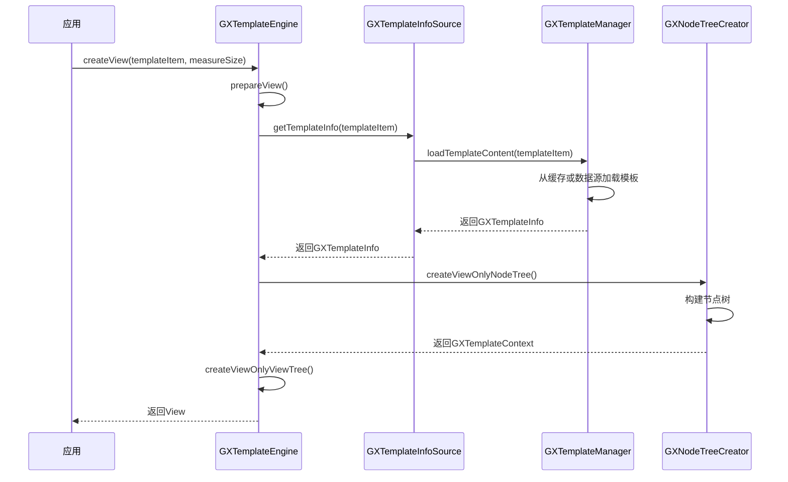
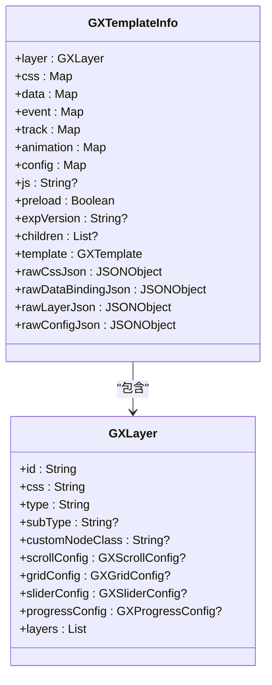
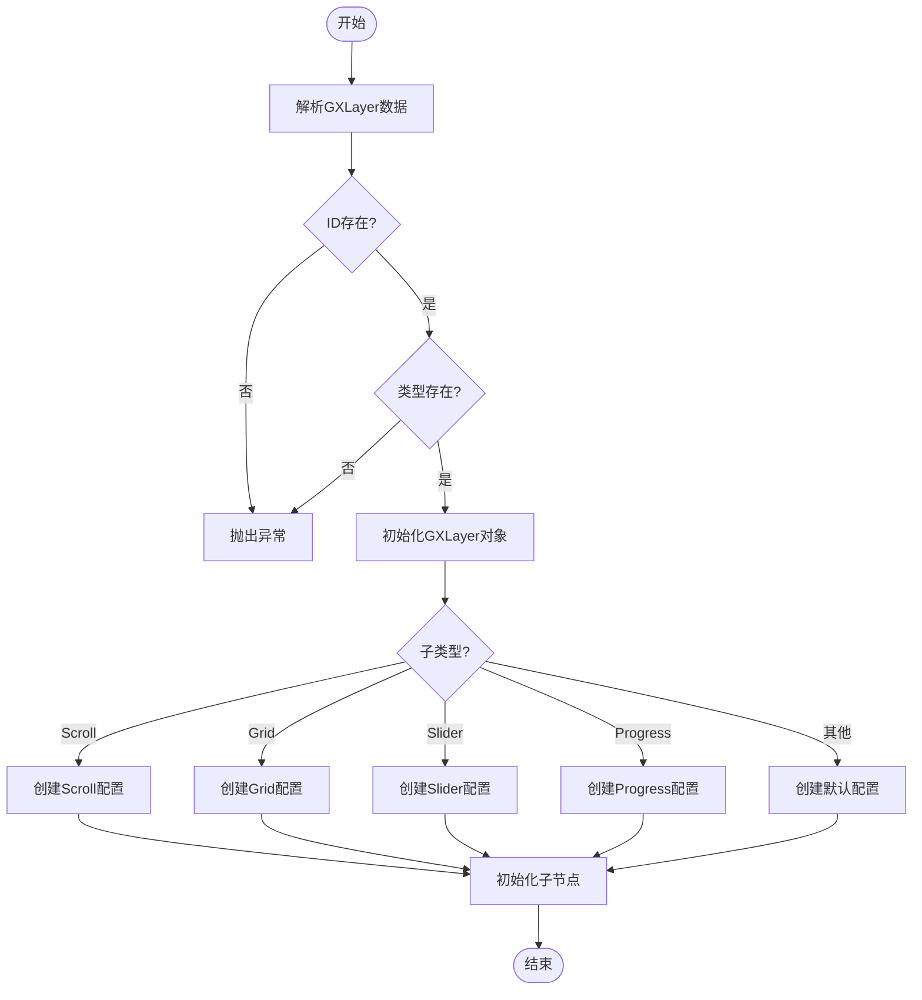
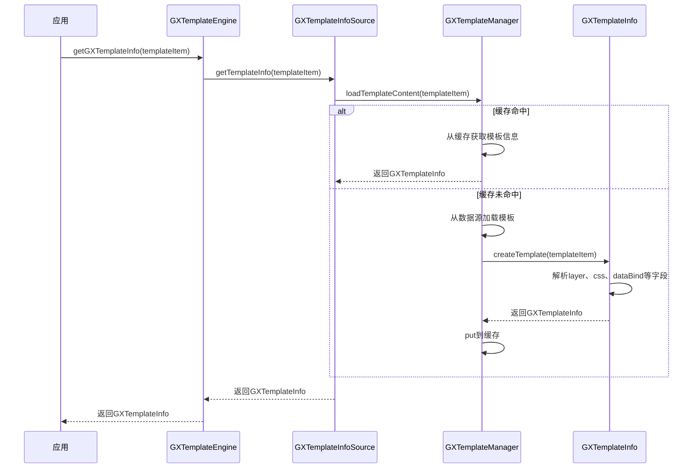
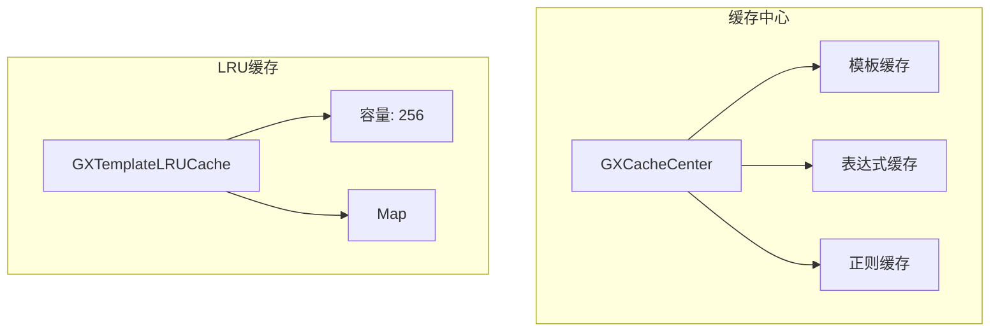
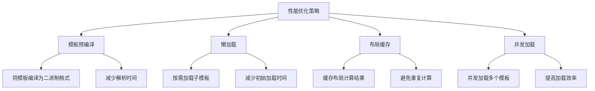
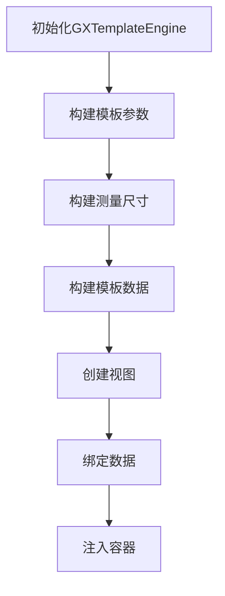
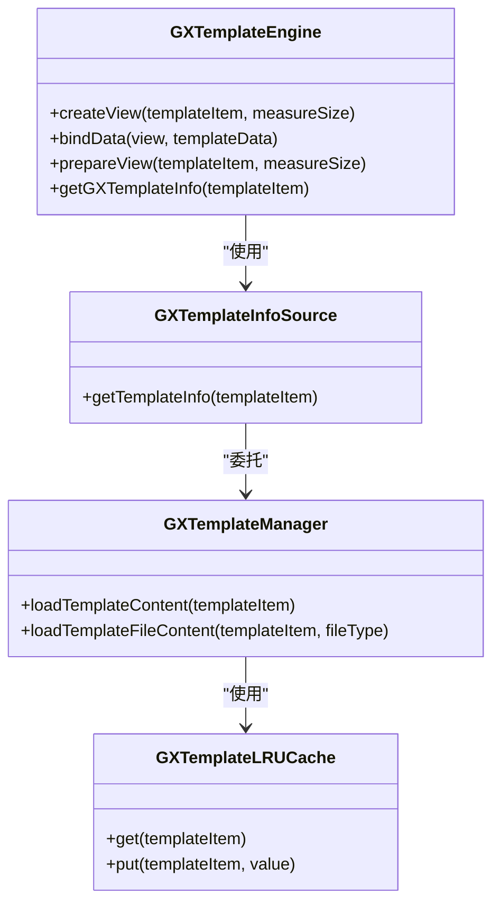
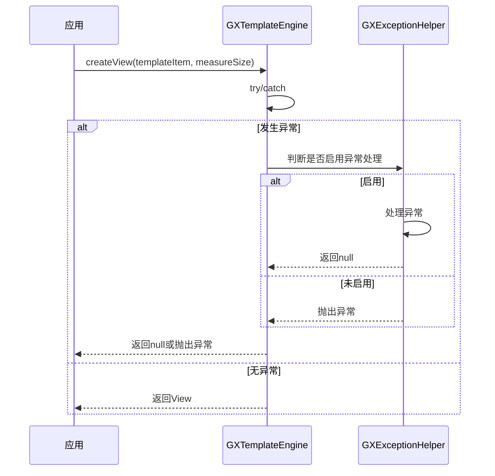

# 模板系统

<cite>
**本文档中引用的文件**  
- [GXTemplateEngine.kt](file://GaiaXAndroid/src/main/kotlin/com/alibaba/gaiax/GXTemplateEngine.kt)
- [GXTemplateInfo.kt](file://GaiaXAndroid/src/main/kotlin/com/alibaba/gaiax/template/GXTemplateInfo.kt)
- [GXLayer.kt](file://GaiaXAndroid/src/main/kotlin/com/alibaba/gaiax/template/GXLayer.kt)
- [GXTemplate.kt](file://GaiaXAndroid/src/main/kotlin/com/alibaba/gaiax/template/GXTemplate.kt)
- [GXTemplateManager.ets](file://GaiaXHarmony/GaiaXCore/GaiaX/src/main/ets/template/GXTemplateManager.ets)
- [GXTemplateLRUCache.ets](file://GaiaXHarmony/GaiaXCore/GaiaX/src/main/ets/template/GXTemplateLRUCache.ets)
- [GXCacheCenter.h](file://GaiaXiOS/GaiaXiOS/Template/Cache/GXCacheCenter.h)
- [GXCacheCenter.m](file://GaiaXiOS/GaiaXiOS/Template/Cache/GXCacheCenter.m)
- [GXNodeTreeCreator.ets](file://GaiaXHarmony/GaiaXCore/GaiaX/src/main/ets/creator/GXNodeTreeCreator.ets)
- [GXNodeTreeCreator.m](file://GaiaXiOS/GaiaXiOS/Core/Creator/GXNodeTreeCreator.m)
- [GXTemplateInfoSource.kt](file://GaiaXAndroid/src/main/kotlin/com/alibaba/gaiax/data/cache/GXTemplateInfoSource.kt)
- [GXAssetsBinaryWithoutSuffixTemplate.kt](file://GaiaXAndroid/src/main/kotlin/com/alibaba/gaiax/data/assets/GXAssetsBinaryWithoutSuffixTemplate.kt)
</cite>

## 目录
1. [简介](#简介)
2. [核心组件](#核心组件)
3. [模板生命周期与GXTemplateEngine](#模板生命周期与gxtemplateengine)
4. [模板元数据与GXTemplateInfo](#模板元数据与gxtemplateinfo)
5. [视图层级结构与GXLayer](#视图层级结构与gxlayer)
6. [模板加载与解析流程](#模板加载与解析流程)
7. [缓存机制](#缓存机制)
8. [性能优化策略](#性能优化策略)
9. [模板创建与使用指南](#模板创建与使用指南)
10. [高级特性](#高级特性)
11. [错误处理与调试](#错误处理与调试)
12. [结论](#结论)

## 简介
GaiaX模板系统是一个轻量级的跨平台纯原生动态卡片解决方案，旨在确保原生体验和性能的同时，帮助客户端实现低代码开发。该系统通过GXTemplateEngine作为核心入口，驱动整个模板的生命周期，包括模板的加载、解析、实例化和渲染。模板元数据由GXTemplateInfo定义和解析，视图层级结构由GXLayer构建和管理。系统支持模板预编译、懒加载等高级特性，并提供模板版本管理、热更新支持和错误处理机制。

## 核心组件
GaiaX模板系统的核心组件包括GXTemplateEngine、GXTemplateInfo、GXLayer和GXTemplate。这些组件协同工作，实现模板的完整生命周期管理。

**本文档中引用的文件**  
- [GXTemplateEngine.kt](file://GaiaXAndroid/src/main/kotlin/com/alibaba/gaiax/GXTemplateEngine.kt)
- [GXTemplateInfo.kt](file://GaiaXAndroid/src/main/kotlin/com/alibaba/gaiax/template/GXTemplateInfo.kt)
- [GXLayer.kt](file://GaiaXAndroid/src/main/kotlin/com/alibaba/gaiax/template/GXLayer.kt)
- [GXTemplate.kt](file://GaiaXAndroid/src/main/kotlin/com/alibaba/gaiax/template/GXTemplate.kt)

## 模板生命周期与GXTemplateEngine
GXTemplateEngine是GaiaX模板系统的核心入口，负责驱动整个模板的生命周期。它提供了创建视图、绑定数据、重置视图和销毁视图等关键方法。

**Diagram sources**
- [GXTemplateEngine.kt](file://GaiaXAndroid/src/main/kotlin/com/alibaba/gaiax/GXTemplateEngine.kt#L558-L583)
- [GXTemplateInfoSource.kt](file://GaiaXAndroid/src/main/kotlin/com/alibaba/gaiax/data/cache/GXTemplateInfoSource.kt#L50-L76)
- [GXTemplateManager.ets](file://GaiaXHarmony/GaiaXCore/GaiaX/src/main/ets/template/GXTemplateManager.ets#L30-L47)
- [GXNodeTreeCreator.ets](file://GaiaXHarmony/GaiaXCore/GaiaX/src/main/ets/creator/GXNodeTreeCreator.ets#L27-L59)

**Section sources**
- [GXTemplateEngine.kt](file://GaiaXAndroid/src/main/kotlin/com/alibaba/gaiax/GXTemplateEngine.kt#L558-L583)

## 模板元数据与GXTemplateInfo
GXTemplateInfo负责定义和解析模板的元数据，包括视图层级、样式、数据绑定、事件、埋点和动画等信息。它通过解析模板文件生成完整的模板信息对象。

**Diagram sources**
- [GXTemplateInfo.kt](file://GaiaXAndroid/src/main/kotlin/com/alibaba/gaiax/template/GXTemplateInfo.kt#L32-L416)
- [GXLayer.kt](file://GaiaXAndroid/src/main/kotlin/com/alibaba/gaiax/template/GXLayer.kt#L28-L311)

**Section sources**
- [GXTemplateInfo.kt](file://GaiaXAndroid/src/main/kotlin/com/alibaba/gaiax/template/GXTemplateInfo.kt#L32-L416)

## 视图层级结构与GXLayer
GXLayer负责构建和管理视图的层级结构。它定义了节点的ID、样式ID、类型、子类型、自定义节点类以及各种配置信息，并通过递归方式构建完整的视图层级树。

**Diagram sources**
- [GXLayer.kt](file://GaiaXAndroid/src/main/kotlin/com/alibaba/gaiax/template/GXLayer.kt#L81-L202)

**Section sources**
- [GXLayer.kt](file://GaiaXAndroid/src/main/kotlin/com/alibaba/gaiax/template/GXLayer.kt#L81-L202)

## 模板加载与解析流程
模板的加载与解析流程包括从数据源获取模板内容、解析模板文件、构建模板信息对象和缓存模板信息等步骤。

**Diagram sources**
- [GXTemplateEngine.kt](file://GaiaXAndroid/src/main/kotlin/com/alibaba/gaiax/GXTemplateEngine.kt#L546-L548)
- [GXTemplateInfoSource.kt](file://GaiaXAndroid/src/main/kotlin/com/alibaba/gaiax/data/cache/GXTemplateInfoSource.kt#L50-L76)
- [GXTemplateManager.ets](file://GaiaXHarmony/GaiaXCore/GaiaX/src/main/ets/template/GXTemplateManager.ets#L30-L47)
- [GXTemplateInfo.kt](file://GaiaXAndroid/src/main/kotlin/com/alibaba/gaiax/template/GXTemplateInfo.kt#L174-L249)

**Section sources**
- [GXTemplateEngine.kt](file://GaiaXAndroid/src/main/kotlin/com/alibaba/gaiax/GXTemplateEngine.kt#L546-L548)
- [GXTemplateInfoSource.kt](file://GaiaXAndroid/src/main/kotlin/com/alibaba/gaiax/data/cache/GXTemplateInfoSource.kt#L50-L76)

## 缓存机制
GaiaX模板系统采用多级缓存机制，包括内存缓存和LRU缓存，以提高模板加载和解析的性能。

**Diagram sources**
- [GXCacheCenter.h](file://GaiaXiOS/GaiaXiOS/Template/Cache/GXCacheCenter.h#L24-L37)
- [GXCacheCenter.m](file://GaiaXiOS/GaiaXiOS/Template/Cache/GXCacheCenter.m#L23-L55)
- [GXTemplateLRUCache.ets](file://GaiaXHarmony/GaiaXCore/GaiaX/src/main/ets/template/GXTemplateLRUCache.ets#L20-L70)

**Section sources**
- [GXCacheCenter.h](file://GaiaXiOS/GaiaXiOS/Template/Cache/GXCacheCenter.h#L24-L37)
- [GXTemplateLRUCache.ets](file://GaiaXHarmony/GaiaXCore/GaiaX/src/main/ets/template/GXTemplateLRUCache.ets#L20-L70)

## 性能优化策略
GaiaX模板系统通过多种策略优化性能，包括模板预编译、懒加载、布局缓存和并发加载等。

**Diagram sources**
- [GXTemplateEngine.kt](file://GaiaXAndroid/src/main/kotlin/com/alibaba/gaiax/GXTemplateEngine.kt#L513-L534)
- [GXGlobalCache.kt](file://GaiaXAndroid/src/main/kotlin/com/alibaba/gaiax/utils/GXGlobalCache.kt#L40-L75)
- [GXAssetsBinaryWithoutSuffixTemplate.kt](file://GaiaXAndroid/src/main/kotlin/com/alibaba/gaiax/data/assets/GXAssetsBinaryWithoutSuffixTemplate.kt#L53-L93)

**Section sources**
- [GXTemplateEngine.kt](file://GaiaXAndroid/src/main/kotlin/com/alibaba/gaiax/GXTemplateEngine.kt#L513-L534)
- [GXGlobalCache.kt](file://GaiaXAndroid/src/main/kotlin/com/alibaba/gaiax/utils/GXGlobalCache.kt#L40-L75)

## 模板创建与使用指南
为初学者提供模板创建和使用的直观指南，包括基本使用步骤和代码示例。

**Diagram sources**
- [GXTemplateEngine.kt](file://GaiaXAndroid/src/main/kotlin/com/alibaba/gaiax/GXTemplateEngine.kt#L63-L76)

**Section sources**
- [GXTemplateEngine.kt](file://GaiaXAndroid/src/main/kotlin/com/alibaba/gaiax/GXTemplateEngine.kt#L63-L76)

## 高级特性
为高级开发者提供模板预编译、懒加载等高级特性的技术细节。

**Diagram sources**
- [GXTemplateEngine.kt](file://GaiaXAndroid/src/main/kotlin/com/alibaba/gaiax/GXTemplateEngine.kt#L558-L583)
- [GXTemplateInfoSource.kt](file://GaiaXAndroid/src/main/kotlin/com/alibaba/gaiax/data/cache/GXTemplateInfoSource.kt#L50-L76)
- [GXTemplateManager.ets](file://GaiaXHarmony/GaiaXCore/GaiaX/src/main/ets/template/GXTemplateManager.ets#L30-L47)
- [GXTemplateLRUCache.ets](file://GaiaXHarmony/GaiaXCore/GaiaX/src/main/ets/template/GXTemplateLRUCache.ets#L20-L70)

**Section sources**
- [GXTemplateEngine.kt](file://GaiaXAndroid/src/main/kotlin/com/alibaba/gaiax/GXTemplateEngine.kt#L558-L583)

## 错误处理与调试
解释模板版本管理、热更新支持和错误处理机制。

**Diagram sources**
- [GXTemplateEngine.kt](file://GaiaXAndroid/src/main/kotlin/com/alibaba/gaiax/GXTemplateEngine.kt#L575-L582)
- [GXExceptionHelper.kt](file://GaiaXAndroid/src/main/kotlin/com/alibaba/gaiax/utils/GXExceptionHelper.kt)

**Section sources**
- [GXTemplateEngine.kt](file://GaiaXAndroid/src/main/kotlin/com/alibaba/gaiax/GXTemplateEngine.kt#L575-L582)

## 结论
GaiaX模板系统通过GXTemplateEngine作为核心入口，实现了模板的完整生命周期管理。GXTemplateInfo负责定义和解析模板元数据，GXLayer负责构建和管理视图层级结构。系统采用多级缓存机制和多种性能优化策略，确保了高效的模板加载和渲染。为初学者提供了直观的使用指南，为高级开发者提供了丰富的高级特性。通过完善的错误处理和调试机制，保证了系统的稳定性和可靠性。