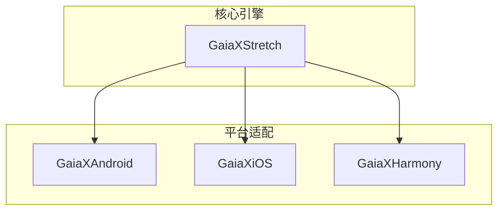
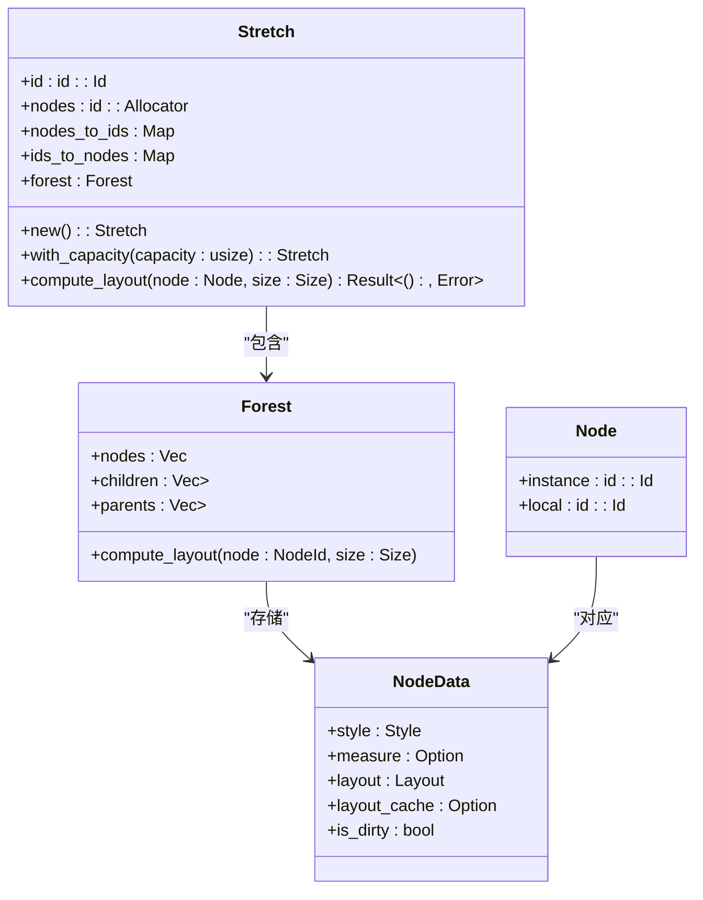
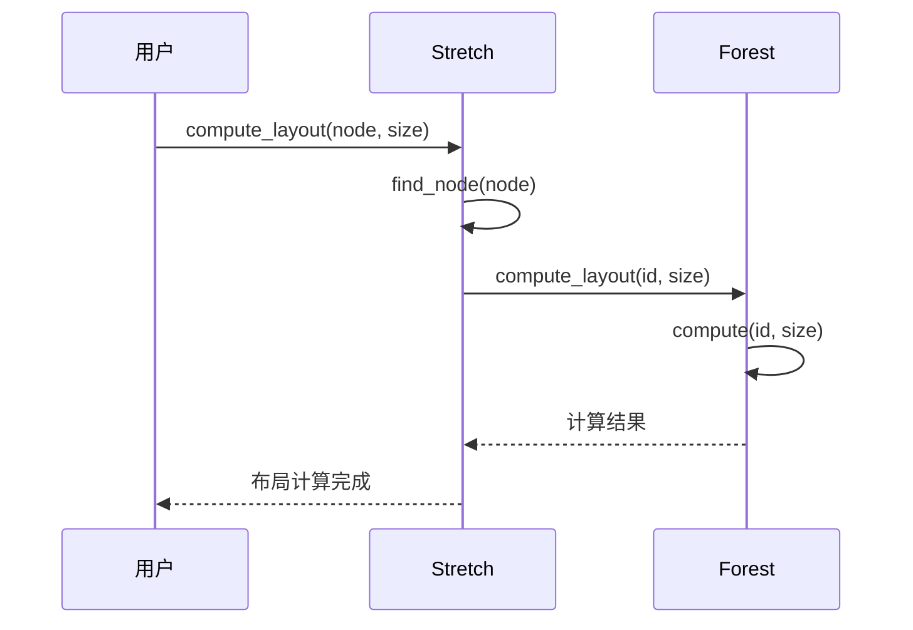
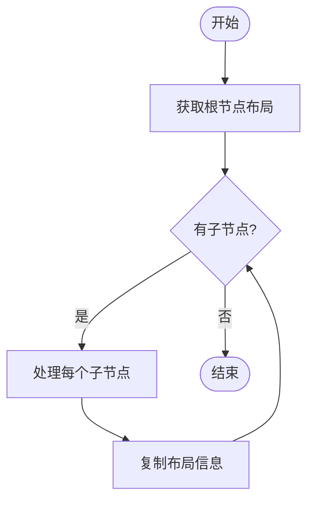
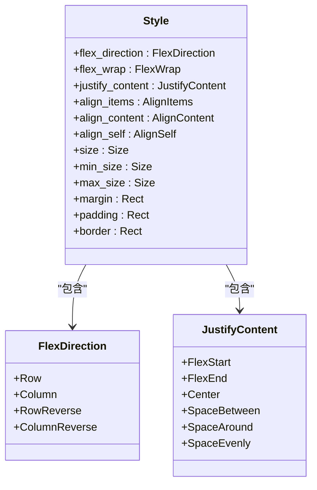
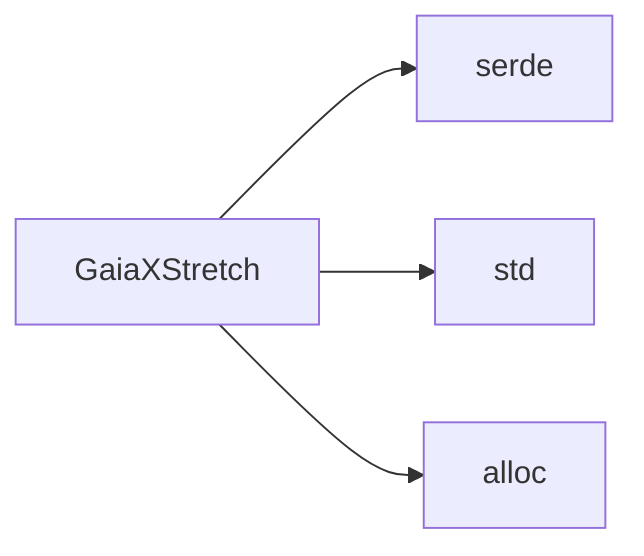

# 布局引擎

<cite>
**本文档引用文件**  
- [lib.rs](file://GaiaXStretch/src/lib.rs)
- [node.rs](file://GaiaXStretch/src/node.rs)
- [algo.rs](file://GaiaXStretch/src/algo.rs)
- [forest.rs](file://GaiaXStretch/src/forest.rs)
- [Layout.kt](file://GaiaXAndroid/src/main/kotlin/app/visly/stretch/Layout.kt)
- [GXLayout.h](file://GaiaXiOS/GaiaXiOS/Core/StretchKit/Classes/GXLayout.h)
- [GXLayout.m](file://GaiaXiOS/GaiaXiOS/Core/StretchKit/Classes/GXLayout.m)
- [Stretch.kt](file://GaiaXAndroid/src/main/kotlin/app/visly/stretch/Stretch.kt)
</cite>

## 目录
1. [简介](#简介)
2. [项目结构](#项目结构)
3. [核心组件](#核心组件)
4. [架构概述](#架构概述)
5. [详细组件分析](#详细组件分析)
6. [依赖分析](#依赖分析)
7. [性能考量](#性能考量)
8. [故障排除指南](#故障排除指南)
9. [结论](#结论)

## 简介
GaiaX布局引擎是一个基于Rust实现的跨平台布局系统，名为GaiaXStretch。该引擎实现了Flexbox布局规范，支持Android、iOS和HarmonyOS平台。其核心功能包括布局计算、尺寸计算、约束处理和性能优化。通过原生绑定机制，GaiaXStretch能够在不同平台上高效运行，并提供内存管理策略以确保稳定性和性能。

## 项目结构
GaiaX项目包含多个模块，分别针对不同的平台和功能。主要模块包括GaiaXAndroid、GaiaXiOS、GaiaXHarmony和GaiaXStretch。其中，GaiaXStretch是核心布局引擎，使用Rust编写，提供跨平台的布局计算能力。其他模块通过JNI或原生绑定调用GaiaXStretch的功能。

**图表来源**
- [lib.rs](file://GaiaXStretch/src/lib.rs)
- [node.rs](file://GaiaXStretch/src/node.rs)

**本节来源**
- [lib.rs](file://GaiaXStretch/src/lib.rs)
- [node.rs](file://GaiaXStretch/src/node.rs)

## 核心组件
GaiaXStretch的核心组件包括`Stretch`、`Node`、`Layout`和`Style`。这些组件共同实现了Flexbox布局算法，支持复杂的布局需求。

**本节来源**
- [lib.rs](file://GaiaXStretch/src/lib.rs)
- [node.rs](file://GaiaXStretch/src/node.rs)

## 架构概述
GaiaXStretch的架构基于Rust的`Stretch`结构，该结构管理布局计算的整个过程。`Stretch`结构包含节点分配器、节点到ID的映射、ID到节点的映射以及森林结构。森林结构用于存储节点树，支持高效的布局计算。

**图表来源**
- [lib.rs](file://GaiaXStretch/src/lib.rs)
- [node.rs](file://GaiaXStretch/src/node.rs)
- [forest.rs](file://GaiaXStretch/src/forest.rs)

## 详细组件分析

### compute_layout函数分析
`compute_layout`函数是GaiaXStretch的核心，负责计算指定节点的布局。该函数首先查找节点ID，然后调用森林结构的`compute_layout`方法进行实际计算。

**图表来源**
- [node.rs](file://GaiaXStretch/src/node.rs)
- [forest.rs](file://GaiaXStretch/src/forest.rs)

**本节来源**
- [node.rs](file://GaiaXStretch/src/node.rs)

### copy_output函数分析
`copy_output`函数负责递归构建布局结果树。该函数从根节点开始，逐层复制布局信息，直到所有子节点都被处理。

**图表来源**
- [algo.rs](file://GaiaXStretch/src/algo.rs)

**本节来源**
- [algo.rs](file://GaiaXStretch/src/algo.rs)

### Flexbox布局规范实现
GaiaXStretch完整实现了Flexbox布局规范，包括主轴和交叉轴的对齐、伸缩、换行等功能。通过`Style`结构体，可以设置各种Flexbox属性，如`flex_direction`、`justify_content`、`align_items`等。

**图表来源**
- [style.rs](file://GaiaXStretch/src/style.rs)

**本节来源**
- [style.rs](file://GaiaXStretch/src/style.rs)

## 依赖分析
GaiaXStretch依赖于Rust的标准库和一些第三方库，如`serde`用于序列化。通过`Cargo.toml`文件管理依赖关系，确保跨平台兼容性。

**图表来源**
- [Cargo.toml](file://GaiaXStretch/Cargo.toml)

**本节来源**
- [Cargo.toml](file://GaiaXStretch/Cargo.toml)

## 性能考量
GaiaXStretch通过缓存机制和高效的算法设计，确保布局计算的高性能。`compute_layout`函数会检查缓存，避免重复计算。此外，通过`mark_dirty`方法，可以精确控制哪些节点需要重新计算。

**本节来源**
- [algo.rs](file://GaiaXStretch/src/algo.rs)
- [forest.rs](file://GaiaXStretch/src/forest.rs)

## 故障排除指南
在使用GaiaXStretch时，可能会遇到布局计算不正确的问题。建议检查以下几点：
1. 确保节点的`Style`设置正确。
2. 检查是否有循环依赖。
3. 验证输入的尺寸是否合理。
4. 使用`mark_dirty`方法强制重新计算。

**本节来源**
- [node.rs](file://GaiaXStretch/src/node.rs)
- [algo.rs](file://GaiaXStretch/src/algo.rs)

## 结论
GaiaXStretch是一个高效、可靠的跨平台布局引擎，基于Rust实现，支持Flexbox布局规范。通过原生绑定机制，可以在Android、iOS和HarmonyOS平台上无缝集成。其核心功能包括布局计算、尺寸计算、约束处理和性能优化，为开发者提供了强大的布局能力。