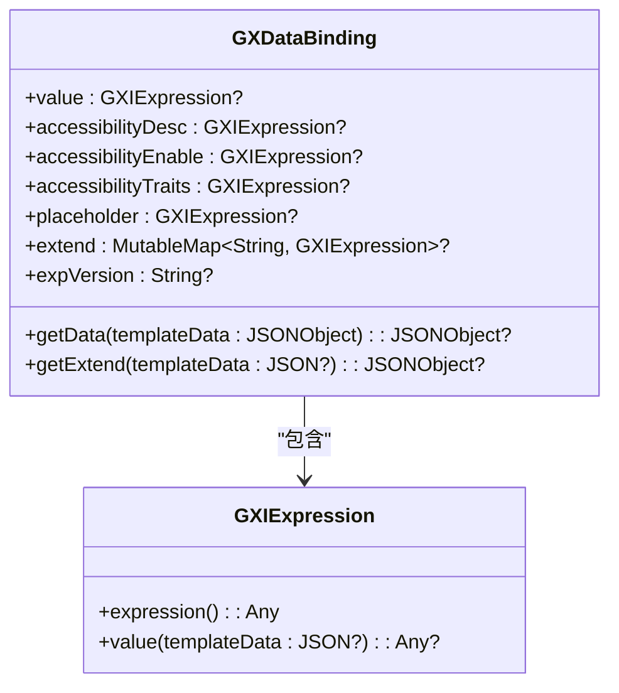
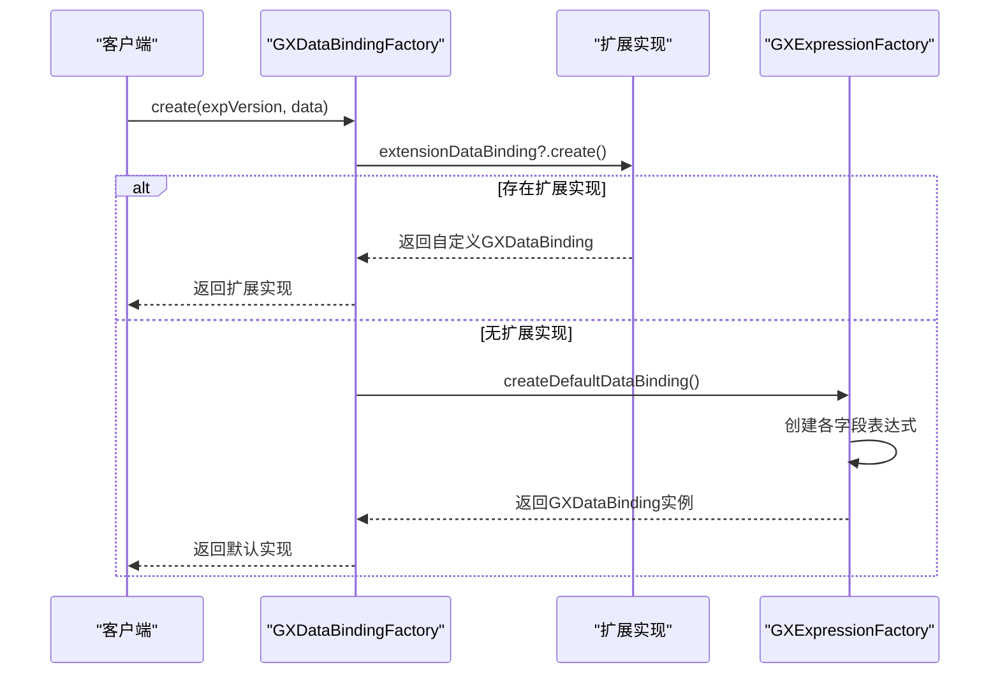
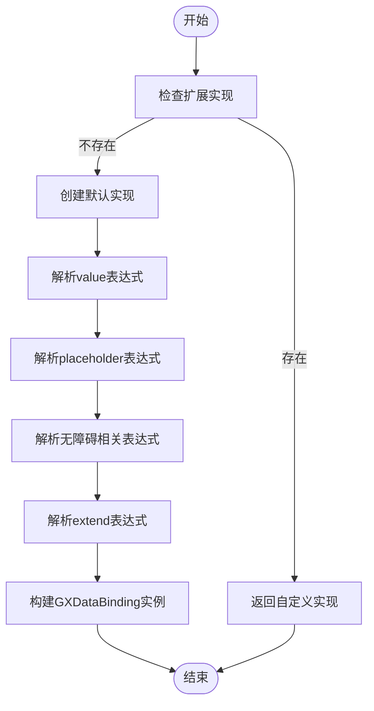
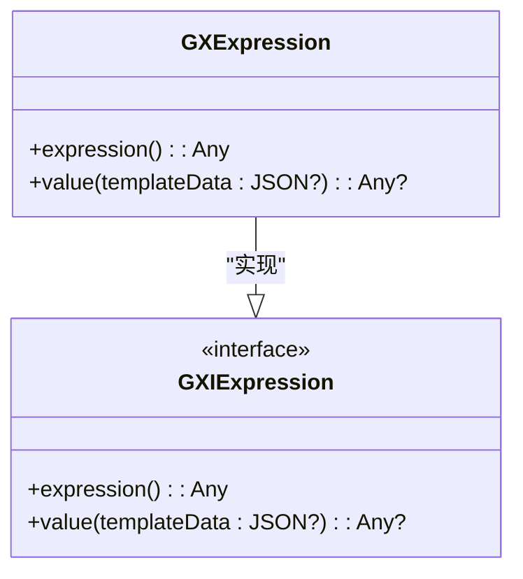
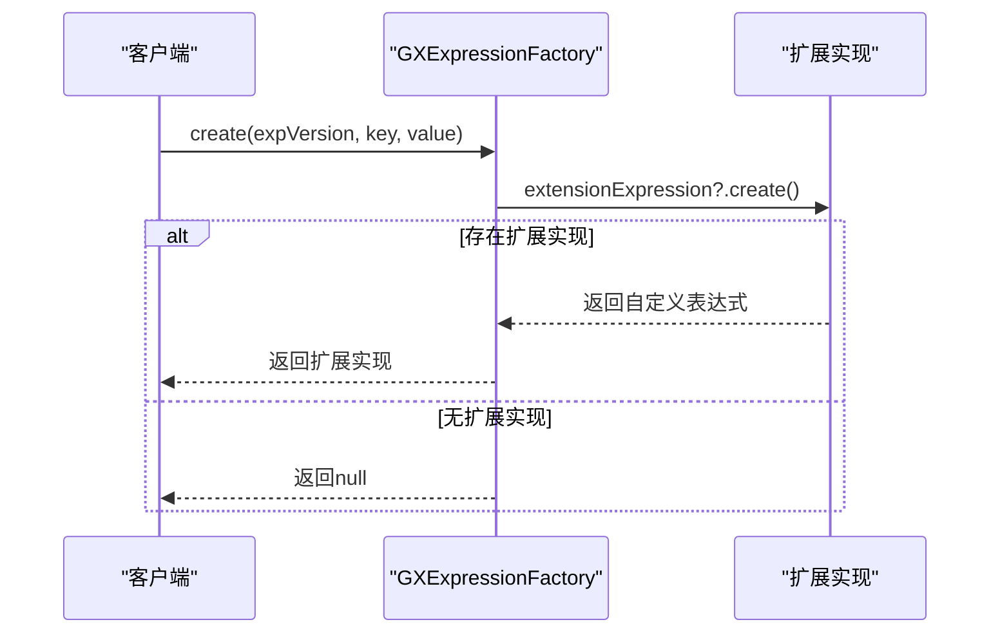
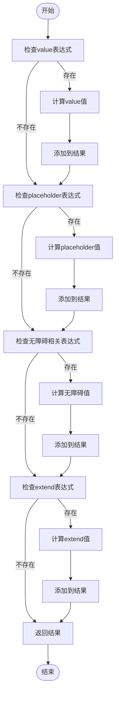
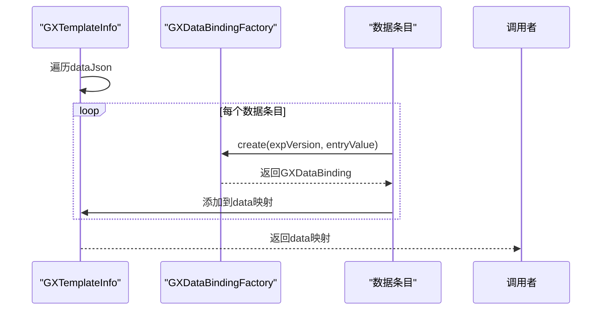
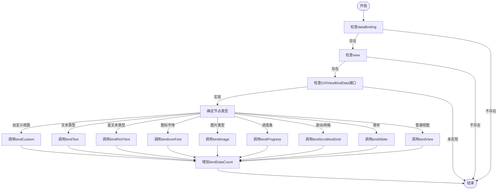
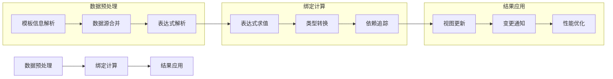
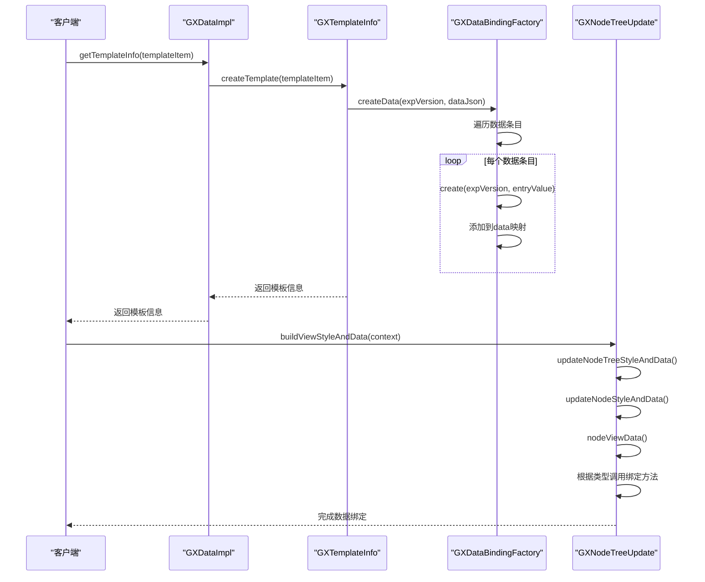

# 数据处理

<cite>
**本文档引用的文件**   
- [GXDataImpl.kt](file://GaiaXAndroid/src/main/kotlin/com/alibaba/gaiax/data/GXDataImpl.kt)
- [GXDataBinding.kt](file://GaiaXAndroid/src/main/kotlin/com/alibaba/gaiax/template/GXDataBinding.kt)
- [GXDataBindingFactory.kt](file://GaiaXAndroid/src/main/kotlin/com/alibaba/gaiax/template/factory/GXDataBindingFactory.kt)
- [GXTemplateInfo.kt](file://GaiaXAndroid/src/main/kotlin/com/alibaba/gaiax/template/GXTemplateInfo.kt)
- [GXExpressionFactory.kt](file://GaiaXAndroid/src/main/kotlin/com/alibaba/gaiax/template/factory/GXExpressionFactory.kt)
- [GXNodeTreeUpdate.kt](file://GaiaXAndroid/src/main/kotlin/com/alibaba/gaiax/render/node/GXNodeTreeUpdate.kt)
</cite>

## 目录
1. [引言](#引言)
2. [核心组件分析](#核心组件分析)
3. [数据绑定创建过程](#数据绑定创建过程)
4. [表达式解析机制](#表达式解析机制)
5. [数据更新策略](#数据更新策略)
6. [数据处理管道](#数据处理管道)
7. [性能优化建议](#性能优化建议)
8. [常见问题解决方案](#常见问题解决方案)

## 引言
GaiaX数据处理系统是整个框架的核心组件之一，负责模板数据的解析、绑定和更新。该系统通过GXDataImpl和GXDataBinding两个核心类实现数据处理功能，为模板渲染提供动态数据支持。本文档将深入分析这两个组件的实现细节，包括数据绑定的创建过程、表达式解析机制、数据更新策略等核心功能，为开发者提供全面的技术参考。

## 核心组件分析

### GXDataImpl类
GXDataImpl是GaiaX数据处理系统的主要实现类，负责管理模板信息和数据源。该类通过模板信息源(templateInfoSource)和模板源(templateSource)两个懒加载属性来缓存和管理模板数据。

**核心功能：**
- 模板信息获取：通过getTemplateInfo方法获取指定模板项的模板信息
- 数据源管理：通过优先级队列管理多个数据源，支持数据源的注册和重置
- 模板信息缓存：通过懒加载机制缓存模板信息，提高数据访问效率

**Section sources**
- [GXDataImpl.kt](file://GaiaXAndroid/src/main/kotlin/com/alibaba/gaiax/data/GXDataImpl.kt#L28-L167)

### GXDataBinding类
GXDataBinding是数据绑定的核心类，封装了模板中各种数据绑定的表达式。该类通过多个GXExpression实例来管理不同的数据绑定字段。

**Diagram sources **
- [GXDataBinding.kt](file://GaiaXAndroid/src/main/kotlin/com/alibaba/gaiax/template/GXDataBinding.kt#L26-L105)

**Section sources**
- [GXDataBinding.kt](file://GaiaXAndroid/src/main/kotlin/com/alibaba/gaiax/template/GXDataBinding.kt#L26-L105)

## 数据绑定创建过程

### 数据绑定工厂
GXDataBindingFactory是数据绑定的创建工厂，负责根据配置数据创建相应的GXDataBinding实例。工厂模式的使用使得数据绑定的创建过程更加灵活和可扩展。

**Diagram sources **
- [GXDataBindingFactory.kt](file://GaiaXAndroid/src/main/kotlin/com/alibaba/gaiax/template/factory/GXDataBindingFactory.kt#L10-L73)
- [GXExpressionFactory.kt](file://GaiaXAndroid/src/main/kotlin/com/alibaba/gaiax/template/factory/GXExpressionFactory.kt#L31-L45)

### 创建流程分析
数据绑定的创建过程遵循以下步骤：

1. **扩展点检查**：首先检查是否存在自定义的数据绑定扩展实现
2. **默认实现创建**：如果不存在扩展实现，则创建默认的数据绑定实例
3. **表达式解析**：使用GXExpressionFactory解析各个字段的表达式
4. **实例构建**：将解析后的表达式注入到GXDataBinding实例中

**Diagram sources **
- [GXDataBindingFactory.kt](file://GaiaXAndroid/src/main/kotlin/com/alibaba/gaiax/template/factory/GXDataBindingFactory.kt#L10-L73)

**Section sources**
- [GXDataBindingFactory.kt](file://GaiaXAndroid/src/main/kotlin/com/alibaba/gaiax/template/factory/GXDataBindingFactory.kt#L10-L73)

## 表达式解析机制

### 表达式接口
GXIExpression是表达式解析的核心接口，定义了表达式的基本行为。所有表达式实现都必须实现该接口。

**Diagram sources **
- [GXIExpression.kt](file://GaiaXAndroid/src/main/kotlin/com/alibaba/gaiax/template/GXIExpression.kt#L24-L29)

### 表达式工厂
GXExpressionFactory负责创建各种类型的表达式实例，通过扩展点机制支持自定义表达式实现。

**Diagram sources **
- [GXExpressionFactory.kt](file://GaiaXAndroid/src/main/kotlin/com/alibaba/gaiax/template/factory/GXExpressionFactory.kt#L31-L45)

### 数据绑定解析
GXDataBinding通过getData方法解析绑定数据，将表达式计算结果转换为JSON对象。

**Diagram sources **
- [GXDataBinding.kt](file://GaiaXAndroid/src/main/kotlin/com/alibaba/gaiax/template/GXDataBinding.kt#L47-L88)

**Section sources**
- [GXDataBinding.kt](file://GaiaXAndroid/src/main/kotlin/com/alibaba/gaiax/template/GXDataBinding.kt#L47-L88)

## 数据更新策略

### 模板信息创建
GXTemplateInfo的createData方法负责创建数据绑定映射，将JSON配置转换为GXDataBinding实例集合。

**Diagram sources **
- [GXTemplateInfo.kt](file://GaiaXAndroid/src/main/kotlin/com/alibaba/gaiax/template/GXTemplateInfo.kt#L279-L298)

### 视图数据绑定
GXNodeTreeUpdate.Style.nodeViewData方法负责将数据绑定到视图组件上，根据节点类型调用相应的绑定方法。

**Diagram sources **
- [GXNodeTreeUpdate.kt](file://GaiaXAndroid/src/main/kotlin/com/alibaba/gaiax/render/node/GXNodeTreeUpdate.kt#L960-L991)

**Section sources**
- [GXNodeTreeUpdate.kt](file://GaiaXAndroid/src/main/kotlin/com/alibaba/gaiax/render/node/GXNodeTreeUpdate.kt#L960-L991)

## 数据处理管道

### 数据处理阶段
GaiaX数据处理管道包含三个主要阶段：数据预处理、绑定计算和结果应用。

**Diagram sources **
- [GXDataImpl.kt](file://GaiaXAndroid/src/main/kotlin/com/alibaba/gaiax/data/GXDataImpl.kt#L28-L167)
- [GXDataBinding.kt](file://GaiaXAndroid/src/main/kotlin/com/alibaba/gaiax/template/GXDataBinding.kt#L26-L105)
- [GXNodeTreeUpdate.kt](file://GaiaXAndroid/src/main/kotlin/com/alibaba/gaiax/render/node/GXNodeTreeUpdate.kt#L960-L991)

### 完整处理流程

**Diagram sources **
- [GXDataImpl.kt](file://GaiaXAndroid/src/main/kotlin/com/alibaba/gaiax/data/GXDataImpl.kt#L30-L33)
- [GXTemplateInfo.kt](file://GaiaXAndroid/src/main/kotlin/com/alibaba/gaiax/template/GXTemplateInfo.kt#L174-L178)
- [GXNodeTreeUpdate.kt](file://GaiaXAndroid/src/main/kotlin/com/alibaba/gaiax/render/node/GXNodeTreeUpdate.kt#L95-L104)

**Section sources**
- [GXDataImpl.kt](file://GaiaXAndroid/src/main/kotlin/com/alibaba/gaiax/data/GXDataImpl.kt#L30-L33)
- [GXTemplateInfo.kt](file://GaiaXAndroid/src/main/kotlin/com/alibaba/gaiax/template/GXTemplateInfo.kt#L174-L178)
- [GXNodeTreeUpdate.kt](file://GaiaXAndroid/src/main/kotlin/com/alibaba/gaiax/render/node/GXNodeTreeUpdate.kt#L95-L104)

## 性能优化建议

### 缓存策略
- 使用懒加载(lazy)属性缓存模板信息和数据源
- 优先级队列缓存已排序的数据源列表
- 复用视图测量组件(GXMeasureViewPool)

### 批量处理
- 批量更新节点布局，减少UI重绘次数
- 延迟处理文字自适应计算，避免重复计算
- 合并数据变更通知，减少事件触发频率

### 内存管理
- 及时释放不再使用的视图测量组件
- 使用弱引用避免内存泄漏
- 合理设置数据缓存大小

## 常见问题解决方案

### 数据绑定失败
**问题**：数据绑定表达式无法正确解析
**解决方案**：
1. 检查表达式语法是否正确
2. 确认数据源中存在对应的字段
3. 验证表达式工厂是否正确注册

### 性能瓶颈
**问题**：大量数据绑定导致界面卡顿
**解决方案**：
1. 使用懒加载减少初始加载时间
2. 优化表达式解析逻辑，避免重复计算
3. 采用分页加载策略处理大数据集

### 类型转换错误
**问题**：数据类型转换失败导致异常
**解决方案**：
1. 在表达式解析时进行类型验证
2. 提供默认值处理空值情况
3. 使用安全的类型转换方法