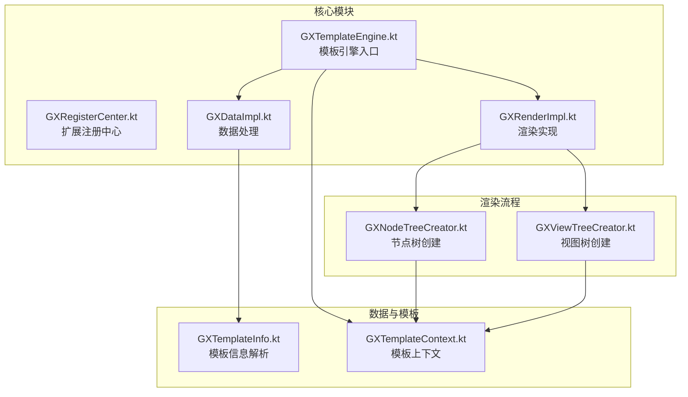
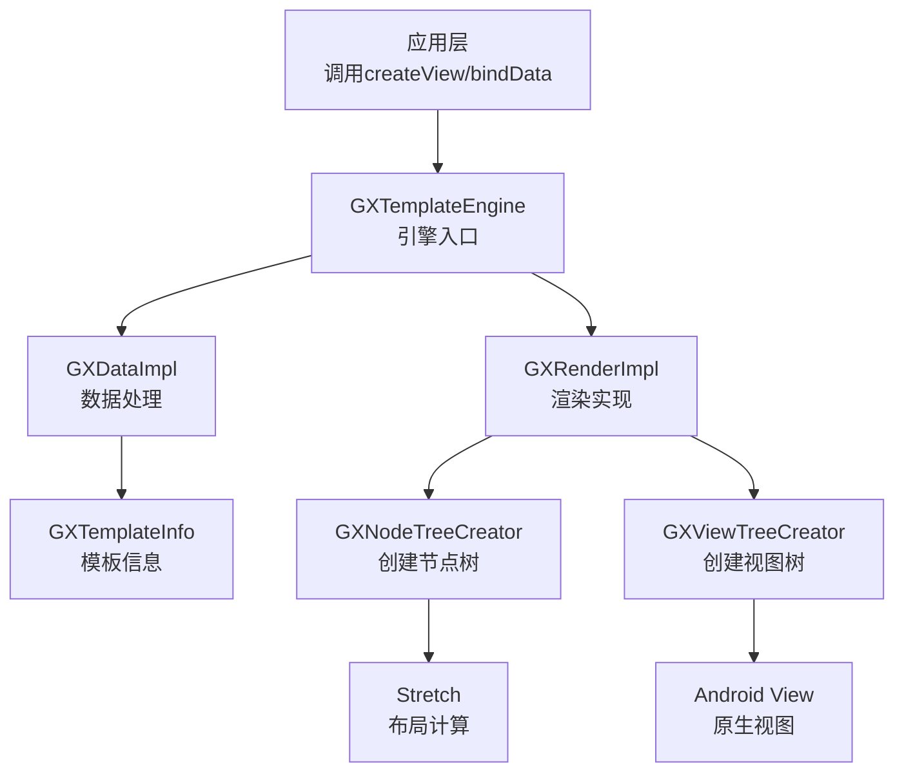
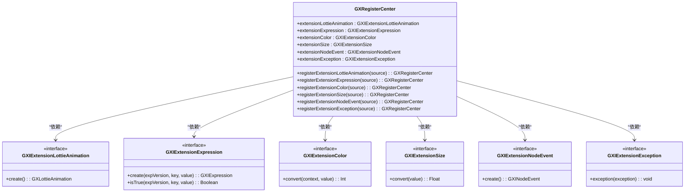
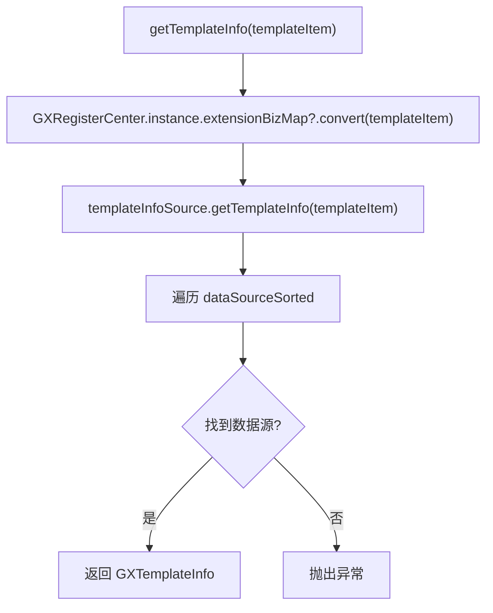
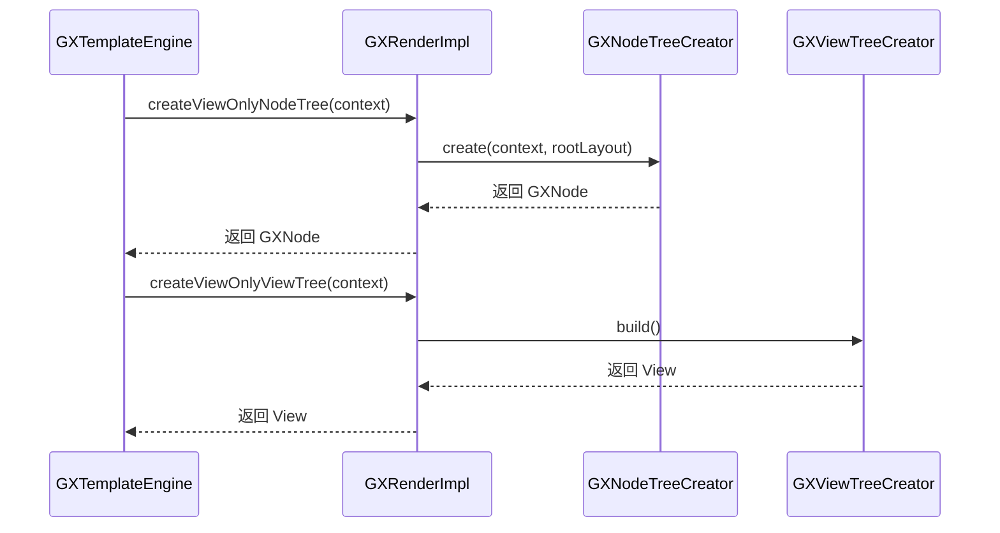
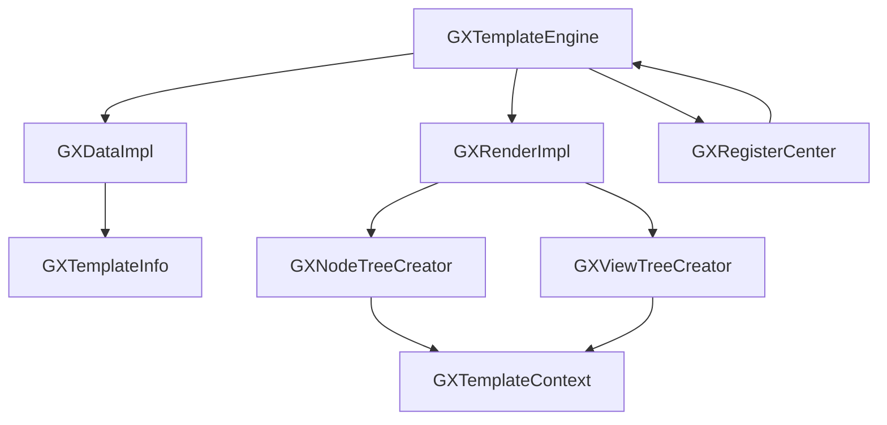

# 核心模块详解

<cite>
**本文档引用文件**   
- [GXTemplateEngine.kt](file://GaiaXAndroid/src/main/kotlin/com/alibaba/gaiax/GXTemplateEngine.kt)
- [GXRegisterCenter.kt](file://GaiaXAndroid/src/main/kotlin/com/alibaba/gaiax/GXRegisterCenter.kt)
- [GXDataImpl.kt](file://GaiaXAndroid/src/main/kotlin/com/alibaba/gaiax/data/GXDataImpl.kt)
- [GXRenderImpl.kt](file://GaiaXAndroid/src/main/kotlin/com/alibaba/gaiax/render/GXRenderImpl.kt)
- [GXTemplateInfo.kt](file://GaiaXAndroid/src/main/kotlin/com/alibaba/gaiax/template/GXTemplateInfo.kt)
- [GXTemplateContext.kt](file://GaiaXAndroid/src/main/kotlin/com/alibaba/gaiax/context/GXTemplateContext.kt)
- [GXNodeTreeCreator.kt](file://GaiaXAndroid/src/main/kotlin/com/alibaba/gaiax/render/node/GXNodeTreeCreator.kt)
- [GXViewTreeCreator.kt](file://GaiaXAndroid/src/main/kotlin/com/alibaba/gaiax/render/view/GXViewTreeCreator.kt)
</cite>

## 目录
1. [引言](#引言)
2. [项目结构](#项目结构)
3. [核心组件](#核心组件)
4. [架构概览](#架构概览)
5. [详细组件分析](#详细组件分析)
6. [依赖分析](#依赖分析)
7. [性能考虑](#性能考虑)
8. [故障排除指南](#故障排除指南)
9. [结论](#结论)

## 引言
GaiaX 是阿里巴巴开发的跨平台动态模板引擎，旨在通过纯原生渲染实现高性能、低代码的动态卡片开发。本架构文档深入解析其核心模块，包括模板引擎、数据处理、渲染系统和布局引擎等关键组件。文档涵盖 GXTemplateEngine 的高阶设计、GXRegisterCenter 的扩展机制、GXDataImpl 的数据处理流程以及 GXRenderImpl 的渲染实现，详细说明组件间的交互关系、数据流和集成模式，并为开发者提供系统上下文图和组件分解图。

## 项目结构
GaiaX 项目采用多平台模块化设计，核心功能通过共享逻辑实现跨平台一致性。Android 模块是主要实现，包含模板引擎、数据处理和渲染系统的核心代码。

**图表来源**
- [GXTemplateEngine.kt](file://GaiaXAndroid/src/main/kotlin/com/alibaba/gaiax/GXTemplateEngine.kt)
- [GXDataImpl.kt](file://GaiaXAndroid/src/main/kotlin/com/alibaba/gaiax/data/GXDataImpl.kt)
- [GXRenderImpl.kt](file://GaiaXAndroid/src/main/kotlin/com/alibaba/gaiax/render/GXRenderImpl.kt)
- [GXTemplateInfo.kt](file://GaiaXAndroid/src/main/kotlin/com/alibaba/gaiax/template/GXTemplateInfo.kt)
- [GXTemplateContext.kt](file://GaiaXAndroid/src/main/kotlin/com/alibaba/gaiax/context/GXTemplateContext.kt)
- [GXNodeTreeCreator.kt](file://GaiaXAndroid/src/main/kotlin/com/alibaba/gaiax/render/node/GXNodeTreeCreator.kt)
- [GXViewTreeCreator.kt](file://GaiaXAndroid/src/main/kotlin/com/alibaba/gaiax/render/view/GXViewTreeCreator.kt)

**章节来源**
- [GXTemplateEngine.kt](file://GaiaXAndroid/src/main/kotlin/com/alibaba/gaiax/GXTemplateEngine.kt#L1-L928)
- [GXRegisterCenter.kt](file://GaiaXAndroid/src/main/kotlin/com/alibaba/gaiax/GXRegisterCenter.kt#L1-L514)

## 核心组件
GaiaX 的核心由四大组件构成：GXTemplateEngine 作为总控中心，协调 GXRegisterCenter、GXDataImpl 和 GXRenderImpl 的工作。GXRegisterCenter 提供了强大的扩展机制，允许业务方注入自定义功能。GXDataImpl 负责模板信息和数据源的获取与解析，而 GXRenderImpl 则实现了从虚拟节点树到原生视图的完整渲染流程。

**章节来源**
- [GXTemplateEngine.kt](file://GaiaXAndroid/src/main/kotlin/com/alibaba/gaiax/GXTemplateEngine.kt#L78-L803)
- [GXRegisterCenter.kt](file://GaiaXAndroid/src/main/kotlin/com/alibaba/gaiax/GXRegisterCenter.kt#L48-L514)

## 架构概览
GaiaX 的架构遵循分层设计原则，从上至下分为引擎层、数据层、渲染层和基础层。引擎层的 GXTemplateEngine 是唯一的对外接口，封装了所有复杂逻辑。数据层负责模板和数据的加载与解析。渲染层是核心，通过创建虚拟节点树（Node Tree）并计算布局，最终生成原生视图树（View Tree）。

**图表来源**
- [GXTemplateEngine.kt](file://GaiaXAndroid/src/main/kotlin/com/alibaba/gaiax/GXTemplateEngine.kt#L78-L803)
- [GXDataImpl.kt](file://GaiaXAndroid/src/main/kotlin/com/alibaba/gaiax/data/GXDataImpl.kt#L29-L168)
- [GXRenderImpl.kt](file://GaiaXAndroid/src/main/kotlin/com/alibaba/gaiax/render/GXRenderImpl.kt#L35-L105)

## 详细组件分析

### GXTemplateEngine 分析
GXTemplateEngine 是 GaiaX 的核心入口，采用单例模式提供 `instance`。它通过 `createView` 和 `bindData` 等方法，协调数据和渲染模块，完成模板的创建和数据绑定。其设计体现了高内聚、低耦合的原则，将复杂的内部流程封装起来。

**章节来源**
- [GXTemplateEngine.kt](file://GaiaXAndroid/src/main/kotlin/com/alibaba/gaiax/GXTemplateEngine.kt#L78-L803)

### GXRegisterCenter 分析
GXRegisterCenter 是 GaiaX 的扩展中心，通过一系列 `registerExtensionXxx` 方法，允许外部注入自定义功能，如 Lottie 动画、表达式解析、字体加载等。这种设计极大地增强了框架的灵活性和可扩展性。

**图表来源**
- [GXRegisterCenter.kt](file://GaiaXAndroid/src/main/kotlin/com/alibaba/gaiax/GXRegisterCenter.kt#L48-L514)

### GXDataImpl 分析
GXDataImpl 负责模板数据的获取。它通过 `GXTemplateInfoSource` 和 `GXTemplateSource` 两个内部类，利用优先级队列（PriorityQueue）管理多个数据源，实现了灵活的数据加载策略。

**图表来源**
- [GXDataImpl.kt](file://GaiaXAndroid/src/main/kotlin/com/alibaba/gaiax/data/GXDataImpl.kt#L29-L168)

### GXRenderImpl 分析
GXRenderImpl 是渲染逻辑的执行者，它将复杂的渲染流程分解为多个步骤：`prepareView` 预计算布局，`createViewOnlyNodeTree` 创建虚拟节点树，`createViewOnlyViewTree` 创建原生视图树，`bindViewDataOnlyNodeTree` 和 `bindViewDataOnlyViewTree` 更新数据和样式。

**图表来源**
- [GXRenderImpl.kt](file://GaiaXAndroid/src/main/kotlin/com/alibaba/gaiax/render/GXRenderImpl.kt#L35-L105)
- [GXNodeTreeCreator.kt](file://GaiaXAndroid/src/main/kotlin/com/alibaba/gaiax/render/node/GXNodeTreeCreator.kt#L29-L136)
- [GXViewTreeCreator.kt](file://GaiaXAndroid/src/main/kotlin/com/alibaba/gaiax/render/view/GXViewTreeCreator.kt#L29-L100)

## 依赖分析
GaiaX 的核心模块依赖于 `app.visly.stretch` 进行布局计算，并依赖 `com.alibaba.fastjson` 进行 JSON 解析。其内部模块间通过清晰的接口进行通信，如 GXTemplateEngine 依赖 GXDataImpl 和 GXRenderImpl，而 GXRenderImpl 又依赖于 GXNodeTreeCreator 和 GXViewTreeCreator。

**图表来源**
- [GXTemplateEngine.kt](file://GaiaXAndroid/src/main/kotlin/com/alibaba/gaiax/GXTemplateEngine.kt#L78-L803)
- [GXDataImpl.kt](file://GaiaXAndroid/src/main/kotlin/com/alibaba/gaiax/data/GXDataImpl.kt#L29-L168)
- [GXRenderImpl.kt](file://GaiaXAndroid/src/main/kotlin/com/alibaba/gaiax/render/GXRenderImpl.kt#L35-L105)

**章节来源**
- [GXTemplateEngine.kt](file://GaiaXAndroid/src/main/kotlin/com/alibaba/gaiax/GXTemplateEngine.kt#L21-L51)
- [GXDataImpl.kt](file://GaiaXAndroid/src/main/kotlin/com/alibaba/gaiax/data/GXDataImpl.kt#L19-L24)

## 性能考虑
GaiaX 通过多种机制优化性能：
1.  **布局缓存**：使用 `GXGlobalCache` 缓存已计算的布局结果，避免重复计算。
2.  **懒加载**：`GXTemplateEngine` 中的 `data` 和 `render` 属性采用 `by lazy` 实现，延迟初始化。
3.  **节点复用**：在滚动容器中，支持节点的复用，减少创建和销毁开销。
4.  **异步准备**：`prepareView` 方法可在后台线程预计算布局，提升主线程流畅度。

## 故障排除指南
常见问题及解决方案：
- **模板无法加载**：检查 `GXRegisterCenter` 是否注册了正确的 `GXIExtensionTemplateSource`，并确认模板路径和 ID 正确。
- **数据无法绑定**：检查 `GXTemplateData` 中的数据结构是否与模板中的绑定表达式匹配。
-   **布局错乱**：检查 CSS 样式是否正确解析，或尝试清除 `GXGlobalCache` 的布局缓存。
-   **内存泄漏**：确保在视图销毁时调用 `GXTemplateEngine.instance.destroyView(view)` 以释放资源。

**章节来源**
- [GXTemplateEngine.kt](file://GaiaXAndroid/src/main/kotlin/com/alibaba/gaiax/GXTemplateEngine.kt#L627-L630)
- [GXExceptionHelper.kt](file://GaiaXAndroid/src/main/kotlin/com/alibaba/gaiax/utils/GXExceptionHelper.kt)

## 结论
GaiaX 通过精心设计的模块化架构，实现了高性能、高扩展性的跨平台动态模板能力。其核心组件职责清晰，交互流程明确，为开发者提供了强大的功能和灵活的定制空间。深入理解其架构有助于更好地使用和扩展该框架。