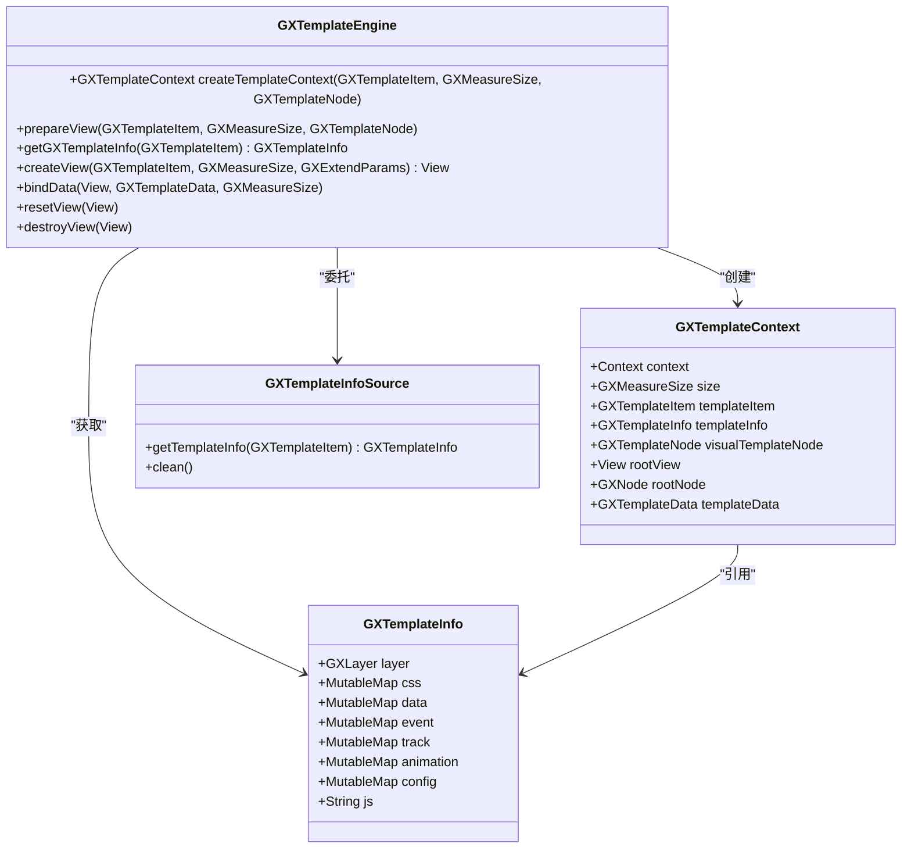
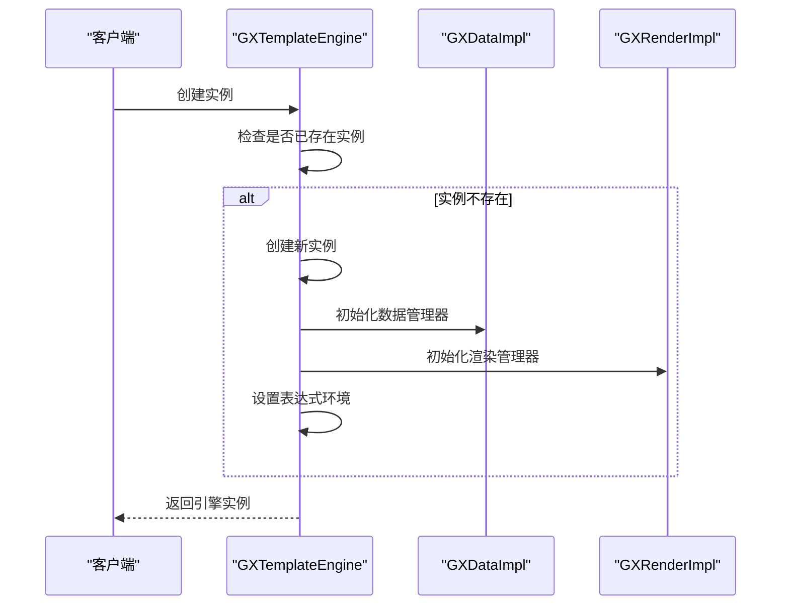
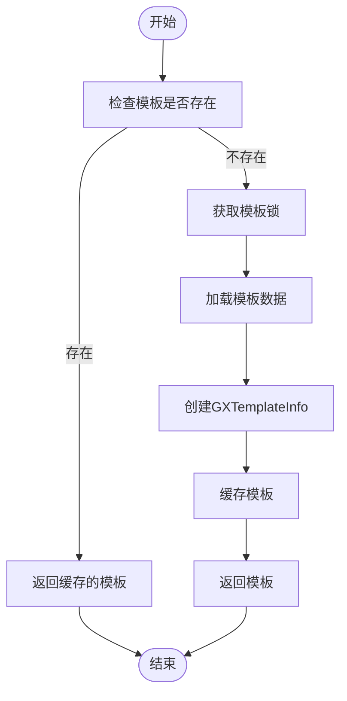
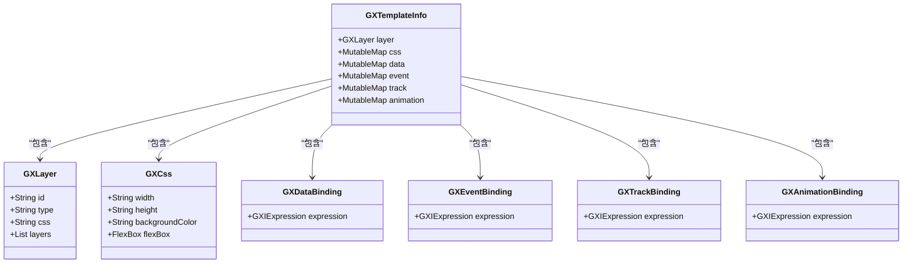
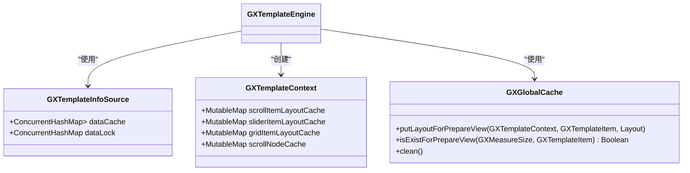
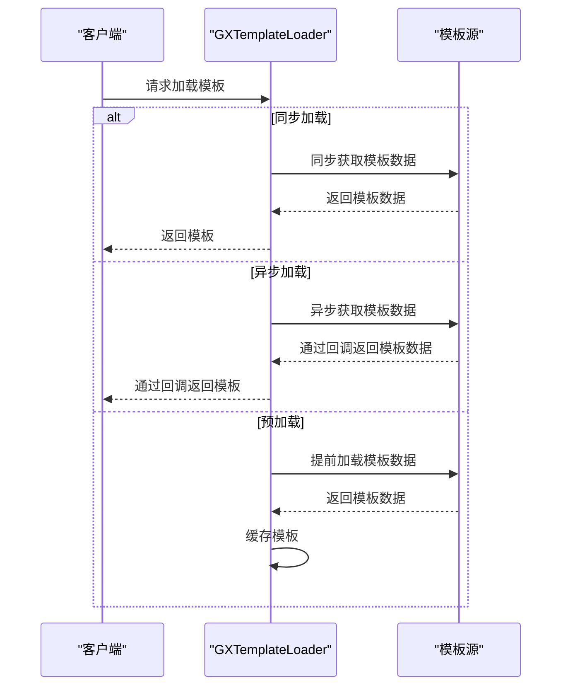
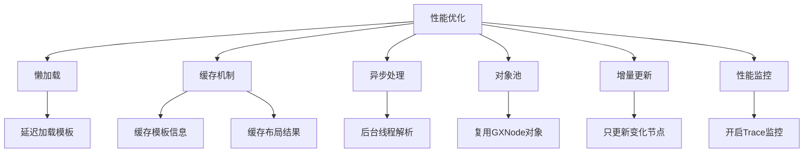
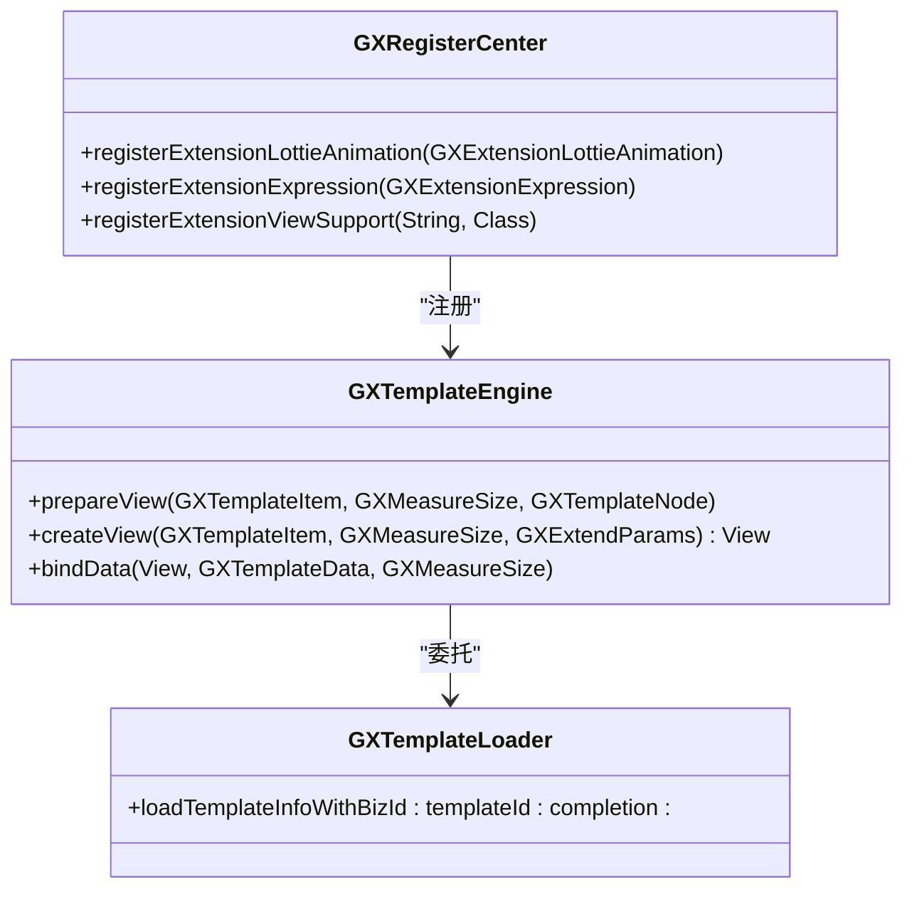

# 模板引擎

<cite>
**本文档引用的文件**
- [GXTemplateEngine.kt](file://GaiaXAndroid/src/main/kotlin/com/alibaba/gaiax/GXTemplateEngine.kt)
- [GXTemplateEngine.m](file://GaiaXiOS/GaiaXiOS/Engine/GXTemplateEngine.m)
- [GXTemplate.kt](file://GaiaXAndroid/src/main/kotlin/com/alibaba/gaiax/template/GXTemplate.kt)
- [GXTemplateInfo.kt](file://GaiaXAndroid/src/main/kotlin/com/alibaba/gaiax/template/GXTemplateInfo.kt)
- [GXTemplateInfoSource.kt](file://GaiaXAndroid/src/main/kotlin/com/alibaba/gaiax/data/cache/GXTemplateInfoSource.kt)
- [GXTemplateContext.kt](file://GaiaXAndroid/src/main/kotlin/com/alibaba/gaiax/context/GXTemplateContext.kt)
- [GXTemplateManager.h](file://GaiaXiOS/GaiaXiOS/Template/Loader/GXTemplateManager.h)
- [GXTemplateLoader.h](file://GaiaXiOS/GaiaXiOS/Template/Loader/GXTemplateLoader.h)
</cite>

## 目录
1. [简介](#简介)
2. [核心设计](#核心设计)
3. [初始化流程](#初始化流程)
4. [模板管理机制](#模板管理机制)
5. [模板解析与编译](#模板解析与编译)
6. [模板缓存机制](#模板缓存机制)
7. [模板加载策略](#模板加载策略)
8. [性能优化技术](#性能优化技术)
9. [高级功能](#高级功能)
10. [跨平台一致性](#跨平台一致性)
11. [错误恢复机制](#错误恢复机制)

## 简介

GaiaX模板引擎是一个轻量级的跨平台纯原生动态卡片解决方案，由阿里巴巴优酷技术团队开发。该引擎旨在确保原生体验和性能的同时，帮助客户端实现低代码开发。除了客户端SDK，还提供了模板可视化构建工具GaiaStudio和Demo项目，支持模板创建、编辑、真机调试和实时预览。

**Section sources**
- [GXTemplateEngine.kt](file://GaiaXAndroid/src/main/kotlin/com/alibaba/gaiax/GXTemplateEngine.kt#L53-L77)

## 核心设计

GaiaX模板引擎的核心设计围绕`GXTemplateEngine`类展开，该类是整个引擎的入口点。引擎采用模块化设计，将模板的加载、解析、编译、渲染和数据绑定等过程分离，确保各组件职责单一且可扩展。

引擎的核心组件包括：
- `GXTemplateEngine`：模板引擎主类，负责协调各个组件的工作
- `GXTemplateContext`：模板上下文，存储模板相关的运行时信息
- `GXTemplateInfo`：模板信息，包含模板的层、样式、数据绑定等元数据
- `GXTemplateInfoSource`：模板信息源，负责模板的加载和缓存管理



**Diagram sources**
- [GXTemplateEngine.kt](file://GaiaXAndroid/src/main/kotlin/com/alibaba/gaiax/GXTemplateEngine.kt#L78-L803)
- [GXTemplateContext.kt](file://GaiaXAndroid/src/main/kotlin/com/alibaba/gaiax/context/GXTemplateContext.kt#L35-L253)
- [GXTemplateInfo.kt](file://GaiaXAndroid/src/main/kotlin/com/alibaba/gaiax/template/GXTemplateInfo.kt#L32-L417)
- [GXTemplateInfoSource.kt](file://GaiaXAndroid/src/main/kotlin/com/alibaba/gaiax/data/cache/GXTemplateInfoSource.kt#L11-L76)

## 初始化流程

模板引擎的初始化流程始于`GXTemplateEngine`实例的创建。引擎采用单例模式，确保全局只有一个实例。初始化过程主要包括以下几个步骤：

1. 创建`GXTemplateEngine`实例
2. 初始化数据管理器`GXDataImpl`
3. 初始化渲染管理器`GXRenderImpl`
4. 设置表达式环境

在iOS平台，初始化过程通过`+ (instancetype)sharedInstance`方法实现，该方法使用GCD的`dispatch_once`确保线程安全的单例创建。初始化时还会调用`[GXExpression setup]`来设置表达式环境。



**Diagram sources**
- [GXTemplateEngine.kt](file://GaiaXAndroid/src/main/kotlin/com/alibaba/gaiax/GXTemplateEngine.kt#L491-L500)
- [GXTemplateEngine.m](file://GaiaXiOS/GaiaXiOS/Engine/GXTemplateEngine.m#L40-L58)

## 模板管理机制

模板管理机制是GaiaX模板引擎的核心功能之一，负责模板的注册、加载、缓存和销毁。引擎通过`GXTemplateInfoSource`类来管理模板的生命周期，确保模板的高效加载和内存使用。

模板管理的主要流程包括：
1. 模板注册：通过`registerTemplate`方法将模板注册到引擎中
2. 模板加载：通过`getTemplateInfo`方法加载模板信息
3. 模板缓存：使用`ConcurrentHashMap`缓存已加载的模板，避免重复加载
4. 模板销毁：通过`clean`方法清除所有缓存的模板

为了防止多线程同时加载同一个模板导致资源浪费和数据不一致，引擎使用了模板锁机制。每个模板都有一个唯一的锁对象，确保同一时间只有一个线程可以加载该模板。



**Diagram sources**
- [GXTemplateInfoSource.kt](file://GaiaXAndroid/src/main/kotlin/com/alibaba/gaiax/data/cache/GXTemplateInfoSource.kt#L29-L58)

## 模板解析与编译

模板解析与编译是GaiaX模板引擎的关键环节，负责将原始的模板数据转换为可渲染的视图树。解析过程主要包括以下几个步骤：

1. 解析模板层数据：将JSON格式的层数据解析为`GXLayer`对象
2. 解析样式数据：将CSS格式的样式数据解析为`GXCss`对象
3. 解析数据绑定：将数据绑定表达式解析为`GXDataBinding`对象
4. 解析事件绑定：将事件绑定表达式解析为`GXEventBinding`对象
5. 解析埋点数据：将埋点数据解析为`GXTrackBinding`对象
6. 解析动画数据：将动画数据解析为`GXAnimationBinding`对象

编译过程则将解析后的模板信息转换为视图节点树。引擎使用`GXNode`类来表示视图节点，每个节点对应一个UI元素。节点树的构建遵循模板的层级结构，确保视图的正确布局。



**Diagram sources**
- [GXTemplateInfo.kt](file://GaiaXAndroid/src/main/kotlin/com/alibaba/gaiax/template/GXTemplateInfo.kt#L32-L417)

## 模板缓存机制

模板缓存机制是GaiaX模板引擎性能优化的重要组成部分。引擎通过多级缓存策略来提高模板的加载速度和内存使用效率。

缓存机制主要包括以下几个方面：
1. 模板信息缓存：使用`ConcurrentHashMap`缓存已解析的`GXTemplateInfo`对象
2. 布局结果缓存：缓存视图节点的布局计算结果，避免重复计算
3. 视图节点缓存：在滚动容器中缓存已创建的视图节点，提高滚动性能
4. 模板锁缓存：缓存模板的锁对象，避免重复创建

缓存的生命周期与模板的生命周期一致。当模板被销毁时，相关的缓存也会被清除。引擎提供了`clean`方法来手动清除所有缓存，适用于内存紧张或需要重新加载模板的场景。



**Diagram sources**
- [GXTemplateInfoSource.kt](file://GaiaXAndroid/src/main/kotlin/com/alibaba/gaiax/data/cache/GXTemplateInfoSource.kt#L24-L25)
- [GXTemplateContext.kt](file://GaiaXAndroid/src/main/kotlin/com/alibaba/gaiax/context/GXTemplateContext.kt#L115-L129)
- [GXTemplateEngine.kt](file://GaiaXAndroid/src/main/kotlin/com/alibaba/gaiax/GXTemplateEngine.kt#L48-L49)

## 模板加载策略

GaiaX模板引擎提供了灵活的模板加载策略，支持同步加载、异步加载和预加载等多种方式。不同的加载策略适用于不同的使用场景，开发者可以根据实际需求选择合适的策略。

### 同步加载
同步加载是最简单的加载方式，适用于模板数据已经存在于本地或需要立即显示的场景。同步加载会阻塞当前线程，直到模板加载完成。

### 异步加载
异步加载适用于从网络或其他耗时源加载模板的场景。异步加载不会阻塞主线程，通过回调函数通知加载结果，确保UI的流畅性。

### 预加载
预加载是一种性能优化策略，适用于可以预测用户行为的场景。通过提前加载可能用到的模板，可以显著减少用户等待时间，提升用户体验。



**Diagram sources**
- [GXTemplateLoader.h](file://GaiaXiOS/GaiaXiOS/Template/Loader/GXTemplateLoader.h#L46-L62)

## 性能优化技术

GaiaX模板引擎采用了多种性能优化技术，确保在复杂场景下仍能保持流畅的用户体验。主要的性能优化技术包括：

1. **懒加载**：只有在需要时才加载和解析模板，减少启动时间和内存占用
2. **缓存机制**：通过多级缓存避免重复的解析和计算，提高渲染速度
3. **异步处理**：将耗时的操作放到后台线程执行，避免阻塞主线程
4. **对象池**：复用频繁创建和销毁的对象，减少GC压力
5. **增量更新**：只更新发生变化的部分，避免全量重绘

引擎还提供了性能监控功能，通过`GXPropUtils.isTrace()`方法可以开启性能追踪，帮助开发者定位性能瓶颈。



**Diagram sources**
- [GXTemplateEngine.kt](file://GaiaXAndroid/src/main/kotlin/com/alibaba/gaiax/GXTemplateEngine.kt#L523-L532)
- [GXTemplateEngine.kt](file://GaiaXAndroid/src/main/kotlin/com/alibaba/gaiax/GXTemplateEngine.kt#L661-L668)

## 高级功能

GaiaX模板引擎提供了丰富的高级功能，满足复杂业务场景的需求。这些功能包括模板注册、预加载、异步加载等。

### 模板注册
通过`GXRegisterCenter`可以注册扩展功能，如Lottie动画、表达式解析、自定义视图支持等。注册的扩展功能可以在模板中使用，增强模板的表现力。

### 预加载
预加载功能允许开发者提前加载可能用到的模板，减少用户等待时间。预加载可以通过`prepareView`方法实现，该方法会预先创建视图节点树但不生成实际的View。

### 异步加载
异步加载功能通过回调机制实现，确保在加载完成后再进行后续操作。异步加载可以避免阻塞主线程，保持UI的流畅性。



**Diagram sources**
- [GXTemplateEngine.kt](file://GaiaXAndroid/src/main/kotlin/com/alibaba/gaiax/GXTemplateEngine.kt#L84-L94)
- [GXTemplateEngine.kt](file://GaiaXAndroid/src/main/kotlin/com/alibaba/gaiax/GXTemplateEngine.kt#L513-L534)
- [GXTemplateLoader.h](file://GaiaXiOS/GaiaXiOS/Template/Loader/GXTemplateLoader.h#L58-L60)

## 跨平台一致性

GaiaX模板引擎设计时充分考虑了跨平台一致性，确保在Android和iOS平台上提供一致的API和行为。虽然底层实现有所不同，但对外暴露的接口保持高度一致。

在Android平台，引擎使用Kotlin编写，充分利用了Kotlin的语言特性。在iOS平台，引擎使用Objective-C编写，遵循iOS的开发规范。两个平台的引擎都提供了类似的类和方法，使得开发者可以使用相同的代码逻辑在不同平台上工作。

```mermaid
graph TB
subgraph "Android"
A[GXTemplateEngine.kt]
B[GXTemplateContext.kt]
C[GXTemplateInfo.kt]
end
subgraph "iOS"
D[GXTemplateEngine.m]
E[GXTemplateContext.h]
F[GXTemplateInfo.h]
end
A < --> D
B < --> E
C < --> F
style A fill:#f9f,stroke:#333
style B fill:#f9f,stroke:#333
style C fill:#f9f,stroke:#333
style D fill:#bbf,stroke:#333
style E fill:#bbf,stroke:#333
style F fill:#bbf,stroke:#333
```

**Diagram sources**
- [GXTemplateEngine.kt](file://GaiaXAndroid/src/main/kotlin/com/alibaba/gaiax/GXTemplateEngine.kt)
- [GXTemplateEngine.m](file://GaiaXiOS/GaiaXiOS/Engine/GXTemplateEngine.m)

## 错误恢复机制

GaiaX模板引擎内置了完善的错误恢复机制，确保在异常情况下仍能保持应用的稳定性。错误处理主要体现在以下几个方面：

1. **异常捕获**：在关键方法中使用try-catch捕获异常，防止崩溃
2. **错误回调**：提供`GXExceptionHelper`类来处理异常，开发者可以自定义异常处理逻辑
3. **安全默认值**：在数据缺失或错误时使用安全的默认值，避免空指针异常
4. **资源清理**：在异常发生时确保资源被正确释放，防止内存泄漏

当发生异常时，引擎会根据`GXExceptionHelper.isException()`的返回值决定是抛出异常还是静默处理。这种设计既保证了开发阶段的问题可发现性，又确保了生产环境的稳定性。

```mermaid
flowchart TD
A[开始] --> B[执行操作]
B --> C{发生异常?}
C --> |是| D[捕获异常]
D --> E{GXExceptionHelper.isException()?}
E --> |是| F[调用GXExceptionHelper.exception()]
E --> |否| G[重新抛出异常]
C --> |否| H[正常结束]
F --> I[静默处理]
G --> J[应用崩溃]
I --> K[结束]
J --> K
```

**Diagram sources**
- [GXTemplateEngine.kt](file://GaiaXAndroid/src/main/kotlin/com/alibaba/gaiax/GXTemplateEngine.kt#L535-L540)
- [GXTemplateEngine.kt](file://GaiaXAndroid/src/main/kotlin/com/alibaba/gaiax/GXTemplateEngine.kt#L576-L581)