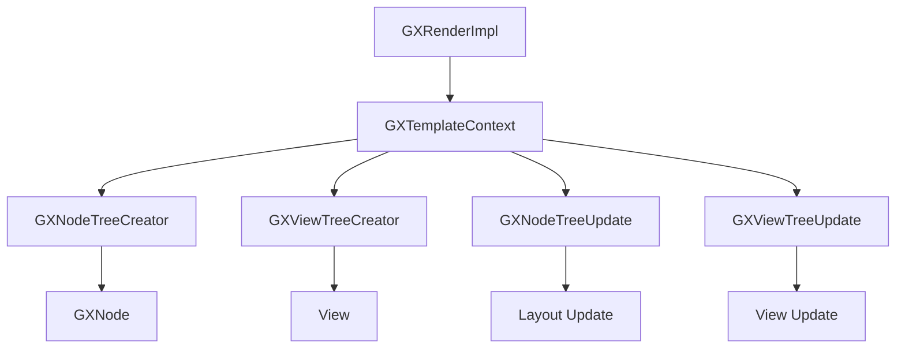
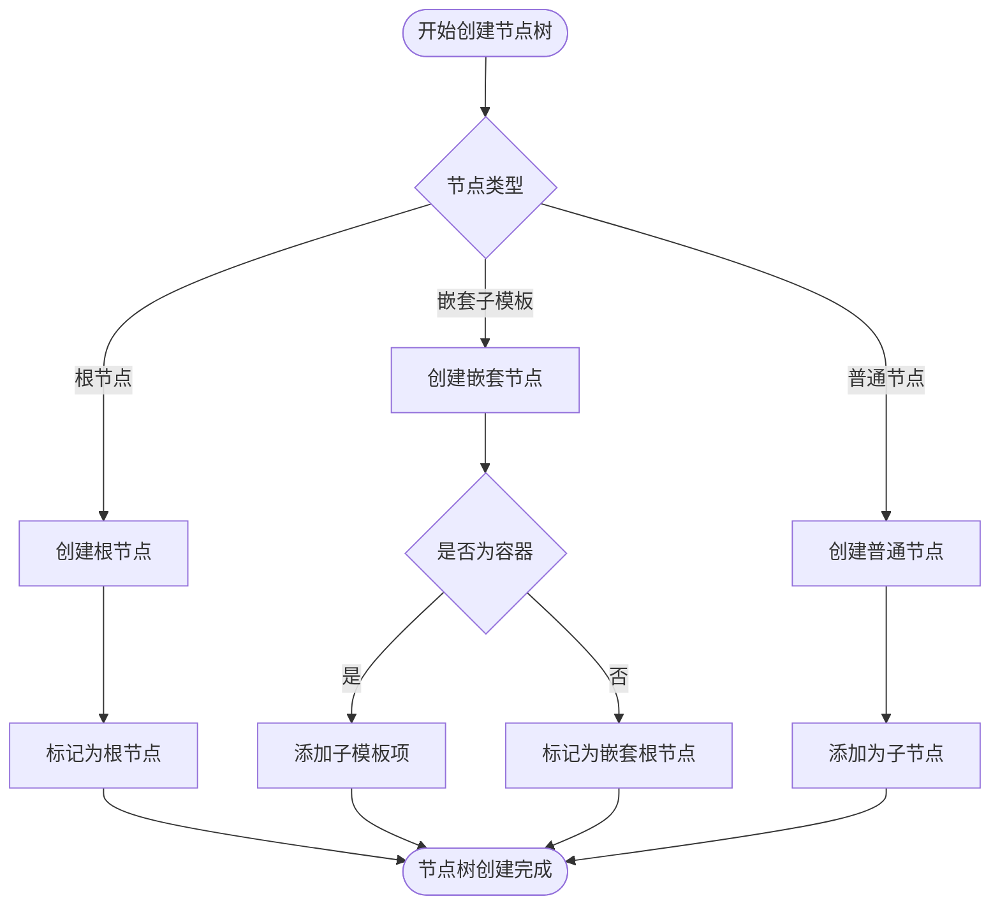
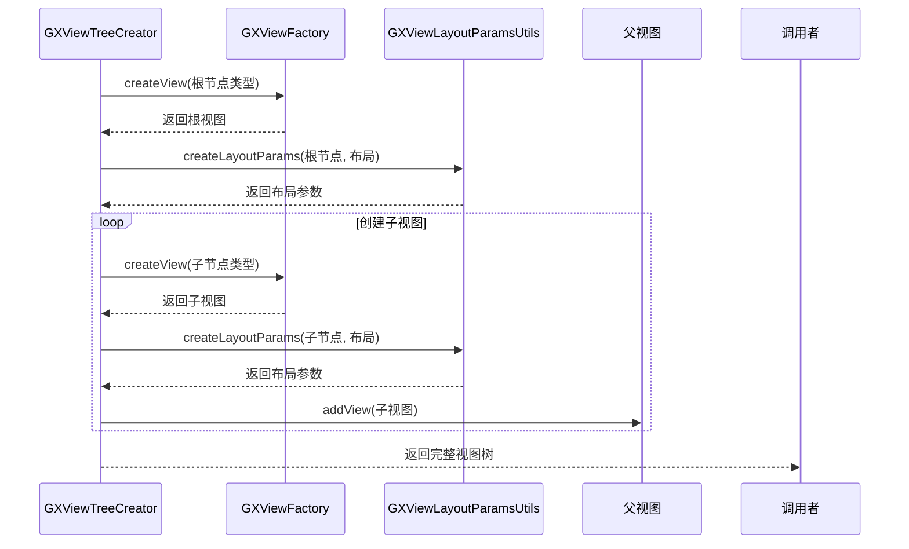
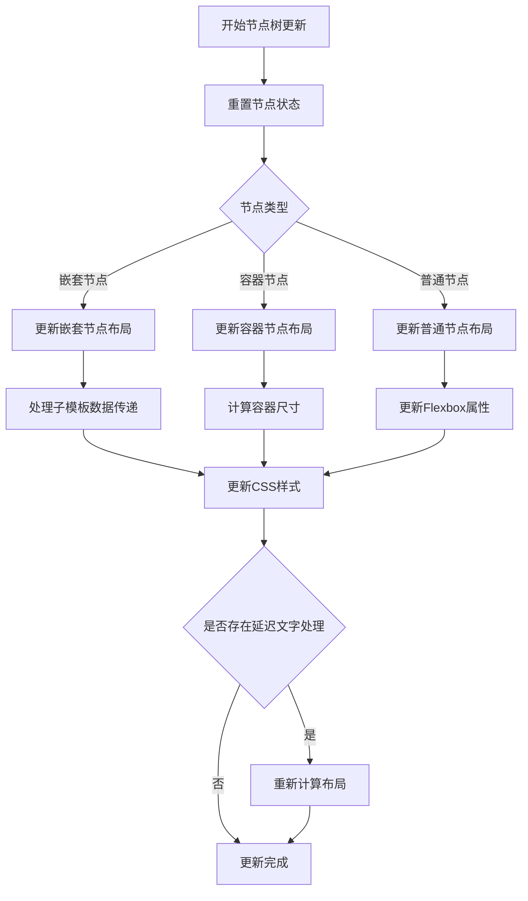
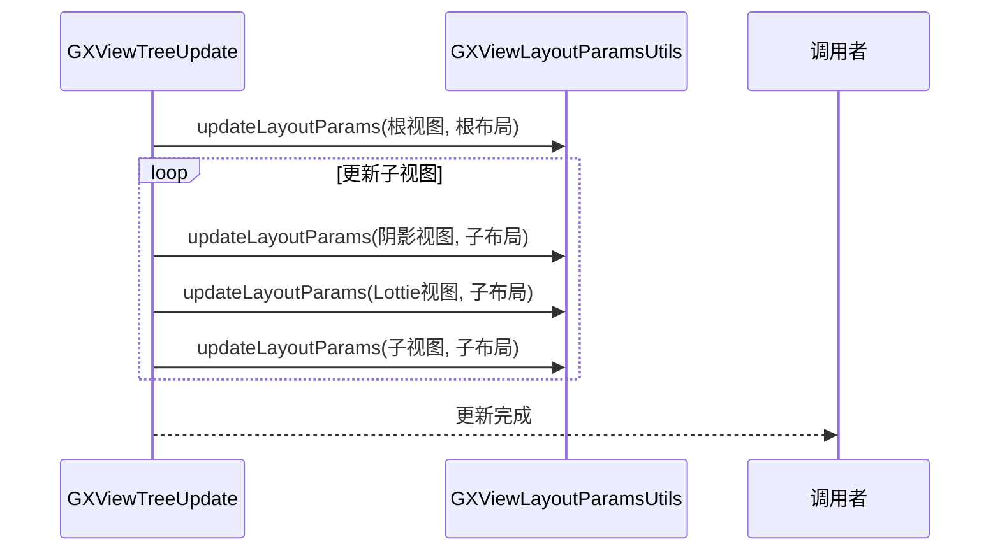
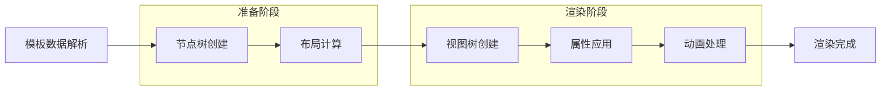

# 渲染系统

<cite>
**本文档引用文件**  
- [GXRenderImpl.kt](file://GaiaXAndroid/src/main/kotlin/com/alibaba/gaiax/render/GXRenderImpl.kt)
- [GXNodeTreeCreator.kt](file://GaiaXAndroid/src/main/kotlin/com/alibaba/gaiax/render/node/GXNodeTreeCreator.kt)
- [GXViewTreeCreator.kt](file://GaiaXAndroid/src/main/kotlin/com/alibaba/gaiax/render/view/GXViewTreeCreator.kt)
- [GXNodeTreeUpdate.kt](file://GaiaXAndroid/src/main/kotlin/com/alibaba/gaiax/render/node/GXNodeTreeUpdate.kt)
- [GXViewTreeUpdate.kt](file://GaiaXAndroid/src/main/kotlin/com/alibaba/gaiax/render/view/GXViewTreeUpdate.kt)
</cite>

## 目录
1. [简介](#简介)
2. [架构设计](#架构设计)
3. [节点树创建机制](#节点树创建机制)
4. [视图树创建机制](#视图树创建机制)
5. [更新机制](#更新机制)
6. [渲染管道流程](#渲染管道流程)
7. [性能优化技术](#性能优化技术)
8. [内存管理策略](#内存管理策略)
9. [错误处理机制](#错误处理机制)
10. [性能分析与调试](#性能分析与调试)
11. [跨平台一致性](#跨平台一致性)

## 简介
GaiaX渲染系统是一个高性能的跨平台UI渲染引擎，专注于复杂动态UI的高效渲染。该系统通过虚拟节点树和视图树的分离设计，实现了渲染性能的最优化。核心组件GXRenderImpl作为渲染引擎的主控制器，协调节点树创建、视图树创建和更新机制，确保UI渲染的高效性和一致性。系统采用Flexbox布局算法进行精确的布局计算，并支持丰富的样式属性和动画效果。

**本文档引用文件**  
- [GXRenderImpl.kt](file://GaiaXAndroid/src/main/kotlin/com/alibaba/gaiax/render/GXRenderImpl.kt)

## 架构设计
GaiaX渲染系统采用分层架构设计，主要包括模板上下文层、节点管理层、视图管理层和渲染执行层。GXRenderImpl作为核心控制器，通过模板上下文(GXTemplateContext)管理整个渲染过程的状态和数据。系统采用虚拟节点树(GXNodeTree)和实际视图树分离的设计模式，先在内存中构建完整的虚拟节点结构，再根据布局计算结果创建实际的UI视图。

**图示来源**  
- [GXRenderImpl.kt](file://GaiaXAndroid/src/main/kotlin/com/alibaba/gaiax/render/GXRenderImpl.kt#L35-L104)

## 节点树创建机制
节点树创建由GXNodeTreeCreator负责，采用递归算法构建完整的虚拟节点结构。创建过程从根节点开始，根据模板层级信息(GXLayer)逐级构建子节点。系统支持嵌套子模板的特殊处理，能够正确处理容器模板下的子模板关系。每个节点包含ID、父节点引用、模板节点信息和Stretch布局节点等核心属性。

**图示来源**  
- [GXNodeTreeCreator.kt](file://GaiaXAndroid/src/main/kotlin/com/alibaba/gaiax/render/node/GXNodeTreeCreator.kt#L29-L135)

**本节来源**  
- [GXNodeTreeCreator.kt](file://GaiaXAndroid/src/main/kotlin/com/alibaba/gaiax/render/node/GXNodeTreeCreator.kt#L29-L135)

## 视图树创建机制
视图树创建由GXViewTreeCreator实现，基于已构建的节点树创建实际的UI视图。系统通过GXViewFactory工厂模式创建不同类型的视图组件，并根据布局信息设置相应的布局参数。对于需要阴影效果的节点，系统会创建专用的GXShadowLayout容器；对于Lottie动画，则会创建独立的动画视图组件。

**图示来源**  
- [GXViewTreeCreator.kt](file://GaiaXAndroid/src/main/kotlin/com/alibaba/gaiax/render/view/GXViewTreeCreator.kt#L29-L99)

**本节来源**  
- [GXViewTreeCreator.kt](file://GaiaXAndroid/src/main/kotlin/com/alibaba/gaiax/render/view/GXViewTreeCreator.kt#L29-L99)

## 更新机制
渲染系统的更新机制分为节点树更新(GXNodeTreeUpdate)和视图树更新(GXViewTreeUpdate)两个阶段。节点树更新负责处理布局计算和样式数据绑定，而视图树更新则负责将计算结果应用到实际视图组件上。这种分离的设计模式避免了频繁的UI重绘，提高了渲染性能。

### 节点树更新
节点树更新主要处理布局计算和样式数据绑定。系统首先更新节点布局信息，然后处理文字自适应等特殊场景。对于包含flexGrow属性的布局，系统会延迟处理文字自适应计算，以确保最终布局的准确性。

**图示来源**  
- [GXNodeTreeUpdate.kt](file://GaiaXAndroid/src/main/kotlin/com/alibaba/gaiax/render/node/GXNodeTreeUpdate.kt#L74-L1322)

### 视图树更新
视图树更新负责将布局计算结果应用到实际视图组件上。系统通过GXViewLayoutParamsUtils工具类更新视图的布局参数，包括位置、大小等信息。对于包含阴影或Lottie动画的特殊节点，系统会同时更新相应的辅助视图组件。

**图示来源**  
- [GXViewTreeUpdate.kt](file://GaiaXAndroid/src/main/kotlin/com/alibaba/gaiax/render/view/GXViewTreeUpdate.kt#L29-L81)

**本节来源**  
- [GXNodeTreeUpdate.kt](file://GaiaXAndroid/src/main/kotlin/com/alibaba/gaiax/render/node/GXNodeTreeUpdate.kt#L74-L1322)
- [GXViewTreeUpdate.kt](file://GaiaXAndroid/src/main/kotlin/com/alibaba/gaiax/render/view/GXViewTreeUpdate.kt#L29-L81)

## 渲染管道流程
GaiaX渲染管道包含四个主要阶段：布局计算、视图创建、属性应用和动画处理。整个流程从模板数据解析开始，经过虚拟节点树构建、布局计算、实际视图创建，最终完成所有样式属性和动画效果的应用。

**图示来源**  
- [GXRenderImpl.kt](file://GaiaXAndroid/src/main/kotlin/com/alibaba/gaiax/render/GXRenderImpl.kt#L35-L104)

## 性能优化技术
GaiaX渲染系统采用多种性能优化技术，包括虚拟节点树缓存、布局计算优化和视图复用机制。系统通过GXGlobalCache全局缓存存储预计算的布局信息，避免重复计算。对于包含flexGrow属性的复杂布局，系统采用延迟计算策略，确保文字自适应等特殊场景的正确性。

**本节来源**  
- [GXNodeTreeUpdate.kt](file://GaiaXAndroid/src/main/kotlin/com/alibaba/gaiax/render/node/GXNodeTreeUpdate.kt#L74-L1322)
- [GXRenderImpl.kt](file://GaiaXAndroid/src/main/kotlin/com/alibaba/gaiax/render/GXRenderImpl.kt#L35-L104)

## 内存管理策略
系统采用精细化的内存管理策略，通过节点释放机制和对象池技术降低内存占用。在节点树创建完成后，系统会及时释放临时资源。对于频繁创建和销毁的视图组件，系统采用对象池模式进行复用，减少垃圾回收压力。

**本节来源**  
- [GXNodeTreeCreator.kt](file://GaiaXAndroid/src/main/kotlin/com/alibaba/gaiax/render/node/GXNodeTreeCreator.kt#L29-L135)
- [GXRenderImpl.kt](file://GaiaXAndroid/src/main/kotlin/com/alibaba/gaiax/render/GXRenderImpl.kt#L35-L104)

## 错误处理机制
渲染系统实现了完善的错误处理机制，通过异常捕获和日志记录确保系统的稳定性。对于关键操作如节点创建、布局计算等，系统会进行参数验证并抛出有意义的异常信息。同时，系统通过Log工具类记录详细的执行轨迹，便于问题排查。

**本节来源**  
- [GXNodeTreeCreator.kt](file://GaiaXAndroid/src/main/kotlin/com/alibaba/gaiax/render/node/GXNodeTreeCreator.kt#L29-L135)
- [GXViewTreeCreator.kt](file://GaiaXAndroid/src/main/kotlin/com/alibaba/gaiax/render/view/GXViewTreeCreator.kt#L29-L99)

## 性能分析与调试
系统提供了丰富的性能分析工具和调试技巧。开发者可以通过traceId跟踪特定渲染任务的执行过程，利用日志系统监控关键操作的执行时间。对于复杂UI的渲染性能分析，建议重点关注布局计算和视图创建阶段的耗时。

**本节来源**  
- [GXRenderImpl.kt](file://GaiaXAndroid/src/main/kotlin/com/alibaba/gaiax/render/GXRenderImpl.kt#L35-L104)
- [GXNodeTreeUpdate.kt](file://GaiaXAndroid/src/main/kotlin/com/alibaba/gaiax/render/node/GXNodeTreeUpdate.kt#L74-L1322)

## 跨平台一致性
GaiaX通过抽象渲染接口和统一的布局算法确保跨平台渲染的一致性。系统采用Stretch布局引擎实现精确的Flexbox布局计算，保证在不同平台上获得相同的布局效果。同时，通过标准化的属性应用流程，确保样式和动画在各平台上的表现一致。

**本节来源**  
- [GXNodeTreeUpdate.kt](file://GaiaXAndroid/src/main/kotlin/com/alibaba/gaiax/render/node/GXNodeTreeUpdate.kt#L74-L1322)
- [GXViewTreeUpdate.kt](file://GaiaXAndroid/src/main/kotlin/com/alibaba/gaiax/render/view/GXViewTreeUpdate.kt#L29-L81)