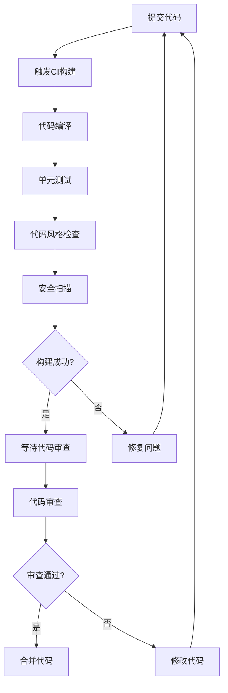

# 贡献指南

<cite>
**本文档中引用的文件**  
- [PR.sh](file://PR.sh)
- [review.sh](file://review.sh)
- [GaiaXAndroid/build.gradle](file://GaiaXAndroid/build.gradle)
- [GaiaXAndroid/gradle.properties](file://GaiaXAndroid/gradle.properties)
- [GaiaXAndroid/README.md](file://GaiaXAndroid/README.md)
- [GaiaXiOS/Podfile](file://GaiaXiOS/Podfile)
- [GaiaXJSiOS/README.md](file://GaiaXJSiOS/README.md)
- [GaiaXHarmony/GaiaXCore/entry/src/ohosTest/ets/test/Ability.test.ets](file://GaiaXHarmony/GaiaXCore/entry/src/ohosTest/ets/test/Ability.test.ets)
- [GaiaXHarmony/GaiaXAnalyze/GaiaXAnalyzeHarmony/entry/src/ohosTest/ets/test/Ability.test.ets](file://GaiaXHarmony/GaiaXAnalyze/GaiaXAnalyzeHarmony/entry/src/ohosTest/ets/test/Ability.test.ets)
- [GaiaXStretch/bindings/harmony_stretch/GXStretch/src/ohosTest/ets/test/Ability.test.ets](file://GaiaXStretch/bindings/harmony_stretch/GXStretch/src/ohosTest/ets/test/Ability.test.ets)
- [GaiaXHarmony/GaiaXCore/entry/src/test/LocalUnit.test.ets](file://GaiaXHarmony/GaiaXCore/entry/src/test/LocalUnit.test.ets)
- [GaiaXHarmony/GaiaXCore/GaiaX/src/test/LocalUnit.test.ets](file://GaiaXHarmony/GaiaXCore/GaiaX/src/test/LocalUnit.test.ets)
- [GaiaXHarmony/GaiaXAnalyze/GaiaXAnalyzeHarmony/GaiaXAnalyze/src/test/LocalUnit.test.ets](file://GaiaXHarmony/GaiaXAnalyze/GaiaXAnalyzeHarmony/GaiaXAnalyze/src/test/LocalUnit.test.ets)
- [GaiaXHarmony/GaiaXAnalyze/GaiaXAnalyzeHarmony/entry/src/test/LocalUnit.test.ets](file://GaiaXHarmony/GaiaXAnalyze/GaiaXAnalyzeHarmony/entry/src/test/LocalUnit.test.ets)
- [GaiaXStretch/bindings/harmony_stretch/GXStretch/src/test/LocalUnit.test.ets](file://GaiaXStretch/bindings/harmony_stretch/GXStretch/src/test/LocalUnit.test.ets)
- [GaiaXAndroidClientToStudio/src/main/java/com/alibaba/gaiax/studio/GXSocket.kt](file://GaiaXAndroidClientToStudio/src/main/java/com/alibaba/gaiax/studio/GXSocket.kt)
- [GaiaXJSiOS/GaiaXJS/src/context/GaiaXJSCContext.m](file://GaiaXJSiOS/GaiaXJS/src/context/GaiaXJSCContext.m)
- [GaiaXAndroidDemo/app/src/main/assets/gaiax_js_code/gx-with-js-api-demo.js](file://GaiaXAndroidDemo/app/src/main/assets/gaiax_js_code/gx-with-js-api-demo.js)
- [README.md](file://README.md)
- [GaiaXAndroid/gradle.properties](file://GaiaXAndroid/gradle.properties)
</cite>

## 目录
1. [简介](#简介)
2. [代码规范](#代码规范)
3. [提交流程](#提交流程)
4. [测试要求](#测试要求)
5. [开发环境配置](#开发环境配置)
6. [社区行为准则](#社区行为准则)

## 简介

GaiaX 是阿里巴巴优酷技术团队研发的一套轻量级纯原生动态化卡片跨端解决方案，支持 Android、iOS 和 Harmony 平台。本贡献指南旨在为开发者提供清晰的代码规范、提交流程、测试要求和开发环境配置说明，确保贡献代码与现有代码库保持一致，促进健康、包容的贡献环境。

## 代码规范

### 代码风格指南

GaiaX 项目遵循各平台的标准代码风格规范。Android 端使用 Kotlin 和 Java，遵循 Google 的 Kotlin 和 Java 代码风格指南。iOS 端使用 Objective-C 和 Swift，遵循 Apple 的编码规范。Harmony 端使用 ETS 语言，遵循 HarmonyOS 的开发规范。

代码应保持一致的缩进（通常为 4 个空格或 1 个制表符），合理的命名约定，以及清晰的注释。避免使用魔法数字和字符串，应使用常量代替。代码应具有良好的可读性和可维护性。

### 命名约定

- **类名**：使用大驼峰命名法（PascalCase），如 `GXTemplateEngine`。
- **方法名**：使用小驼峰命名法（camelCase），如 `createView`。
- **变量名**：使用小驼峰命名法，如 `templateId`。
- **常量名**：使用全大写字母，单词间用下划线分隔，如 `MAX_CACHE_SIZE`。
- **资源文件名**：使用小写字母和下划线分隔，如 `template_data.json`。

### 架构原则

GaiaX 采用模块化设计，各功能模块职责清晰，耦合度低。核心模块包括模板引擎、数据绑定、事件处理、动画支持等。新增功能应遵循单一职责原则，避免在一个类中实现过多功能。应充分利用现有模块，避免重复造轮子。

**Section sources**
- [README.md](file://README.md)

## 提交流程

### Pull Request 提交流程

1. Fork 项目仓库到个人账户。
2. 在本地创建新分支进行开发。
3. 完成开发后，提交代码并推送到个人仓库的分支。
4. 在 GitHub 上创建 Pull Request，目标为上游仓库的主分支。
5. 填写 PR 描述，说明修改内容、解决的问题和相关 issue 链接。
6. 等待代码审查和 CI 构建结果。

### 代码审查标准

代码审查将重点关注以下方面：
- 代码是否符合项目代码规范。
- 是否引入了新的 bug 或潜在问题。
- 是否有足够的测试覆盖。
- 文档是否同步更新。
- 是否影响性能或包大小。
- 是否遵循项目架构原则。

审查者将提供反馈，贡献者需根据反馈进行修改，直到 PR 被批准。

### 合并策略

PR 需要至少一位核心维护者批准后才能合并。合并前必须通过所有 CI 构建和测试。对于重大变更，可能需要多位维护者共同审查。合并后，相关 issue 将被自动关闭。

**Section sources**
- [PR.sh](file://PR.sh)
- [review.sh](file://review.sh)

## 测试要求

### 测试覆盖率要求

所有新增代码和修改的代码都必须有相应的测试覆盖。单元测试覆盖率应尽量保持在 80% 以上。对于核心功能模块，覆盖率要求更高。测试应覆盖正常流程、边界条件和异常情况。

### 测试用例编写规范

测试用例应具有明确的名称，描述测试的场景和预期结果。使用标准的测试框架（如 JUnit、XCTest、Hypium）进行测试。测试数据应独立于生产数据，避免依赖外部环境。测试应是可重复的，不依赖于执行顺序。

### 持续集成流程

项目配置了持续集成（CI）系统，每次 PR 提交都会自动触发构建和测试。CI 流程包括：
- 代码编译
- 单元测试执行
- 代码风格检查
- 安全扫描

只有 CI 构建成功，PR 才能被合并。贡献者应确保本地测试通过后再提交 PR，以减少 CI 失败的次数。



**Diagram sources**
- [GaiaXHarmony/GaiaXCore/entry/src/ohosTest/ets/test/Ability.test.ets](file://GaiaXHarmony/GaiaXCore/entry/src/ohosTest/ets/test/Ability.test.ets)
- [GaiaXHarmony/GaiaXAnalyze/GaiaXAnalyzeHarmony/entry/src/ohosTest/ets/test/Ability.test.ets](file://GaiaXHarmony/GaiaXAnalyze/GaiaXAnalyzeHarmony/entry/src/ohosTest/ets/test/Ability.test.ets)
- [GaiaXStretch/bindings/harmony_stretch/GXStretch/src/ohosTest/ets/test/Ability.test.ets](file://GaiaXStretch/bindings/harmony_stretch/GXStretch/src/ohosTest/ets/test/Ability.test.ets)
- [GaiaXHarmony/GaiaXCore/entry/src/test/LocalUnit.test.ets](file://GaiaXHarmony/GaiaXCore/entry/src/test/LocalUnit.test.ets)
- [GaiaXHarmony/GaiaXCore/GaiaX/src/test/LocalUnit.test.ets](file://GaiaXHarmony/GaiaXCore/GaiaX/src/test/LocalUnit.test.ets)
- [GaiaXHarmony/GaiaXAnalyze/GaiaXAnalyzeHarmony/GaiaXAnalyze/src/test/LocalUnit.test.ets](file://GaiaXHarmony/GaiaXAnalyze/GaiaXAnalyzeHarmony/GaiaXAnalyze/src/test/LocalUnit.test.ets)
- [GaiaXHarmony/GaiaXAnalyze/GaiaXAnalyzeHarmony/entry/src/test/LocalUnit.test.ets](file://GaiaXHarmony/GaiaXAnalyze/GaiaXAnalyzeHarmony/entry/src/test/LocalUnit.test.ets)
- [GaiaXStretch/bindings/harmony_stretch/GXStretch/src/test/LocalUnit.test.ets](file://GaiaXStretch/bindings/harmony_stretch/GXStretch/src/test/LocalUnit.test.ets)

## 开发环境配置

### Android 开发环境

Android 端使用 Gradle 作为构建系统。开发环境要求：
- Android Studio Flamingo | 2022.2.1 Patch 2
- JDK 11.0.18
- Android SDK 33

在 `build.gradle` 文件中配置依赖：
```gradle
implementation 'com.github.alibaba.GaiaX:GaiaX-Adapter:$version'
implementation 'com.github.alibaba.GaiaX:GaiaX:$version'
implementation 'com.alibaba:fastjson:1.2.76'
```

**Section sources**
- [GaiaXAndroid/README.md](file://GaiaXAndroid/README.md)
- [GaiaXAndroid/build.gradle](file://GaiaXAndroid/build.gradle)
- [GaiaXAndroid/gradle.properties](file://GaiaXAndroid/gradle.properties)

### iOS 开发环境

iOS 端使用 CocoaPods 作为依赖管理工具。在 Podfile 中添加依赖：
```ruby
pod 'GaiaXiOS'
```

项目最低支持 iOS 9.0 版本。

**Section sources**
- [GaiaXiOS/Podfile](file://GaiaXiOS/Podfile)

### Harmony 开发环境

Harmony 端使用 oh-package.json5 文件管理依赖。在文件中添加：
```json
"dependencies": {
  "GaiaxHarmony": ""
}
```

模板文件应放置在 `src/main/resources/rawfile/` 目录下。

## 社区行为准则

我们致力于创建一个开放、包容和尊重的社区。所有贡献者都应遵守以下准则：
- 尊重他人，使用礼貌用语。
- 以建设性的方式提出批评和建议。
- 包容不同的观点和背景。
- 避免任何形式的歧视和骚扰。
- 遵守开源许可证和知识产权规定。

我们鼓励所有开发者积极参与讨论，分享想法，共同推动项目发展。对于违反行为准则的行为，项目维护者有权采取相应措施。

**Section sources**
- [README.md](file://README.md)