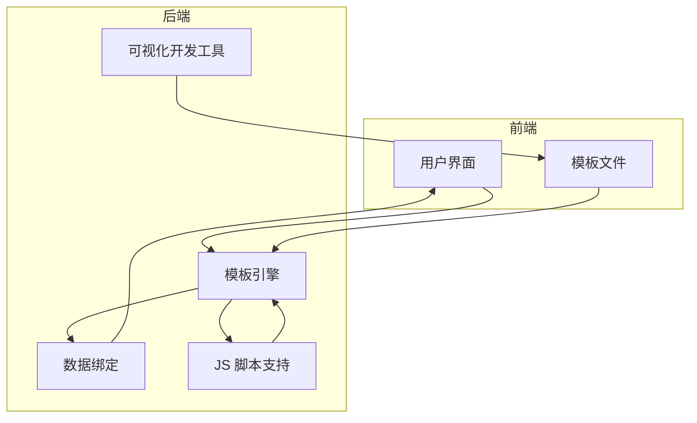

# 项目概述

<cite>
**本文档中引用的文件**  
- [README.md](file://README.md)
- [GaiaXAndroid/README.md](file://GaiaXAndroid/README.md)
- [GaiaXiOS/README.md](file://GaiaXiOS/README.md)
- [GaiaXHarmony/README.md](file://GaiaXHarmony/README.md)
- [GaiaXAndroid/src/main/kotlin/com/alibaba/gaiax/GXTemplateEngine.kt](file://GaiaXAndroid/src/main/kotlin/com/alibaba/gaiax/GXTemplateEngine.kt)
- [GaiaXAndroidJS/src/main/kotlin/com/alibaba/gaiax/js/GXJSEngine.kt](file://GaiaXAndroidJS/src/main/kotlin/com/alibaba/gaiax/js/GXJSEngine.kt)
- [GaiaXiOS/GaiaXiOS/Engine/GXTemplateEngine.h](file://GaiaXiOS/GaiaXiOS/Engine/GXTemplateEngine.h)
- [GaiaXStretch/src/lib.rs](file://GaiaXStretch/src/lib.rs)
- [GaiaXTaro/packages/gaiax-taro/src/gaiax/GXTemplateEngine.tsx](file://GaiaXTaro/packages/gaiax-taro/src/gaiax/GXTemplateEngine.tsx)
</cite>

## 目录
1. [简介](#简介)
2. [核心目标与优势](#核心目标与优势)
3. [跨平台支持](#跨平台支持)
4. [技术架构](#技术架构)
5. [主要功能特性](#主要功能特性)
6. [技术栈与构建系统](#技术栈与构建系统)
7. [使用案例](#使用案例)
8. [与其他框架的差异化优势](#与其他框架的差异化优势)
9. [许可证](#许可证)

## 简介

GaiaX 是由阿里巴巴优酷技术团队研发的一套轻量级纯原生动态化卡片跨端解决方案。该项目旨在通过高性能的原生渲染能力，帮助客户端开发实现低代码，同时保证原生体验与性能。GaiaX 不仅提供了客户端 SDK，还配套了模板可视化搭建工具 Studio 和 Demo 工程，支持从模板创建、编辑、真机调试到预览的全链路技术。

## 核心目标与优势

GaiaX 的核心目标是在保证原生体验与性能的同时，帮助客户端开发实现低代码。其主要优势包括：

- **高性能**：通过纯原生渲染，确保应用的流畅性和响应速度。
- **跨端技术**：支持 Android、iOS 和 HarmonyOS 平台，实现一次开发，多端运行。
- **可视化搭建**：提供模板可视化搭建工具 Studio，降低开发门槛。
- **纯 Native 渲染**：利用平台原生组件进行渲染，确保最佳性能和用户体验。

## 支持平台

GaiaX 支持以下平台：

- **Android**：基于 Kotlin 和 Java 开发，使用 Gradle 构建系统。
- **iOS**：基于 Objective-C 和 Swift 开发，使用 CocoaPods 构建系统。
- **HarmonyOS**：基于 ETS（Extended TypeScript）开发，使用 HapPack 构建系统。

### Android 开发环境
- **IDE**：Android Studio Flamingo | 2022.2.1 Patch 2
- **JDK 版本**：11.0.18

### iOS 开发环境
- **IDE**：Xcode
- **构建系统**：CocoaPods

### HarmonyOS 开发环境
- **IDE**：DevEco Studio NEXT Developer Beta1
- **API 版本**：12

**Section sources**
- [GaiaXAndroid/README.md](file://GaiaXAndroid/README.md#L5-L8)
- [GaiaXiOS/README.md](file://GaiaXiOS/README.md#L1-L10)
- [GaiaXHarmony/README.md](file://GaiaXHarmony/README.md#L3-L7)

## 技术架构

GaiaX 的技术架构主要包括以下几个部分：

- **模板引擎**：负责解析模板文件，生成原生视图。
- **数据绑定**：将数据与视图进行绑定，实现动态更新。
- **JS 脚本支持**：支持在模板中嵌入 JS 脚本，实现复杂的逻辑处理。
- **可视化开发工具**：提供模板可视化搭建工具 Studio，支持拖拽式设计。



**Diagram sources**
- [README.md](file://README.md#L47-L49)
- [GaiaXAndroid/src/main/kotlin/com/alibaba/gaiax/GXTemplateEngine.kt](file://GaiaXAndroid/src/main/kotlin/com/alibaba/gaiax/GXTemplateEngine.kt#L77-L927)

## 主要功能特性

### 模板解析
GaiaX 支持从 assets 目录加载模板文件，并解析生成原生视图。模板文件通常包含 HTML、CSS 和 JSON 数据。

### 数据绑定
通过 `GXTemplateData` 类，可以将数据与视图进行绑定。数据绑定支持文本、图片、列表等多种类型。

### JS 脚本支持
GaiaX 支持在模板中嵌入 JS 脚本，通过 `GXJSEngine` 类实现 JS 引擎的初始化和调用。JS 脚本可以用于处理复杂的业务逻辑。

### 可视化开发工具集成
GaiaX 提供了模板可视化搭建工具 Studio，支持拖拽式设计，简化模板开发流程。

**Section sources**
- [GaiaXAndroid/src/main/kotlin/com/alibaba/gaiax/GXTemplateEngine.kt](file://GaiaXAndroid/src/main/kotlin/com/alibaba/gaiax/GXTemplateEngine.kt#L77-L927)
- [GaiaXAndroidJS/src/main/kotlin/com/alibaba/gaiax/js/GXJSEngine.kt](file://GaiaXAndroidJS/src/main/kotlin/com/alibaba/gaiax/js/GXJSEngine.kt#L19-L425)

## 技术栈与构建系统

### 技术栈
- **Android**：Kotlin、Java
- **iOS**：Objective-C、Swift
- **HarmonyOS**：ETS（Extended TypeScript）
- **JS 引擎**：Rust、QuickJS
- **样式布局**：CSS、FlexBox

### 构建系统
- **Android**：Gradle
- **iOS**：CocoaPods
- **HarmonyOS**：HapPack

**Section sources**
- [README.md](file://README.md#L53)
- [GaiaXAndroid/README.md](file://GaiaXAndroid/README.md#L5-L8)
- [GaiaXiOS/README.md](file://GaiaXiOS/README.md#L1-L10)
- [GaiaXHarmony/README.md](file://GaiaXHarmony/README.md#L3-L7)

## 使用案例

### Android 使用方法
1. **依赖**：在 `build.gradle` 文件中添加依赖。
   ```gradle
   implementation 'com.github.alibaba.GaiaX:GaiaX-Adapter:$version'
   implementation 'com.github.alibaba.GaiaX:GaiaX:$version'
   implementation 'com.alibaba:fastjson:1.2.76'
   ```
2. **模板文件**：将模板文件放置在 `assets` 目录下。
3. **调用方式**：
   ```kotlin
   // 初始化
   GXTemplateEngine.instance.init(activity)

   // 构建模板参数
   val item = GXTemplateEngine.GXTemplateItem(activity, "templateBiz", "templateId")
   val size = GXTemplateEngine.GXMeasureSize(100F.dpToPx(), null)
   val dataJson = AssetsUtils.parseAssets(activity, "template-data.json")
   val data = GXTemplateEngine.GXTemplateData(dataJson)

   // 创建模板视图
   val view = GXTemplateEngine.instance.createView(item, size)

   // 视图绑定数据
   GXTemplateEngine.instance.bindData(view, data)

   // 将模板插入到容器中进行渲染
   findViewById<ViewGroup>(R.id.template_container).addView(view, 0)
   ```

### iOS 使用方法
1. **依赖**：在 `Podfile` 中添加依赖。
   ```ruby
   pod 'GaiaXiOS'
   ```
2. **模板文件**：将模板文件放置在 App 或 Framework 中。
3. **调用方式**：
   ```objective-c
   // 引入头文件
   #import <GaiaXiOS/GaiaXiOS.h>

   // 注册模板服务
   [TheGXRegisterCenter registerTemplateServiceWithBizId:bizId templateBundle:@"xxx.bundle"];

   // 构建模板参数
   GXTemplateItem *item = [[GXTemplateItem alloc] init];
   item.templateId = templateId;
   item.bizId = templateBiz;

   CGSize size = CGSizeMake(1080, NAN);

   GXTemplateData *data = [[GXTemplateData alloc] init];
   data.data = @{@"xxx": @"xxx"};

   // 创建模板视图
   UIView *view = [TheGXTemplateEngine creatViewByTemplateItem:item measureSize:size];

   // 视图绑定数据
   [TheGXTemplateEngine bindData:data onView:view];

   // 将模板插入到容器中进行渲染
   [self.view addSubview:view];
   ```

### HarmonyOS 使用方法
1. **依赖管理**：在 `oh-package.json5` 文件中添加依赖。
   ```json
   "dependencies": {
     "GaiaxHarmony": ""
   }
   ```
2. **模板文件**：将模板文件放置在项目 `rawfile` 目录下。
3. **调用方式**：
   ```typescript
   import { GXTemplateItem } from 'GaiaxHarmony/src/main/ets/context/GXTemplateItem';
   import { GXTemplateData } from 'GaiaxHarmony/src/main/ets/context/GXTemplateData';
   import { GXComponent } from 'GaiaxHarmony/src/main/ets/components/GXComponent';
   import { Size } from 'gxstretch';

   // 构建模板参数
   templateItem = new GXTemplateItem('bizId', 'templateId', 'templateVersion');

   templateData = new GXTemplateData();
   templateData.data = @{@"xxx": @"xxx"};

   measureSize: Size<number> = new Size(NaN, NaN);

   // 创建模板视图
   GXComponent({
     templateItem: this.templateItem,
     templateData: this.templateData,
     measureSize: this.measureSize
   });
   ```

**Section sources**
- [README.md](file://README.md#L57-L236)

## 与其他框架的差异化优势

GaiaX 与其他类似框架相比，具有以下差异化优势：

- **高性能**：通过纯原生渲染，确保应用的流畅性和响应速度。
- **跨端一致性**：支持 Android、iOS 和 HarmonyOS 平台，实现一次开发，多端运行。
- **低代码开发**：提供模板可视化搭建工具 Studio，降低开发门槛。
- **灵活的数据绑定**：支持多种数据类型和复杂的绑定逻辑。
- **强大的 JS 脚本支持**：支持在模板中嵌入 JS 脚本，实现复杂的业务逻辑。

## 许可证

GaiaX 项目由阿里巴巴开发，遵循 Apache 许可证（版本 2.0）。该项目包含多种第三方组件，遵循其他开源许可证。更多信息请参见 NOTICE 文件。

**Section sources**
- [README.md](file://README.md#L277-L283)